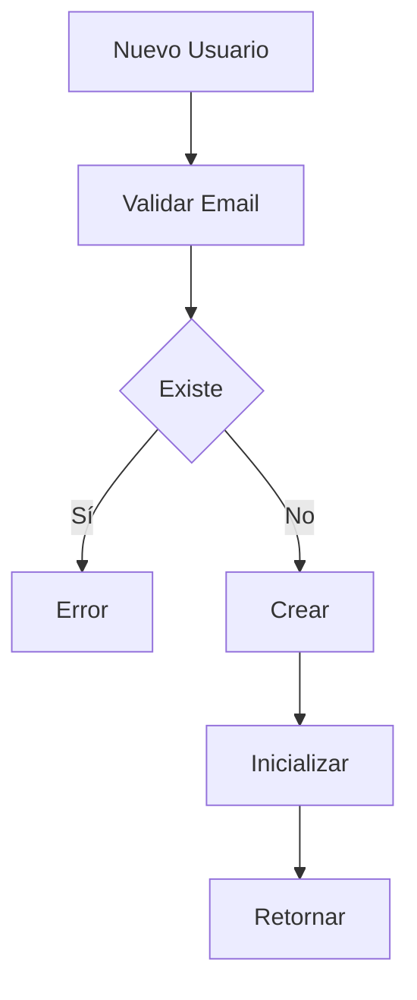
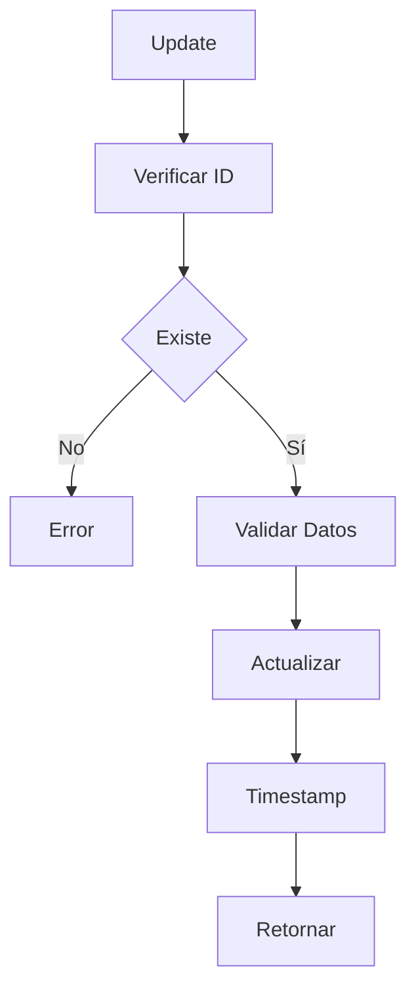
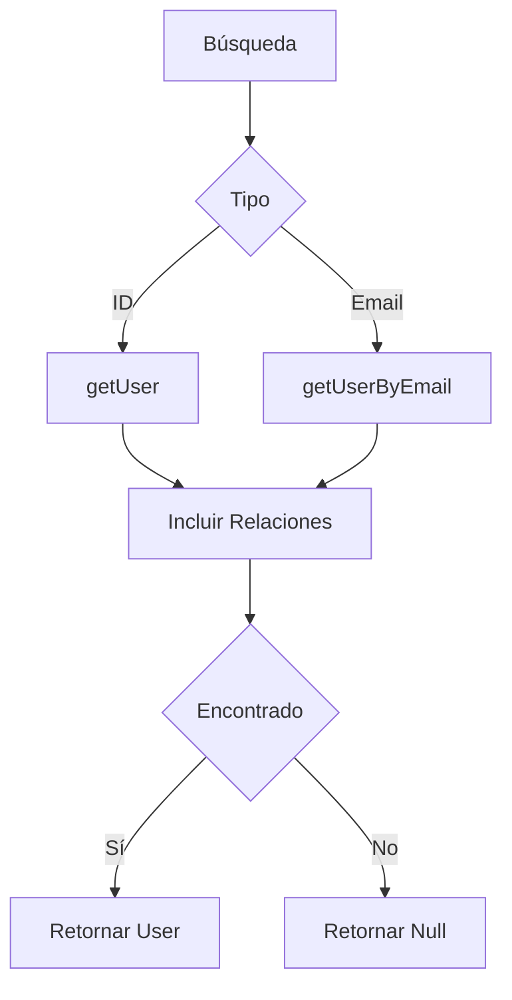
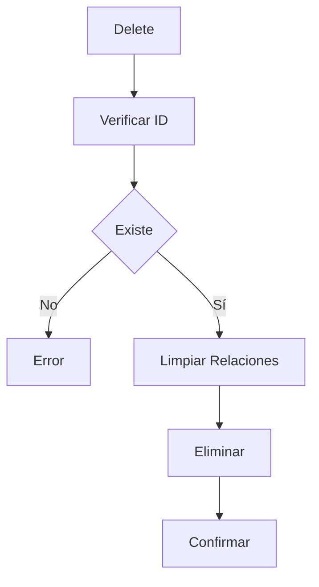

# 👥 Servicio de Usuarios

## 📝 Descripción

El servicio de usuarios gestiona las operaciones CRUD relacionadas con los usuarios del sistema, incluyendo la creación, actualización, recuperación y eliminación de usuarios.

## 🔧 Características Principales

### Estructura de Usuario

```typescript
interface CreateUserInput {
	email: string;
	name?: string;
}

interface User {
	id: string;
	email: string;
	name: string | null;
	createdAt: Date;
	updatedAt: Date;
	images: Image[];
	albums: Album[];
}
```

## 📚 Métodos Principales

### `createUser`

- Crea nuevo usuario
- Validación de email
- Timestamps automáticos
- Respuesta tipada

### `getUser`

- Recupera usuario por ID
- Incluye relaciones
- Manejo de 404
- Retorno nullable

### `getUserByEmail`

- Búsqueda por email
- Incluye relaciones
- Validación de formato
- Retorno nullable

### `updateUser`

- Actualiza datos de usuario
- Actualización parcial
- Timestamp automático
- Validación de cambios

### `deleteUser`

- Elimina usuario
- Limpieza de recursos
- Validación de existencia
- Manejo seguro

## 🔄 Flujo de Trabajo

### Gestión de Usuarios

1. Creación/Registro
2. Validación de datos
3. Gestión de relaciones
4. Mantenimiento de estado

### Relaciones

- Imágenes asociadas
- Álbumes creados
- Perfiles vinculados
- Estadísticas personales

## 🔐 Seguridad

### Validaciones

- Email único
- Formato de datos
- Permisos de acceso
- Integridad referencial

## 📈 Optimizaciones

### Base de Datos

- Índices optimizados
- Relaciones eficientes
- Consultas optimizadas
- Transacciones seguras

### Rendimiento

- Operaciones asíncronas
- Caché de usuarios
- Control de memoria
- Batch operations

## 🔗 Dependencias

- Prisma: ORM
- Database: SQLite
- Validation: Email
- TypeScript: Types

## 🚧 Áreas de Mejora

- Implementar autenticación
- Mejorar validaciones
- Añadir roles y permisos
- Optimizar consultas

## 📝 Notas Técnicas

- Modelo relacional
- Índices compuestos
- Transacciones seguras
- Logging detallado

## 🔄 Diagramas de Flujo

### Registro de Usuario



### Actualización de Usuario



### Búsqueda de Usuario



### Eliminación de Usuario


