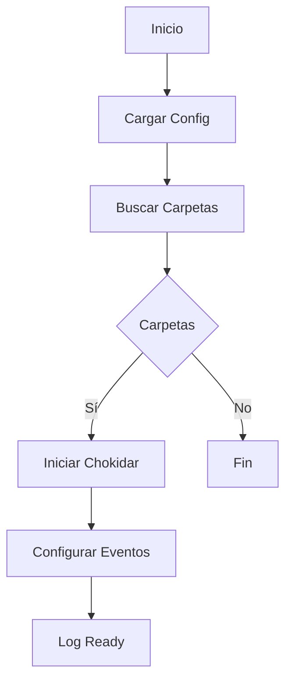
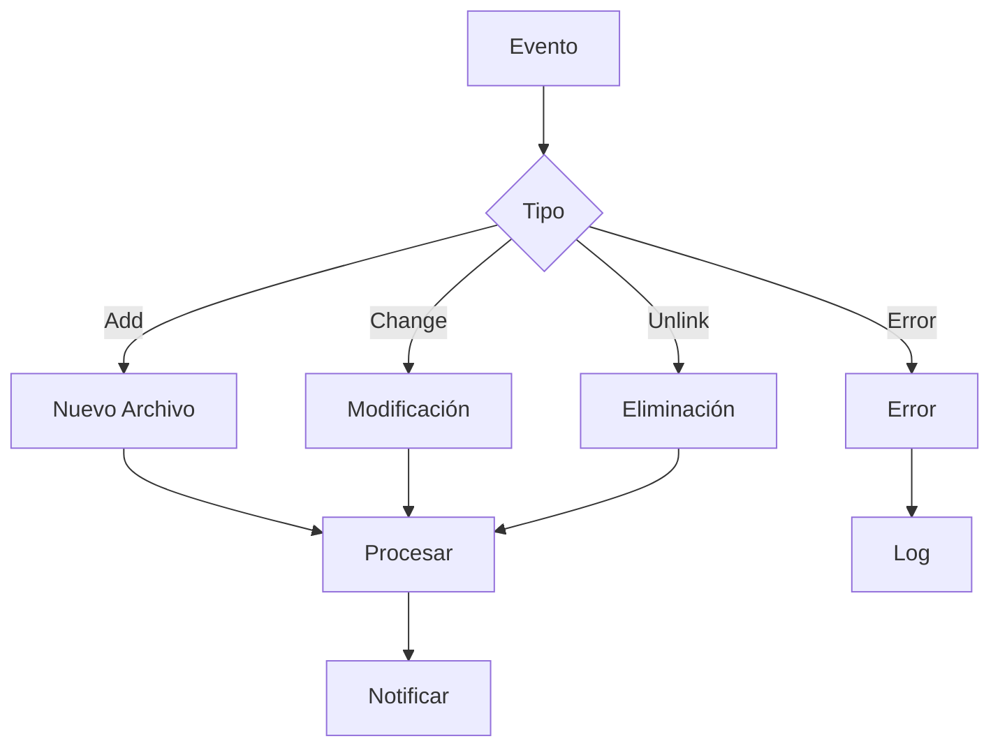
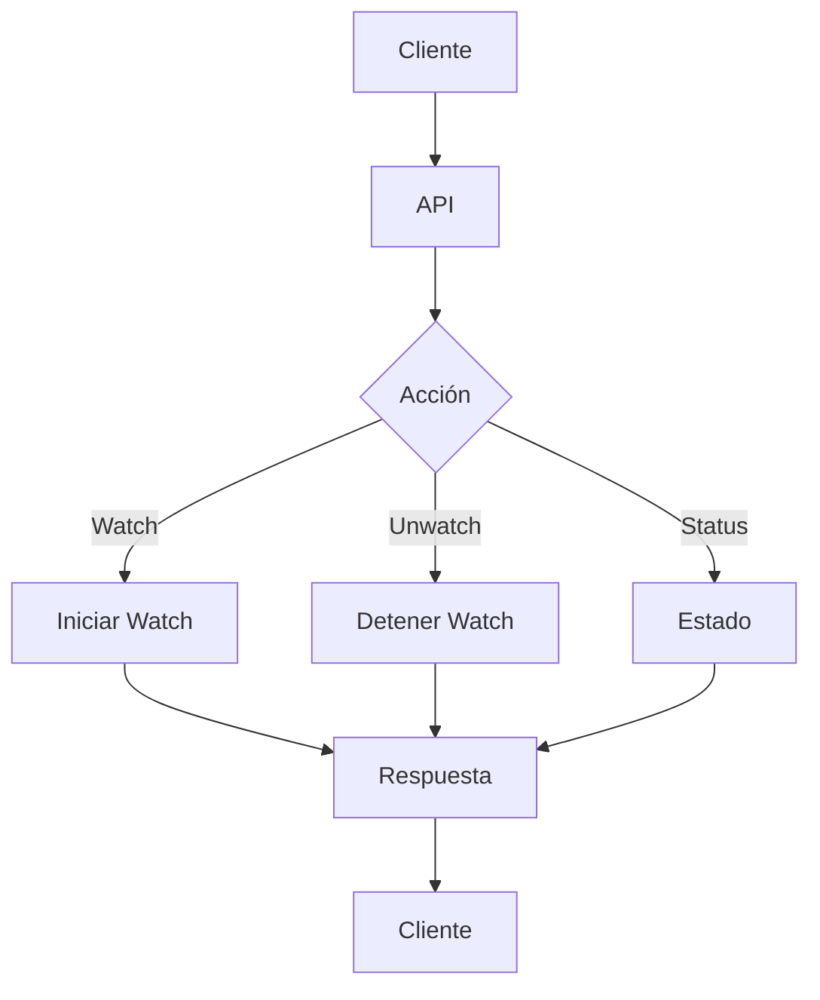
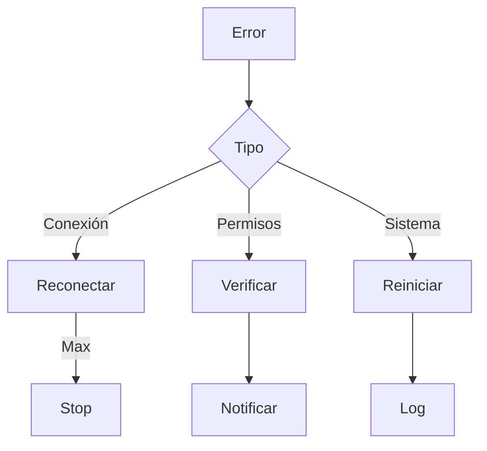

# 👀 Servicio de Monitoreo (Watcher)

## 📝 Descripción

El servicio de monitoreo es responsable de observar cambios en tiempo real en las carpetas indexadas, permitiendo mantener la base de datos sincronizada con el sistema de archivos.

## 🔧 Características Principales

### Cliente (Frontend)

```typescript
interface WatcherClient {
	watchFolder(folderId: string): Promise<void>;
	stopWatching(folderId: string): Promise<void>;
	startWatchingAll(): Promise<void>;
	stopWatchingAll(): void;
}
```

### Servidor (Backend)

```typescript
interface WatcherServer {
	initialize(): Promise<boolean>;
	stop(): void;
	watcher: chokidar.FSWatcher | null;
}
```

## 📚 Métodos Principales

### Cliente

#### `watchFolder`

- Inicia monitoreo de carpeta específica
- Comunicación con API
- Manejo de errores robusto
- Validación de estado

#### `stopWatching`

- Detiene monitoreo de carpeta
- Limpieza de recursos
- Actualización de estado
- Notificación al servidor

#### `startWatchingAll`

- Inicia monitoreo de todas las carpetas marcadas
- Proceso en paralelo
- Recuperación de estado
- Sincronización automática

#### `stopWatchingAll`

- Detiene todos los monitores activos
- Limpieza global
- Liberación de recursos
- Estado consistente

### Servidor

#### `initialize`

- Configuración de Chokidar
- Carga de carpetas monitoreadas
- Configuración de eventos
- Logging detallado

#### `stop`

- Detiene el monitor global
- Limpieza de recursos
- Logging de estado
- Manejo seguro

## 🔄 Eventos Monitoreados

### Sistema de Archivos

- `add`: Nuevos archivos
- `unlink`: Archivos eliminados
- `change`: Modificaciones
- `error`: Errores del sistema

### Configuración

```typescript
{
  persistent: true,
  ignoreInitial: true,
  awaitWriteFinish: {
    stabilityThreshold: 2000,
    pollInterval: 100
  }
}
```

## 🔐 Seguridad

### Validaciones

- Verificación de permisos
- Existencia de carpetas
- Estado del sistema
- Integridad de datos

## 📈 Optimizaciones

### Rendimiento

- Monitoreo asíncrono
- Estabilidad de escritura
- Control de recursos
- Caché de estado

### Memoria

- Limpieza automática
- Gestión de watchers
- Control de concurrencia
- Liberación proactiva

## 🔗 Dependencias

- Chokidar: Monitor de archivos
- Prisma: Base de datos
- API: Comunicación cliente/servidor
- FileSystem: Acceso a archivos

## 🚧 Áreas de Mejora

- Mejorar manejo de errores
- Optimizar uso de memoria
- Añadir más eventos
- Mejorar logging

## 📝 Notas Técnicas

- Sistema deprecado en transición
- Nuevo sistema en desarrollo
- Mantener compatibilidad
- Migración gradual

## 🔄 Integración

### API Endpoints

- `/api/folders/watch`: Control de monitoreo
- `/api/folders/watched`: Estado de carpetas
- `/api/folders/:id/watch`: Control individual

### Estado Global

- Mapa de watchers activos
- Estado de monitoreo
- Carpetas monitoreadas
- Errores y eventos

## 🔄 Diagramas de Flujo

### Inicialización del Watcher



### Gestión de Eventos



### Sistema Cliente/Servidor



### Manejo de Errores


