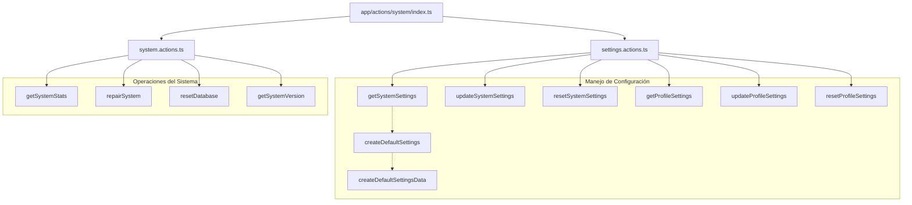

# Acciones de Sistema (Server Actions)

Este documento describe las acciones del servidor relacionadas con el sistema y la configuración de la aplicación.

## Estructura de Archivos

```
src/app/actions/system/
├── index.ts              # Exportaciones principales
├── settings.actions.ts   # Acciones para gestión de configuración
└── system.actions.ts     # Acciones para operaciones del sistema
```

## Diagrama de Arquitectura



## Descripción de las Acciones

### Acciones de Configuración (`settings.actions.ts`)

| Acción | Descripción |
|--------|-------------|
| `getSystemSettings()` | Obtiene la configuración global del sistema |
| `updateSystemSettings(data)` | Actualiza la configuración global |
| `resetSystemSettings()` | Restablece la configuración global a valores predeterminados |
| `getProfileSettings(profileId)` | Obtiene la configuración de un perfil específico |
| `updateProfileSettings(profileId, data)` | Actualiza la configuración de un perfil |
| `resetProfileSettings(profileId)` | Restablece un perfil a la configuración global |

### Acciones del Sistema (`system.actions.ts`)

| Acción | Descripción |
|--------|-------------|
| `getSystemStats()` | Obtiene estadísticas del sistema en tiempo real |
| `repairSystem()` | Realiza operaciones de reparación del sistema |
| `resetDatabase()` | Resetea la base de datos (¡operación destructiva!) |
| `getSystemVersion()` | Obtiene información sobre la versión del sistema |

## Manejo de Errores

Las acciones implementan un manejo de errores estandarizado:

```typescript
// En settings.actions.ts
class SettingsError extends Error {
  constructor(
    message: string,
    public code?: string,
    public cause?: unknown
  ) {
    super(message);
    this.name = 'SettingsError';
  }
}

// En system.actions.ts
class SystemError extends Error {
  constructor(
    message: string,
    public cause?: unknown
  ) {
    super(message);
    this.name = 'SystemError';
  }
}
```

## Ejemplos de Uso

### Obtener y Actualizar Configuración Global

```typescript
import { getSystemSettings, updateSystemSettings } from '@/app/actions/system';

// Obtener configuración
const settings = await getSystemSettings();

// Actualizar configuración
await updateSystemSettings({ theme: 'dark', fontSize: 18 });
```

### Obtener Estadísticas del Sistema

```typescript
import { getSystemStats } from '@/app/actions/system';

// Obtener estadísticas actuales
const stats = await getSystemStats();
console.log(`CPU Usage: ${stats.cpuUsage}%`);
console.log(`Memory Usage: ${stats.memoryUsage}%`);
```

### Gestionar Configuración de Perfiles

```typescript
import { getProfileSettings, updateProfileSettings } from '@/app/actions/system';

// Obtener configuración de un perfil
const profileId = 'user123';
const settings = await getProfileSettings(profileId);

// Actualizar configuración específica del perfil
await updateProfileSettings(profileId, {
  notificationsEnabled: true,
  emailNotifications: false
});

// Restablecer perfil a configuración global
await resetProfileSettings(profileId);
```