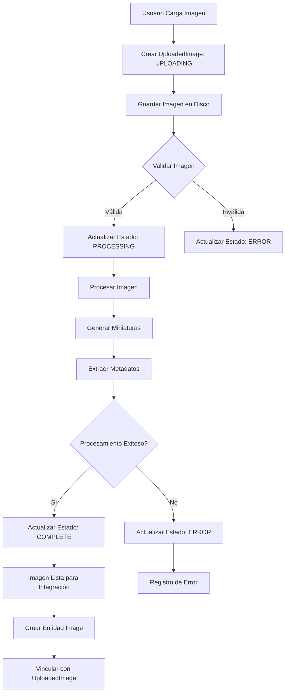

# Documentación de la Entidad UploadedImage

## Introducción

La entidad `UploadedImage` representa imágenes que han sido cargadas al sistema pero que aún pueden estar en proceso de procesamiento, indexación o clasificación. Esta entidad sirve como un estado intermedio entre la carga inicial de la imagen y su integración completa en el sistema como una entidad `Image`.

## Estructura de la Entidad

### Propiedades Básicas

```typescript
interface UploadedFile {
    id: EntityId;
    name: string;
    originalName: string;
    path: string;
    type: UploadedFileType;
    mimeType: string;
    size: number;
    status: UploadStatus;
    progress: number;
    error?: string;
    metadata: JSONString<MediaMetadata>;
    uploadedAt: Date;
    userId: EntityId;
}

// La entidad UploadedImage extiende de UploadedFile
interface UploadedImage extends UploadedFile {
    type: UploadedFileType.IMAGE;
    width?: number;
    height?: number;
    thumbnailPath?: string;
}
```

### Enumeraciones

```typescript
enum UploadStatus {
    PENDING = 'pending',
    UPLOADING = 'uploading',
    PROCESSING = 'processing',
    COMPLETE = 'complete',
    ERROR = 'error'
}

enum UploadedFileType {
    IMAGE = 'image',
    VIDEO = 'video',
    AUDIO = 'audio',
    DOCUMENT = 'document',
    OTHER = 'other'
}
```

### Validación con Zod

```typescript
const uploadStatusSchema = z.nativeEnum(UploadStatus);
const uploadedFileTypeSchema = z.nativeEnum(UploadedFileType);

const uploadedFileSchema = z.object({
    id: z.string(),
    name: z.string(),
    originalName: z.string(),
    path: z.string(),
    type: uploadedFileTypeSchema,
    mimeType: z.string(),
    size: z.number().positive(),
    status: uploadStatusSchema,
    progress: z.number().min(0).max(100),
    error: z.string().optional(),
    metadata: z.string(),
    uploadedAt: z.date(),
    userId: z.string()
});

const uploadedImageSchema = uploadedFileSchema.extend({
    type: z.literal(UploadedFileType.IMAGE),
    width: z.number().optional(),
    height: z.number().optional(),
    thumbnailPath: z.string().optional()
});
```

## Diagrama de Flujo



## Estructura de Carpetas

```
src/
├─ types/
│  ├─ entities/
│  │  ├─ uploaded-image/
│  │     ├─ types.ts        # Tipos básicos
│  │     ├─ transformers.ts # Transformadores para la entidad
│  │     └─ index.ts        # Exportaciones
│  └─ uploaded-images.ts    # Tipos generales de archivos cargados
├─ lib/
│  ├─ server/
│  │  └─ services/
│  │     └─ uploaded-image/ # Carpeta del servicio UploadedImage
│  │        ├─ transformers/  # Transformadores específicos
│  │        ├─ service.ts     # Implementación del servicio
│  │        └─ index.ts       # Punto de entrada
├─ app/
│  └─ api/
│     └─ uploads/          # API endpoints para cargas
│        └─ route.ts       # Manejadores de rutas
```

## Interacciones con el Sistema de Eventos

La entidad UploadedImage utiliza el sistema de eventos para notificar cambios durante el proceso de carga y procesamiento.

### Eventos Emitidos

- `uploaded-image:created` - Cuando se crea una nueva imagen cargada
- `uploaded-image:updated` - Cuando se actualiza el estado o metadatos
- `uploaded-image:deleted` - Cuando se elimina una imagen cargada
- `uploaded-images:changed` - Evento general para cambios en las imágenes cargadas

### Ejemplo de Emisión de Eventos

```typescript
import { emit } from '@/lib/server/events.server';

async function processUploadedImage(imageId: string): Promise<void> {
  try {
    // Actualizar estado a PROCESSING
    await updateImageStatus(imageId, UploadStatus.PROCESSING);

    // Emitir evento de actualización
    await emit({
      type: 'uploaded-image:updated',
      id: imageId,
      data: { status: UploadStatus.PROCESSING }
    });

    // Procesar imagen...

    // Actualizar estado a COMPLETE
    await updateImageStatus(imageId, UploadStatus.COMPLETE);

    // Emitir evento de actualización
    await emit({
      type: 'uploaded-image:updated',
      id: imageId,
      data: { status: UploadStatus.COMPLETE }
    });

  } catch (error) {
    // Actualizar estado a ERROR
    await updateImageStatus(imageId, UploadStatus.ERROR, error.message);

    // Emitir evento de actualización
    await emit({
      type: 'uploaded-image:updated',
      id: imageId,
      data: { status: UploadStatus.ERROR, error: error.message }
    });
  }
}
```

## Ejemplos de Uso en el Proyecto

### Subida de una Imagen

```typescript
import { uploadedImageService } from '@/lib/server/services/uploaded-image';

async function uploadImage(file: File, userId: string): Promise<UploadedImage | null> {
  try {
    // Crear entrada inicial
    const uploadedImage = await uploadedImageService.createUploadedImage({
      name: file.name,
      originalName: file.name,
      type: UploadedFileType.IMAGE,
      mimeType: file.type,
      size: file.size,
      status: UploadStatus.UPLOADING,
      progress: 0,
      userId
    });

    if (!uploadedImage) {
      throw new Error('No se pudo crear la entrada para la imagen');
    }

    // Guardar archivo físicamente
    const path = await saveFileToDisk(file, uploadedImage.id);

    // Actualizar con la ruta
    await uploadedImageService.updateUploadedImage(uploadedImage.id, {
      path,
      status: UploadStatus.PENDING,
    });

    // Iniciar procesamiento asíncrono
    void processUploadedImage(uploadedImage.id);

    return uploadedImage;
  } catch (error) {
    console.error('Error al subir imagen:', error);
    return null;
  }
}

async function saveFileToDisk(file: File, id: string): Promise<string> {
  // Implementación de guardado en disco
  const buffer = await file.arrayBuffer();
  const path = `/uploads/${id}-${file.name}`;

  // Guardar buffer en disco...

  return path;
}
```

### Obtención de Imágenes Cargadas por Usuario

```typescript
import { uploadedImageService } from '@/lib/server/services/uploaded-image';

async function getUserUploadedImages(userId: string): Promise<UploadedImage[]> {
  try {
    return await uploadedImageService.getUserUploadedImages(userId);
  } catch (error) {
    console.error('Error al obtener imágenes cargadas:', error);
    return [];
  }
}
```

### Conversión de UploadedImage a Image

```typescript
import { uploadedImageService } from '@/lib/server/services/uploaded-image';
import { imageService } from '@/lib/server/services/image';

async function convertToImage(uploadedImageId: string): Promise<boolean> {
  try {
    const uploadedImage = await uploadedImageService.getUploadedImageById(uploadedImageId);

    if (!uploadedImage || uploadedImage.status !== UploadStatus.COMPLETE) {
      throw new Error('La imagen no está lista para ser convertida');
    }

    // Convertir a entidad Image
    const metadata = JSON.parse(uploadedImage.metadata);
    const image = await imageService.createImage({
      name: uploadedImage.name,
      path: uploadedImage.path,
      size: uploadedImage.size,
      width: uploadedImage.width,
      height: uploadedImage.height,
      mimeType: uploadedImage.mimeType,
      metadata: uploadedImage.metadata,
      thumbnailPath: uploadedImage.thumbnailPath,
      userId: uploadedImage.userId,
    });

    if (!image) {
      throw new Error('No se pudo crear la entidad Image');
    }

    // Opcionalmente, marcar UploadedImage como procesada o eliminarla
    // await uploadedImageService.deleteUploadedImage(uploadedImageId);

    return true;
  } catch (error) {
    console.error('Error al convertir a Image:', error);
    return false;
  }
}
```

## Consideraciones Importantes

1. **Procesamiento Asíncrono**: El procesamiento de imágenes debe realizarse de forma asíncrona para no bloquear la interfaz de usuario.

2. **Manejo de Errores**: Implementar estrategias robustas para el manejo de errores durante todas las fases del proceso.

3. **Limpieza**: Configurar mecanismos para limpiar imágenes en estado ERROR o aquellas que ya han sido convertidas a entidades Image.

4. **Validación**: Validar tamaño, formato y contenido de las imágenes antes de procesarlas para evitar problemas de seguridad.

5. **Progreso**: Proporcionar información de progreso detallada para mejorar la experiencia del usuario.

## Integraciones con Otras Entidades

La entidad UploadedImage se integra con varias otras entidades del sistema:

- **Image**: Las UploadedImage completas se convierten en entidades Image
- **User**: Cada imagen cargada está asociada a un usuario
- **Folder**: Las imágenes pueden asociarse con carpetas existentes durante la carga

## Conclusión

La entidad UploadedImage proporciona un mecanismo robusto para gestionar el proceso de carga y procesamiento de imágenes antes de su integración completa en el sistema. Su diseño permite un manejo asíncrono y centrado en el usuario para mejorar la experiencia de carga de imágenes.