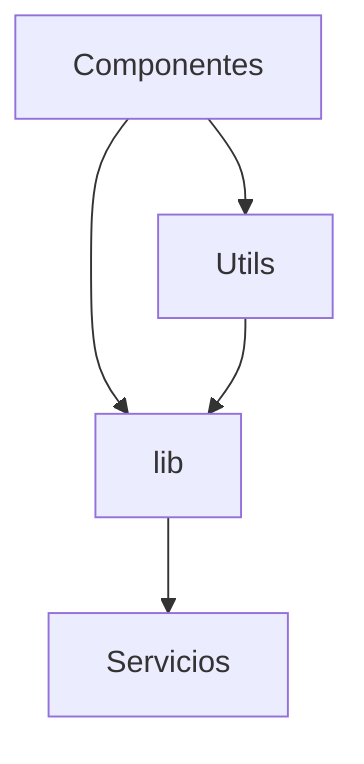

# Utils y Biblioteca Compartida

Este proyecto agrupa funciones auxiliares en dos ubicaciones principales:

- `src/utils` para utilidades ligeras de la interfaz.
- `src/lib` para helpers más complejos y lógica reutilizable por servicios y acciones.

## Relación entre ambos módulos



### `src/utils`

Contiene funciones pequeñas y sin dependencias. Ejemplo de uso:

```typescript
import { cn } from '@/utils';

const classes = cn('p-2', isActive && 'bg-green-500');
```

### `src/lib`

Almacena lógica compartida como cache, logger, validadores y hooks de React:

```text
src/lib/
├── cache.ts             # Sistema de caché en memoria
├── logger/              # Configuración y utilidades de logging
├── hooks/               # Hooks reutilizables en componentes y servicios
├── validators/          # Validaciones de datos
└── config/              # Configuración centralizada
```

Ejemplo de uso de un hook:

```typescript
import { useWindowSize } from '@/lib/hooks/use-window-size';

const { width, height } = useWindowSize();
```

### Buenas prácticas

- Mantén los helpers sin efectos secundarios siempre que sea posible.
- Documenta las utilidades exportadas en `src/utils/README.md` o `src/lib/README.md`.
- Si una función crece demasiado o se relaciona con datos del servidor, muévela a `src/lib` y documenta su uso.
