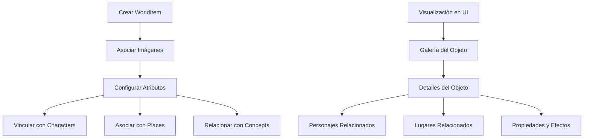

# Documentación de la Entidad WorldItem

## Introducción

La entidad `WorldItem` representa objetos, artefactos o elementos del mundo dentro del sistema de gestión de imágenes. Esta entidad permite a los usuarios organizar y catalogar imágenes relacionadas con objetos específicos, especialmente útil para diseñadores de worldbuilding, escritores, artistas conceptuales y creadores de contenido para juegos.

## Estructura de la Entidad

### Propiedades Básicas

```typescript
interface WorldItem {
    id: string;               // Identificador único (CUID)
    name: string;             // Nombre del objeto (único)
    description?: string;     // Descripción opcional
    emoji: string;            // Emoji para representación visual (default: 🎯)
    color: string;            // Color temático (default: #3b82f6)
    shortcut?: string;        // Acceso rápido opcional
    category?: string;        // Categoría (default: "general")

    // Configuración
    sortBy: string;           // Criterio de ordenación (default: "name")
    filters: string;          // Filtros serializados (default: "empty_array")

    // Atributos del objeto
    type: string;             // Tipo de objeto (default: "misc")
    rarity: string;           // Rareza del objeto (default: "common")
    attributes: string;       // Atributos serializados (default: "empty_array")
    effects: string;          // Efectos serializados (default: "empty_array")
    size: string;             // Tamaño del objeto (default: "medium")

    // Características detalladas
    requirements: string;     // Requisitos para usar/obtener el objeto
    origin: string;           // Origen o procedencia del objeto
    stats: string;            // Estadísticas serializadas

    // Visualización
    featuredImage?: string;   // Imagen destacada (referencia)
    isFavorite: boolean;      // Marcado como favorito

    // Metadatos
    createdAt: Date;          // Fecha de creación
    updatedAt: Date;          // Fecha de última actualización
}
```

## Diagrama de Flujo



## Estructura de Carpetas

```
src/
├─ types/
│  ├─ entities/
│  │  ├─ world-item/
│  │     ├─ types.ts            # Tipos principales del objeto
│  │     └─ index.ts            # Exportaciones
├─ transformers/
│  ├─ world-item/
│  │  ├─ index.ts               # Exportaciones y funciones públicas
│  │  ├─ transformer.ts         # Transformadores principales
│  │  ├─ serializers.ts         # Serializadores/deserializadores
│  │  ├─ mappers.ts             # Funciones de mapeo
│  │  └─ types.ts               # Tipos internos del transformador
├─ components/
│  ├─ cards/
│  │  ├─ world-item-card/       # Componentes de tarjeta de objeto
│  ├─ views/
│  │  ├─ world-items/           # Vistas para objetos
├─ app/
│  └─ api/
│     └─ world-items/           # API endpoints para objetos
│        └─ route.ts            # Manejadores de rutas
├─ utils/
│  └─ world-item/               # Utilidades específicas para objetos
│     ├─ helpers.ts             # Funciones auxiliares
│     ├─ validators.ts          # Validadores
│     └─ index.ts               # Exportaciones
```

## Interacciones con el Sistema de Eventos

### Eventos Emitidos

- `world-item:created` - Cuando se crea un objeto nuevo
- `world-item:updated` - Cuando se modifica un objeto existente
- `world-item:deleted` - Cuando se elimina un objeto
- `world-item:images:added` - Cuando se asocian imágenes a un objeto
- `world-item:images:removed` - Cuando se desasocian imágenes de un objeto
- `world-item:characters:added` - Cuando se asocian personajes a un objeto
- `world-item:characters:removed` - Cuando se desasocian personajes de un objeto

## Ejemplos de Uso en el Proyecto

### Creación de un Objeto del Mundo

```typescript
import { createWorldItem } from '@/transformers/world-item';

// Crear un objeto básico
const newWorldItem = await createWorldItem({
  name: "Anillo Único",
  description: "Un anillo forjado por Sauron en los fuegos del Monte del Destino",
  type: "artifact",
  rarity: "legendary",
  size: "small",
  category: "fantasy",
  // Las propiedades que son arrays se serializarán automáticamente
  attributes: ["magical", "cursed", "golden"],
  effects: ["invisibility", "extended life", "corruption"],
  // Propiedades textuales
  origin: "Forjado por Sauron en el Monte del Destino durante la Segunda Edad",
  requirements: "Voluntad fuerte para resistir su influencia corruptora"
});

console.log(`Objeto creado: ${newWorldItem.id}`);
```

### Obtención de Objetos del Mundo

```typescript
import { searchWorldItems, getWorldItemById } from '@/transformers/world-item';

// Buscar objetos por criterios
const searchResult = await searchWorldItems({
  filters: {
    text: "Anillo",
    type: "artifact",
    rarity: "legendary"
  },
  sortBy: "name",
  sortDirection: "asc",
  take: 10,
  skip: 0
});

console.log(`Encontrados ${searchResult.total} objetos`);

// Obtener un objeto específico con todas sus relaciones
const worldItem = await getWorldItemById("world_item_id_here");
if (worldItem) {
  console.log(`Objeto: ${worldItem.name}`);
  console.log(`Imágenes asociadas: ${worldItem.images.length}`);
  console.log(`Personajes relacionados: ${worldItem.characters.length}`);
  console.log(`Lugares donde se encuentra: ${worldItem.places.length}`);
}
```

### Asociación de Imágenes con Objeto

```typescript
import { prisma } from '@/lib/prisma';
import { getWorldItemById } from '@/transformers/world-item';

// Asociar imágenes a un objeto
async function associateImagesWithWorldItem(worldItemId: string, imageIds: string[]) {
  // Crear conexiones entre objeto e imágenes
  await prisma.worldItem.update({
    where: { id: worldItemId },
    data: {
      images: {
        connect: imageIds.map(id => ({ id }))
      }
    }
  });

  // Obtener el objeto actualizado con sus relaciones
  const updatedWorldItem = await getWorldItemById(worldItemId);
  return updatedWorldItem;
}

// Ejemplo de uso
const updatedWorldItem = await associateImagesWithWorldItem(
  "world_item_id_here",
  ["image_id_1", "image_id_2"]
);
```

### Vinculación de Personajes con un Objeto

```typescript
import { prisma } from '@/lib/prisma';
import { getWorldItemById } from '@/transformers/world-item';

// Vincular personajes a un objeto
async function connectCharactersToWorldItem(worldItemId: string, characterIds: string[]) {
  // Crear conexiones entre objeto y personajes
  await prisma.worldItem.update({
    where: { id: worldItemId },
    data: {
      characters: {
        connect: characterIds.map(id => ({ id }))
      }
    }
  });

  // Obtener el objeto actualizado con sus relaciones
  const updatedWorldItem = await getWorldItemById(worldItemId);
  return updatedWorldItem;
}

// Ejemplo de uso
const ringWithBearers = await connectCharactersToWorldItem(
  "ring_id",
  ["frodo_id", "bilbo_id", "gollum_id"]
);
```

### Actualización de un Objeto

```typescript
import { updateWorldItem } from '@/transformers/world-item';

// Actualizar atributos de un objeto
const updatedWorldItem = await updateWorldItem("world_item_id_here", {
  description: "Descripción actualizada del objeto",
  rarity: "artifact",
  // Actualizar arrays serializados
  effects: ["invisibility", "extended life", "corruption", "mind control"],
  // Actualizar origen
  origin: "Origen actualizado con nuevos descubrimientos lore..."
});
```

## Consideraciones Importantes

1. **Serialización de Datos**: Varios campos como `attributes`, `effects`, etc., se almacenan como strings serializados en la base de datos. Los transformadores se encargan de serializar/deserializar estos campos automáticamente.

2. **Relaciones Complejas**: Un WorldItem puede tener múltiples relaciones:
   - Puede ser utilizado por diferentes personajes
   - Puede encontrarse en varios lugares
   - Puede tener diferentes representaciones (imágenes)
   - Puede relacionarse con conceptos abstractos

3. **Índices**: La entidad tiene índices para optimizar búsquedas por nombre, fecha de creación, tipo, rareza y categoría.

4. **Categorización**: El sistema de tipado y categorías permite organizar los objetos en jerarquías lógicas (armas, artefactos, herramientas, etc.).

## Integraciones con Otras Entidades

La entidad WorldItem se integra con:

- **Image**: Las imágenes pueden estar asociadas a objetos mediante relación many-to-many
- **Video**: Los videos pueden estar asociados a objetos mediante relación many-to-many
- **Character**: Los personajes pueden utilizar/poseer objetos mediante relación many-to-many
- **Place**: Los objetos pueden encontrarse en lugares mediante relación many-to-many
- **Concept**: Los conceptos pueden estar relacionados con objetos mediante relación many-to-many
- **Group**: Los objetos pueden ser agrupados mediante relación many-to-many

## Casos de Uso Típicos

1. **Inventarios para worldbuilding**: Catalogar objetos importantes en universos narrativos.
2. **Diseño de juegos**: Crear y organizar ítems para juegos de rol o videojuegos.
3. **Referencias visuales para artistas**: Mantener catálogos de objetos para referencia artística.
4. **Desarrollo de props**: Documentar y organizar accesorios para producciones audiovisuales.
5. **Generación de AI**: Utilizar los atributos de objetos como prompts para generar arte con IA.

## Conclusión

La entidad WorldItem proporciona una estructura para catalogar y organizar elementos objetuales dentro del sistema de gestión de imágenes. Su diseño permite la creación de inventarios detallados para proyectos de worldbuilding, juegos de rol, o desarrollo narrativo, enriqueciendo el ecosistema de entidades interrelacionadas en el sistema.