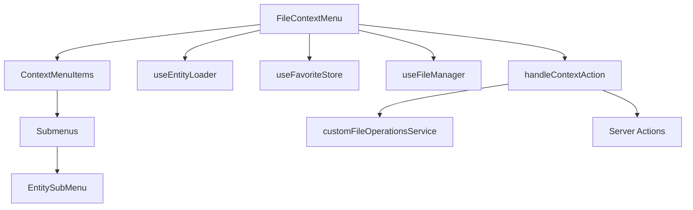

# Documentación Técnica: Menú Contextual

## 📝 Descripción general

El menú contextual es un componente esencial que permite a los usuarios realizar acciones sobre las imágenes mediante un menú desplegable al hacer clic derecho. Proporciona acceso rápido a funcionalidades como marcar imágenes, añadirlas a colecciones, etiquetar, descargar, copiar al portapapeles y más.

## 🧩 Estructura del componente



### Archivos principales

1. **`context-menu.tsx`**: Componente principal del menú contextual.
2. **`context-action-handler.ts`**: Maneja las acciones del menú contextual.
3. **`components/submenus.tsx`**: Componentes para los submenús de entidades.
4. **`components/entity-submenu.tsx`**: Componente genérico para submenús.
5. **`hooks/use-entity-loader.ts`**: Hook para cargar datos de entidades.
6. **`types.ts`**: Definiciones de tipos para el menú contextual.

## 🚀 Funcionalidades principales

### 1. Operaciones de archivos

- **Abrir ubicación**: Abre la carpeta donde se encuentra el archivo.
- **Descargar archivo**: Descarga la imagen al dispositivo.
- **Copiar al portapapeles**: Copia la imagen al portapapeles del sistema.
- **Eliminar archivo**: Elimina el archivo con confirmación del usuario.

### 2. Gestión de entidades

- **Añadir a colecciones**: Asocia imágenes a colecciones existentes.
- **Añadir etiquetas**: Asigna etiquetas a las imágenes.
- **Asociar con entidades**: Conecta imágenes con álbumes, personajes, lugares, objetos, etc.
- **Crear nuevas entidades**: Permite crear entidades nuevas y asociarlas.

### 3. Marcado y favoritos

- **Marcar/desmarcar**: Selecciona múltiples imágenes para operaciones por lotes.
- **Favoritos**: Añade/elimina imágenes de favoritos para acceso rápido.

## 🔄 Flujo de datos

1. **Apertura del menú**:
   - Usuario hace clic derecho → `onOpenChange` → Precargar entidades frecuentes.
   - Los stores correspondientes se consultan para obtener datos actualizados.

2. **Selección de una acción**:
   - Usuario selecciona acción → `handleContextAction` → Procesamiento específico.
   - Las acciones pueden invocar server actions o funciones locales.

3. **Actualización de UI**:
   - Notificaciones de éxito/error mediante `toastService`.
   - Actualización de estados en stores (favoritos, selección, etc.).

## 🧪 Integración con el sistema

### Stores utilizados:

- **FileManagerStore**: Gestiona la selección y manipulación de archivos.
- **FavoriteStore**: Maneja los archivos marcados como favoritos.
- **Stores de entidades**: Proveen datos para colecciones, etiquetas, álbumes, etc.

### Eventos del sistema:

- **`open-create-X-dialog`**: Abre diálogos para crear nuevas entidades.
- **`show-file-details`**: Muestra detalles del archivo seleccionado.
- **`set-settings-tab`**: Navega a la pestaña de configuraciones correspondiente.

## 🛠️ Optimizaciones implementadas

1. **Renderizado condicional**: Solo se renderiza el contenido cuando el menú está abierto.
2. **Memoización**: Componentes y funciones memoizadas para evitar renderizados innecesarios.
3. **Lazy loading**: Las entidades se cargan solo cuando se necesitan.
4. **Precarga de datos comunes**: Colecciones, etiquetas y álbumes se precargan al montar.
5. **ScrollArea**: Para listas grandes se implementa área de desplazamiento.

## 📊 Ejemplo de uso

```tsx
<FileContextMenu
  file={fileItem}
  onAction={handleContextAction}
>
  <ImageThumbnail src={fileItem.thumbnail} />
</FileContextMenu>
```

## ⚠️ Posibles problemas y soluciones

1. **Listas vacías**: Si las listas aparecen vacías, verificar que los datos estén cargando correctamente desde las server actions.
2. **Errores de portapapeles**: Algunas funciones del portapapeles requieren permisos del usuario o contexto seguro.
3. **Rendimiento con muchas entidades**: Utilizar virtualización para listas muy grandes.

## 📈 Mejoras futuras

1. Implementar caché local para mejorar rendimiento.
2. Añadir soporte para arrastrar y soltar desde el menú contextual.
3. Implementar historial de acciones recientes para cada archivo.
4. Añadir acciones personalizables por el usuario.

## 🔗 Referencias

- [Context Menu - Shadcn UI](https://ui.shadcn.com/docs/components/context-menu)
- [Server Actions - Next.js Documentation](https://nextjs.org/docs/app/building-your-application/data-fetching/server-actions)
- [Zustand - State Management](https://github.com/pmndrs/zustand)