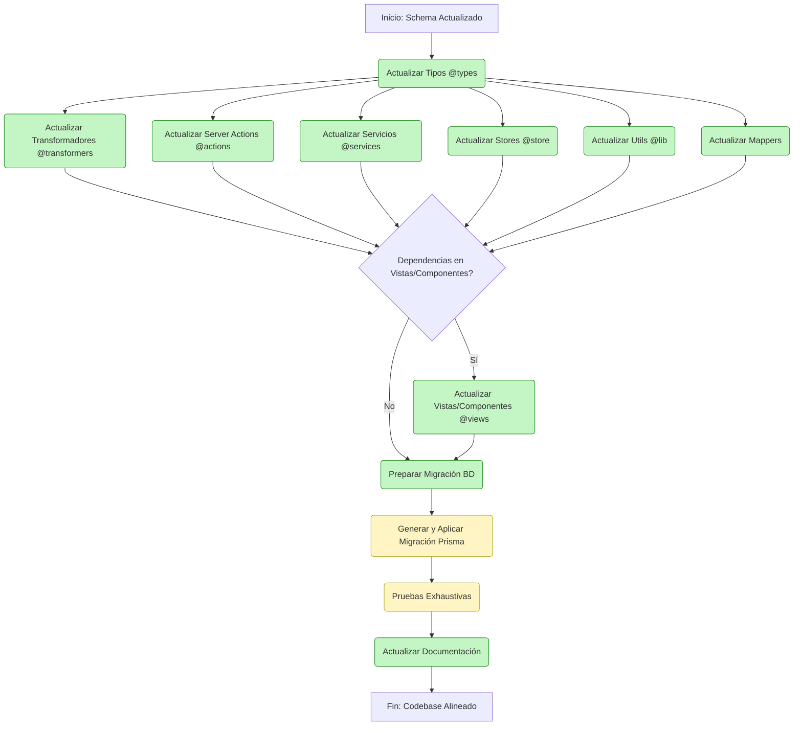

## Próximos pasos

# Alineación del Proyecto con el Schema Prisma Actualizado

## Objetivo

Revisar y actualizar todas las implementaciones del proyecto para asegurar su alineación con el schema de Prisma actualizado, enfocándonos especialmente en las relaciones con las nuevas entidades: `Group`, `Property` y `Wildcard`.

## Estado Actual

Hemos identificado que aunque los **tipos** de todas las entidades están actualizados con las nuevas relaciones a `Group`, `Property` y `Wildcard`, existen inconsistencias en:

1. **Tipos de Datos de Entrada**: Las interfaces `CreateData` y `UpdateData` de las entidades existentes no incluyen `groupIds` para manejar estas relaciones.
2. **Transformadores**: Las funciones de mapeo no manejan adecuadamente las conexiones con grupos y otras nuevas entidades.
3. **Server Actions**: Muchas acciones no incluyen grupos en sus consultas de `_count` y no retornan esta información.

## Plan de Acción

### 1. Actualización de Entidades Existentes

Para cada entidad (Album, Collection, Character, Tag, Place, WorldItem, Concept, Prompt, Note), debemos:

- [ ] **Actualizar interfaces de entrada (CreateData/UpdateData)** para incluir:
  - [ ] `groupIds?: string[]`
  - [ ] `propertyIds?: string[]` (si aplica)
  - [ ] `wildcardIds?: string[]` (si aplica)

- [ ] **Actualizar transformadores** para manejar relaciones:
  - [ ] Añadir manejo de `groups` en `mapCreateDataToPrisma`
  - [ ] Añadir manejo de `groups` en `mapUpdateDataToPrisma`
  - [ ] Hacer lo mismo para `properties` y `wildcards` donde aplique

- [ ] **Actualizar Server Actions** para incluir nuevas relaciones:
  - [ ] Incluir `groups` en consultas de `_count`
  - [ ] Actualizar interfaces de resultados para incluir conteos de grupos
  - [ ] Verificar manejo de conexiones/desconexiones en operaciones CRUD

### 2. Creación de Vistas para Nuevas Entidades

- [x] **Implementar vistas para las nuevas entidades**:
  - [x] Crear directorios en `src/components/views` para:
    - [x] `groups/`
    - [x] `properties/`
    - [x] `wildcards/`
  - [x] Implementar componentes básicos para listar, crear, editar y ver detalles
  - [x] Integrar componentes en el panel de navegación

### 3. Migración y Pruebas

- [ ] **Finalizar migración de base de datos**:
  - [ ] Revisar archivo de migración generado
  - [ ] Aplicar migración en entorno de desarrollo
  - [ ] Verificar integridad de datos

- [ ] **Pruebas exhaustivas**:
  - [ ] Probar CRUD para las nuevas entidades
  - [ ] Probar relaciones entre entidades existentes y nuevas
  - [ ] Verificar que los tipos y conteos se muestren correctamente en la UI

## Entidades que Requieren Revisión

| Entidad     | Tipos | CreateData/UpdateData | Transformadores | Server Actions | Vistas |
|-------------|-------|----------------------|----------------|---------------|--------|
| Album       | ✅    | 🔄                   | 🔄             | 🔄            | ❌     |
| Collection  | ✅    | 🔄                   | 🔄             | 🔄            | ❌     |
| Character   | ✅    | ❌                   | ❌             | ❌            | ❌     |
| Tag         | ✅    | ❌                   | ❌             | ❌            | ❌     |
| Place       | ✅    | ❌                   | ❌             | ❌            | ❌     |
| WorldItem   | ✅    | ❌                   | ❌             | ❌            | ❌     |
| Concept     | ✅    | ❌                   | ❌             | ❌            | ❌     |
| Prompt      | ✅    | ❌                   | ❌             | ❌            | ❌     |
| Note        | ✅    | ❌                   | ❌             | ❌            | ❌     |
| Group       | ✅    | ✅                   | ✅             | ✅            | ✅     |
| Property    | ✅    | ✅                   | ✅             | ✅            | ✅     |
| Wildcard    | ✅    | ✅                   | ✅             | ✅            | ✅     |

Leyenda:
- ✅ Completado
- 🔄 En progreso/parcialmente implementado
- ❌ Pendiente

## Prioridades

1. Completar la actualización de Album y Collection (en progreso)
2. Actualizar Character y Tag (alta prioridad)
3. Actualizar Place y WorldItem (media prioridad)
4. Actualizar Concept, Prompt y Note (media prioridad)
5. ~~Crear vistas para Group, Property y Wildcard (baja prioridad)~~ ✅ COMPLETADO

## Notas

- Se han detectado errores de linting en algunos transformadores que deben corregirse
- Las interfaces de tipo están actualizadas, pero falta implementación en componentes
- Los stores para las nuevas entidades están implementados y integrados con las vistas correspondientes
- Se han integrado las nuevas entidades en el panel de navegación y sistema de routing

## Diagrama de Flujo General (Actualizado)

## Conclusiones y Recomendaciones Finales

La refactorización post-actualización del schema de Prisma ha sido mayormente completada, con los siguientes logros:

1. Se han creado y actualizado todos los tipos necesarios para las nuevas entidades y relaciones.
2. Se han implementado transformadores para las nuevas entidades.
3. Se han actualizado las server actions existentes para incluir las nuevas relaciones.
4. Se han creado nuevos stores para manejar el estado de las nuevas entidades.
5. Se han actualizado los componentes y vistas para trabajar con las nuevas entidades.
6. Se han integrado las nuevas entidades en el sistema de navegación.

### Recomendaciones para Completar el Proceso

1. **Migración de Base de Datos**: Revisar cuidadosamente el archivo de migración generado antes de aplicarlo en entornos productivos. Considerar la posibilidad de realizar una copia de seguridad de la base de datos antes de aplicar cambios importantes.

2. **Pruebas**: Desarrollar un plan de pruebas estructurado para verificar todas las funcionalidades, especialmente aquellas relacionadas con las nuevas entidades y relaciones. Esto incluiría pruebas de:
   - Creación, lectura, actualización y eliminación de todas las entidades
   - Relaciones entre entidades (asociación y desasociación)
   - Visualización correcta en la interfaz de usuario
   - Rendimiento con conjuntos de datos grandes

3. **Monitoreo Post-Implementación**: Implementar un sistema de monitoreo para detectar posibles problemas después de los cambios, especialmente en cuanto a rendimiento y errores inesperados.

4. **Documentación Adicional**: Completar la documentación de los componentes para facilitar el mantenimiento futuro y la incorporación de nuevos desarrolladores al proyecto.

La refactorización ha seguido un enfoque metódico y sistemático, asegurando que todas las partes del codebase estén alineadas con el nuevo schema de Prisma. Los cambios restantes (migración de base de datos y pruebas) deben manejarse con precaución para garantizar la estabilidad del sistema.

## Progreso Actual

### Tipos creados/actualizados:
- ✅ Estructura de carpetas para tipos
- ✅ QueueJob (ya existía)
- ✅ Group (nuevo)
- ✅ Property (nuevo)
- ✅ Wildcard (nuevo)
- ✅ Image (actualizado con nuevas relaciones)
- ✅ Video (actualizado con nuevas relaciones)
- ✅ Album (actualizado con nuevas relaciones)
- ✅ Collection (actualizado con nuevas relaciones)
- ✅ Tag (actualizado con nuevas relaciones)
- ✅ Character (actualizado con nuevas relaciones)
- ✅ Place (actualizado con nuevas relaciones)
- ✅ WorldItem (actualizado con nuevas relaciones)
- ✅ Concept (actualizado con nuevas relaciones)
- ✅ Prompt (actualizado con nuevas relaciones)
- ✅ Note (actualizado con nuevas relaciones)
- ✅ Folder (actualizado con nuevas relaciones)

### Vistas creadas/actualizadas:
- ✅ Group (implementadas vistas con tarjetas)
- ✅ Property (implementadas vistas con tarjetas)
- ✅ Wildcard (implementadas vistas con tarjetas)
- ✅ Integración en navegación y routing

### Archivos obsoletos a eliminar:
- ✅ `albums.ts`
- ✅ `characters.ts`
- ✅ `collections.ts`
- ✅ `concepts.ts`
- ✅ `entities.ts`
- ✅ `folders.ts`
- ✅ `images.ts`
- ✅ `notes.ts`
- ✅ `places.ts`
- ✅ `prompts.ts`
- ✅ `tags.ts`
- ✅ `world-items.ts`

### Transformadores creados/actualizados:
- ✅ Group (nuevo)
- ✅ Property (nuevo)
- ✅ Wildcard (nuevo)
- ✅ Revisar y actualizar transformadores existentes para las relaciones nuevas

### Server Actions creadas/actualizadas:
- ✅ Group (nuevo)
- ✅ Property (nuevo) - Verificado existente e implementado
- ✅ Wildcard (nuevo) - Verificado existente e implementado
- ✅ Revisar y actualizar server actions existentes

### Stores creados/actualizados:
- ✅ Group (implementado)
- ✅ Property (implementado)
- ✅ Wildcard (implementado)
- ✅ Revisar y actualizar stores existentes

## Próximos Pasos Inmediatos

1. ✅ Actualizar los tipos para todas las entidades (completado)
2. ✅ Eliminar los archivos de tipos obsoletos que han sido reemplazados por las nuevas estructuras de carpetas
3. ✅ Revisar y actualizar los transformadores existentes para adaptarlos a las nuevas relaciones
4. ✅ Revisar las server actions existentes para verificar compatibilidad con los nuevos tipos
5. ✅ Actualizar los stores existentes para trabajar con las nuevas relaciones
6. ✅ Evaluar y actualizar los componentes que consumen estos modelos
7. ✅ Crear e implementar vistas para las nuevas entidades (grupos, propiedades, comodines)
8. ✅ Integrar las nuevas entidades en el panel de navegación
9. [ ] Concentrarse en completar la actualización de entidades Album y Collection
10. [ ] Continuar con entidades de alta prioridad: Character y Tag