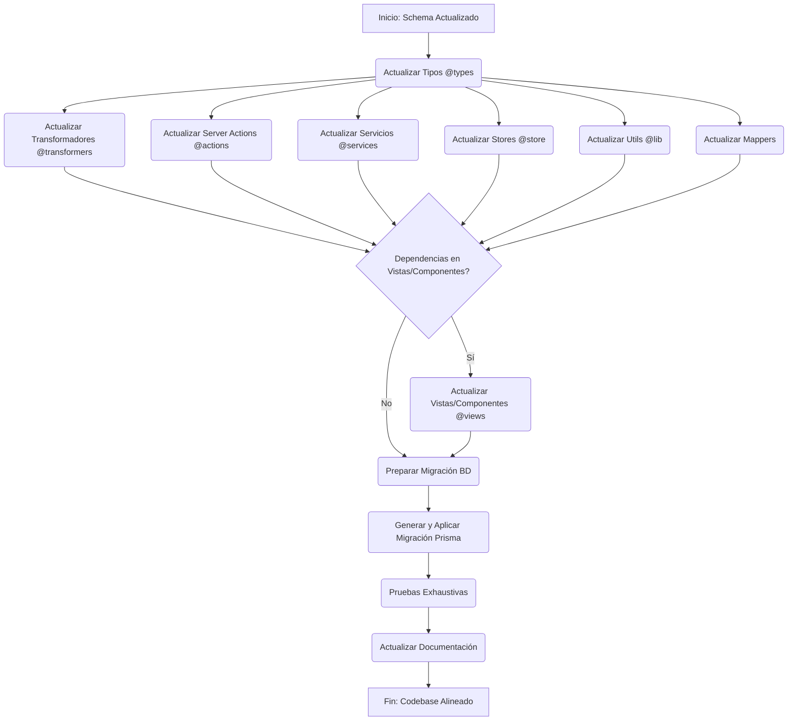

## Próximos pasos

1. Optimizar el sistema de timeout para cargas de respaldo
2. Considerar reducir la verbosidad de logs en producción
3. Implementar una solución centralizada para el manejo de errores de API
4. Completar la migración de stores restantes para usar server actions como método principal de carga
5. Eliminar APIs RESTful redundantes una vez se confirme que los server actions funcionan correctamente

*Esta tarea se considera completada con las mejoras actuales. Cualquier refinamiento adicional se registrará como nuevas tareas.*

# Refactorización Post-Actualización de Schema Prisma

## Objetivo

Alinear todo el codebase con los cambios recientes realizados en `schema.prisma`, asegurando que tipos, stores, transformadores, acciones del servidor, servicios, mapeadores, vistas y utilidades reflejen la nueva estructura de datos.

## Plan de Acción Detallado

### 1. Análisis del Schema (Completado)

- [x] Revisar `schema.prisma` para identificar todos los modelos nuevos, modificados y eliminados, así como cambios en campos y relaciones.

### 2. Actualización de Tipos (`src/types`)

- [x] **Revisión Manual:**
    - [x] Crear nuevos archivos de tipos para modelos nuevos (`Group`, `Property`, `Wildcard`).
    - [x] Revisar y actualizar cada archivo `.ts` y `.d.ts` en `src/types` para que coincida con los modelos de `schema.prisma`
    - [x] Actualizar tipos de `Image`, `Video`, `Album`, `Collection`, `Tag` para reflejar nuevas relaciones
    - [x] Actualizar tipos de `Character`, `Place`, `WorldItem`, `Concept`, `Prompt`, `Note` para reflejar nuevas relaciones
    - [ ] Prestar especial atención a las relaciones (e.g., `ImageToAlbum`, `FolderToFolder`).
    - [ ] Eliminar archivos de tipos obsoletos correspondientes a modelos eliminados o reestructurados.

### 3. Actualización de Transformadores (`src/transformers`)

- [x] **Revisión por Entidad:**
    - [x] Crear transformadores para nuevas entidades (`Group`, `Property`, `Wildcard`).
    - [x] Implementar funciones básicas de mapeo para las nuevas entidades.
    - [x] Implementar serializadores para las nuevas entidades.
    - [ ] Revisar cada subdirectorio (`image/`, `folder/`, `album/`, etc.) para actualizar los transformadores existentes.
    - [ ] Actualizar la lógica de transformación para que coincida con las nuevas estructuras de modelos y tipos.
    - [ ] Asegurar que las funciones manejen correctamente los campos nuevos, modificados o eliminados.
- [x] **Nuevos Transformadores:**
    - [x] Crear transformadores para los nuevos modelos (`Group`, `Property`, `Wildcard`).
- [ ] **Consistencia:** Validar que el *shape* de los datos transformados sea consistente y esperado por el resto de la aplicación.

### 4. Actualización de Server Actions (`src/app/actions`)

- [ ] **Revisión por Entidad:**
    - [ ] Revisar las acciones dentro de cada subdirectorio (`albums/`, `folders/`, `images/`, etc.).
    - [ ] Actualizar todas las llamadas al cliente Prisma (`prisma.model.findUnique`, `findMany`, `create`, `update`, `delete`, etc.) para usar los nombres de modelos, campos y relaciones correctos según el nuevo schema.
    - [ ] Prestar atención a cómo se manejan las operaciones relacionales (`connect`, `disconnect`, `create`, `set`).
- [x] **Nuevas Acciones:**
    - [x] Crear server actions para los nuevos modelos (`Group`).
    - [x] Crear server actions para los nuevos modelos (`Property`, `Wildcard`).
- [ ] **Tipos de Retorno:** Asegurar que los tipos de retorno de las acciones coincidan con las definiciones de tipos actualizadas.

### 5. Actualización de Servicios (`src/services`)

- [ ] **Revisión de Lógica:**
    - [ ] Revisar cada archivo de servicio (`folder.service.ts`, `image.service.ts`, etc.).
    - [ ] Actualizar las llamadas al cliente Prisma de manera similar a las Server Actions.
- [ ] **Refactorización (Server Actions vs. Services):**
    - [ ] Identificar lógica en servicios que podría ser reemplazada o simplificada mediante el uso directo de Server Actions desde el cliente.
    - [ ] Migrar lógica apropiada a Server Actions si mejora el rendimiento o la mantenibilidad.
- [ ] **Nuevos Servicios/Métodos:**
    - [ ] Añadir servicios o métodos para nuevos modelos si se requiere lógica de negocio compleja que no encaja en Server Actions simples.

### 6. Actualización de Zustand Stores (`src/store`)

- [x] **Estructura del Estado:**
    - [x] Implementación de stores para las nuevas entidades (`Group`, `Property`, `Wildcard`)
    - [ ] Revisar los archivos de store existentes (`image-resources.store.ts`, `settings.store.ts`, etc.).
    - [ ] Actualizar las interfaces/tipos del estado de cada store para que coincidan con los nuevos modelos y tipos.
- [ ] **Acciones del Store:**
    - [ ] Actualizar las acciones (funciones dentro de `create(...)`) que interactúan con Server Actions o servicios. Asegurar que envíen y reciban datos con la estructura correcta.
- [x] **Nuevos Stores:**
    - [x] Crear nuevos stores para gestionar el estado de los nuevos modelos (`groupStore`, `propertyStore`, `wildcardStore`)

### 7. Actualización de Mapeadores (Localizar y Actualizar)

- [ ] **Búsqueda:**
    - [ ] Realizar una búsqueda en el codebase (usando `grep` o búsqueda del IDE) por funciones o archivos que actúen como mapeadores de datos (podrían estar en `src/lib`, `src/transformers`, o dentro de componentes específicos).
    - [ ] Usar `codebase_search` si es necesario para encontrar patrones de mapeo.
- [ ] **Actualización:**
    - [ ] Actualizar la lógica de mapeo para alinearla con el nuevo schema y los tipos actualizados.

### 8. Actualización de Vistas/Componentes (`src/components/views`, `src/components/*`)

- [ ] **Consumo de Datos:**
    - [ ] Revisar componentes que obtienen o muestran datos de los modelos afectados.
    - [ ] Actualizar la lógica de obtención de datos (hooks como `useQuery`, llamadas a Server Actions, suscripciones a stores).
    - [ ] Ajustar `props` y estado interno de los componentes.
- [ ] **Renderizado UI:**
    - [ ] Modificar elementos de la UI para mostrar correctamente los campos nuevos o modificados y manejar la ausencia de campos eliminados.

### 9. Actualización de Utilidades (`src/lib`)

- [ ] **Revisión de Funciones:**
    - [ ] Revisar archivos como `utils.ts`, `entity-utils.ts`, `image.ts`, `db.ts`, etc.
    - [ ] Actualizar cualquier lógica que dependa de la estructura del schema anterior (nombres de campos, tipos, relaciones).
    - [ ] Asegurar que las funciones que interactúan con la base de datos o manipulan datos de modelos usen la estructura correcta.

### 10. Migración de Base de Datos

- [ ] **Generar Migración:**
    - [ ] Ejecutar `pnpm prisma migrate dev --name update-schema-alignment` (o un nombre descriptivo similar) para generar el archivo de migración SQL.
- [ ] **Aplicar Migración:**
    - [ ] Revisar la migración generada y aplicarla a la base de datos de desarrollo.

### 11. Pruebas

- [ ] **Pruebas Funcionales:**
    - [ ] Probar exhaustivamente todas las funcionalidades de la aplicación, especialmente aquellas relacionadas con CRUD de entidades, visualización de datos y relaciones.
- [ ] **Pruebas de Regresión:**
    - [ ] Asegurar que los cambios no hayan introducido errores en funcionalidades no directamente relacionadas.

### 12. Documentación

- [ ] **Actualizar Documentación Interna:**
    - [ ] Actualizar READMEs, comentarios de código, diagramas (como los de Mermaid) y cualquier otra documentación interna para reflejar la nueva estructura.
- [ ] **Documentación de Componentes:**
    - [ ] Actualizar la documentación de los componentes afectados (si aplica).

## Diagrama de Flujo General (Mermaid)

## Progreso Actual

### Tipos creados/actualizados:
- ✅ Estructura de carpetas para tipos
- ✅ QueueJob (ya existía)
- ✅ Group (nuevo)
- ✅ Property (nuevo)
- ✅ Wildcard (nuevo)
- ✅ Image (actualizado con nuevas relaciones)
- ✅ Video (actualizado con nuevas relaciones)
- ✅ Album (actualizado con nuevas relaciones)
- ✅ Collection (actualizado con nuevas relaciones)
- ✅ Tag (actualizado con nuevas relaciones)
- ✅ Character (actualizado con nuevas relaciones)
- ✅ Place (actualizado con nuevas relaciones)
- ✅ WorldItem (actualizado con nuevas relaciones)
- ✅ Concept (actualizado con nuevas relaciones)
- ✅ Prompt (actualizado con nuevas relaciones)
- ✅ Note (actualizado con nuevas relaciones)

### Transformadores creados/actualizados:
- ✅ Group (nuevo)
- ✅ Property (nuevo)
- ✅ Wildcard (nuevo)
- ⬜ Revisar y actualizar transformadores existentes para las relaciones nuevas

### Server Actions creadas/actualizadas:
- ✅ Group (nuevo)
- ✅ Property (nuevo) - Verificado existente e implementado
- ✅ Wildcard (nuevo) - Verificado existente e implementado
- ⬜ Revisar y actualizar server actions existentes

### Stores creados/actualizados:
- ✅ Group (implementado)
- ✅ Property (implementado)
- ✅ Wildcard (implementado)
- ⬜ Revisar y actualizar stores existentes

## Próximos Pasos Inmediatos

1. ✅ Actualizar los tipos para todas las entidades (completado)
2. Revisar y actualizar los transformadores existentes para adaptarlos a las nuevas relaciones
3. Revisar las server actions existentes para verificar compatibilidad con los nuevos tipos
4. Actualizar los stores existentes para trabajar con las nuevas relaciones
5. Evaluar y actualizar los componentes que consumen estos modelos

## Notas de Progreso

- Se han creado los tipos para Group, Property y Wildcard siguiendo el schema de Prisma
- Se han actualizado los tipos de las entidades existentes para incluir las nuevas relaciones con Group, Property y Wildcard
- Se ha completado la actualización de tipos para todas las entidades principales
- Se ha mantenido la consistencia en la estructura de las interfaces para asegurar compatibilidad con el código existente
- Los nuevos tipos siguen patrones y convenciones consistentes para facilitar su uso en el codebase