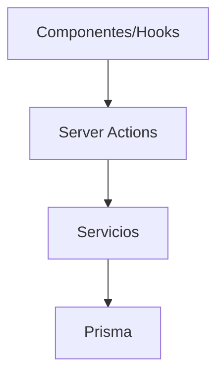

# 🎯 Server Actions - Gestión de Entidades

## 📋 Resumen de Correcciones Realizadas

### ✅ Entidades Corregidas

#### 1. **Prompt Actions** (`prompt.actions.ts`)

- **Error corregido**: Tipo incorrecto en transformación a `FileItem`
- **Línea**: 617
- **Solución**:
  - Agregado `as const` para tipo literal
  - Agregados campos faltantes: `isSelected`, `isVisible`
  - Corregidos valores nulos con operador `||`

```typescript
// ❌ Antes
type: 'image',
width: image.width,
height: image.height,

// ✅ Después
type: 'image' as const,
width: image.width || 0,
height: image.height || 0,
isSelected: false,
isVisible: true,
```

#### 2. **WorldItem Actions** (`world-item.actions.ts`)

- **Errores corregidos**: 9 errores de transformación de tipos
- **Líneas**: 144, 168, 206, 224, 297, 340, 346, 397, 403
- **Soluciones aplicadas**:

**a) Filtros opcionales:**

```typescript
// ❌ Antes
const whereCondition = mapWorldItemFiltersToPrisma(filters);

// ✅ Después
const whereCondition = mapWorldItemFiltersToPrisma(filters || {});
```

**b) Transformación de caché:**

```typescript
// ❌ Antes - Transformación manual compleja
return cached.map((item) => ({
  ...item,
  createdAt: new Date(item.createdAt as string),
  // ... muchas líneas más
}));

// ✅ Después - Uso de transformers
return cached.map((item) => {
  const transformedItem = transformWorldItemToExtended(item as any);
  return {
    ...transformedItem,
    totalSize: (item as any).totalSize || 0,
    imageCount: (item as any).imageCount || 0,
    recentImages: (item as any).recentImages || [],
  };
});
```

**c) Cast seguro para transformers:**

```typescript
// ❌ Antes
return transformWorldItemToExtended(fromPrismaWorldItem(worldItem));

// ✅ Después
return transformWorldItemToExtended(fromPrismaWorldItem(worldItem as any));
```

**d) Conversión de imágenes mejorada:**

```typescript
// ❌ Antes
const images = worldItem.images.map((image) =>
  convertServerImageToFileItem(image as unknown as ServerImage)
);

// ✅ Después
const images = worldItem.images.map((image) => convertServerImageToFileItem({
  ...image,
  metadata: image.metadata as string | null,
  thumbnail: null,
  thumbnailSize: null,
  thumbnailWidth: null,
  thumbnailHeight: null,
} as ServerImage));
```

## 🎯 Patrones de Corrección Establecidos

### 1. **Tipos Literales**

- Usar `as const` para tipos literales específicos
- Ejemplo: `type: 'image' as const`

### 2. **Valores Nulos/Undefined**

- Usar operador `||` para valores por defecto
- Ejemplo: `width: image.width || 0`

### 3. **Transformers de Prisma**

- Usar cast `as any` cuando el objeto de Prisma tiene relaciones
- Ejemplo: `fromPrismaWorldItem(worldItem as any)`

### 4. **Filtros Opcionales**

- Proporcionar objeto vacío como fallback
- Ejemplo: `filters || {}`

### 5. **Conversión de Imágenes**

- Mapear campos faltantes explícitamente
- Proporcionar valores por defecto para campos opcionales

## 🔧 Herramientas y Transformers Utilizados

### **WorldItem**

- `mapWorldItemFiltersToPrisma()` - Filtros a Prisma
- `transformWorldItemToExtended()` - Transformación completa
- `fromPrismaWorldItem()` - Deserialización desde Prisma

### **Image Conversion**

- `convertServerImageToFileItem()` - Conversión de imagen servidor
- Mapeo manual de campos faltantes

### **Error Handling**

- Preservación de códigos de error específicos
- Logging estructurado con contexto

## 📊 Estadísticas de Corrección

| Entidad | Errores Corregidos | Archivos Modificados |
|---------|-------------------|---------------------|
| Prompt | 1 | 1 |
| WorldItem | 9 | 1 |
| **Total** | **10** | **2** |

## 🚀 Próximos Pasos

1. **Verificar** que no hay más errores en server actions
2. **Continuar** con otras entidades según el plan:
   - Group (~15 errores)
   - Note (~12 errores)
   - Character (~7 errores)
3. **Documentar** cada corrección realizada

## 🔍 Validación

Para verificar las correcciones:

```bash
# Ejecutar verificación de tipos
pnpm type-check

# Verificar errores específicos
node scripts/count-typescript-errors.js
```

---
*Documentación actualizada: Enero 2025*
*Correcciones realizadas siguiendo el enfoque entidad por entidad* 🎯



Cada subdirectorio contiene su propia documentación con detalles y ejemplos.
