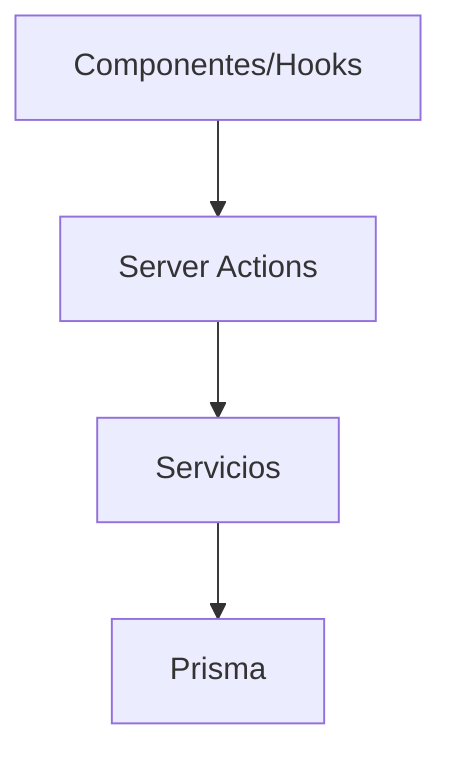

# Server Actions

Este directorio agrupa las funciones "use server" que actúan como puente entre los componentes/hook y la capa de `services`.
Cada carpeta corresponde a una entidad o módulo del sistema (albums, folders, tags, etc.).

Cada subdirectorio contiene su propia documentación con detalles y ejemplos.
