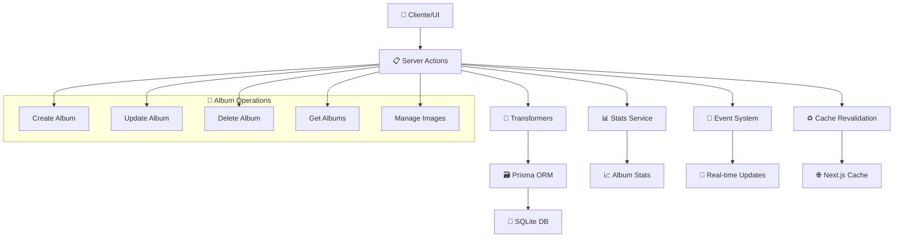

# 📁 Albums Actions

## 📄 Descripción

El módulo **Albums** gestiona la creación, modificación y eliminación de álbumes de imágenes en el sistema. Los álbumes actúan como contenedores organizacionales que permiten agrupar imágenes relacionadas y facilitar su gestión mediante colecciones temáticas.

### 🎯 Funcionalidades Principales

- **Gestión CRUD**: Crear, leer, actualizar y eliminar álbumes
- **Gestión de Imágenes**: Asociar/desasociar imágenes con álbumes
- **Estadísticas**: Cálculo automático de conteos y metadatos
- **Eventos**: Notificaciones de cambios para actualización de cache

## 🌊 Flujo de Operaciones



## 📋 Server Actions Disponibles

### 🏗️ CRUD Básico

#### `getAlbums(): Promise<AlbumWithStats[]>`

- **Descripción**: Obtiene todos los álbumes con estadísticas calculadas
- **Retorna**: Array de álbumes con conteos de imágenes, grupos, propiedades y wildcards
- **Características**: Optimizado para evitar N+1 queries, incluye ordenamiento
- **Ejemplo de uso**: Listado principal de álbumes en la UI

#### `getAlbum(id: string): Promise<Album>`

- **Descripción**: Obtiene un álbum específico por ID
- **Parámetros**: `id` - UUID del álbum
- **Retorna**: Datos completos del álbum
- **Manejo de errores**: Lanza `AlbumError` si no se encuentra

#### `createAlbum(data: CreateAlbumData): Promise<Album>`

- **Descripción**: Crea un nuevo álbum en el sistema
- **Parámetros**: `data` - Datos del álbum (name, description, etc.)
- **Retorna**: Álbum creado con ID generado
- **Efectos secundarios**:
  - Revalida rutas de Next.js cache
  - Emite evento `albums:modified`
  - Actualiza estadísticas del sistema

#### `updateAlbum(id: string, data: UpdateAlbumData): Promise<Album>`

- **Descripción**: Actualiza un álbum existente
- **Parámetros**:
  - `id` - UUID del álbum
  - `data` - Datos a actualizar (parciales)
- **Retorna**: Álbum actualizado
- **Validaciones**: Verifica existencia antes de actualizar

#### `deleteAlbum(id: string): Promise<void>`

- **Descripción**: Elimina un álbum del sistema
- **Parámetros**: `id` - UUID del álbum a eliminar
- **Retorna**: Void (sin retorno)
- **Comportamiento**: Eliminación en cascada de relaciones

### 🖼️ Gestión de Imágenes

#### `getAlbumImages(albumId: string): Promise<FileItem[]>`

- **Descripción**: Obtiene todas las imágenes asociadas a un álbum
- **Parámetros**: `albumId` - UUID del álbum
- **Retorna**: Array de objetos FileItem con metadatos de imagen
- **Transformación**: Convierte ServerImage a FileItem para la UI

#### `addImageToAlbum(albumId: string, imageId: string): Promise<void>`

- **Descripción**: Asocia una imagen específica a un álbum
- **Parámetros**:
  - `albumId` - UUID del álbum destino
  - `imageId` - UUID de la imagen a agregar
- **Validaciones**: Verifica existencia de álbum e imagen
- **Duplicados**: Previene asociaciones duplicadas

#### `removeImageFromAlbum(albumId: string, imageId: string): Promise<void>`

- **Descripción**: Desasocia una imagen de un álbum
- **Parámetros**:
  - `albumId` - UUID del álbum
  - `imageId` - UUID de la imagen a remover
- **Comportamiento**: Solo elimina la relación, no la imagen

#### `addImagesToAlbum(albumId: string, imageIds: string[]): Promise<void>`

- **Descripción**: Asocia múltiples imágenes a un álbum en batch
- **Parámetros**:
  - `albumId` - UUID del álbum destino
  - `imageIds` - Array de UUIDs de imágenes
- **Optimización**: Operación batch para mejor rendimiento
- **Transaccional**: Todas las operaciones en una sola transacción

#### `removeImagesFromAlbum(albumId: string, imageIds: string[]): Promise<void>`

- **Descripción**: Desasocia múltiples imágenes de un álbum
- **Parámetros**:
  - `albumId` - UUID del álbum
  - `imageIds` - Array de UUIDs de imágenes a remover
- **Optimización**: Operación batch para mejor rendimiento

## 🔗 Relaciones y Dependencias

### 📦 Servicios Utilizados

- **prisma**: ORM para acceso a base de datos
- **serverLogger**: Sistema de logging contextual
- **statsEventEmitter**: Emisión de eventos de estadísticas
- **emit**: Sistema de eventos del servidor
- **revalidatePath**: Invalidación de cache de Next.js

### 🔄 Transformers

- **transformAlbumToExtended**: Convierte datos de Prisma a tipos de dominio
- **mapCreateAlbumDataToPrisma**: Mapea datos de creación a esquema de BD
- **mapUpdateAlbumDataToPrisma**: Mapea datos de actualización a esquema de BD
- **convertServerImageToFileItem**: Convierte imágenes a formato de UI

### 🏗️ Tipos Utilizados

- **Album, AlbumBase**: Tipos base de álbum
- **CreateAlbumData, UpdateAlbumData**: DTOs para operaciones CRUD
- **AlbumWithStats**: Álbum extendido con estadísticas calculadas
- **FileItem**: Representación de archivo para la UI
- **ServerImage**: Imagen en formato de servidor

## 💡 Ejemplos de Uso

### 📋 Obtener lista de álbumes

```typescript
import { getAlbums } from '@/app/actions/albums';

export async function AlbumsList() {
  const albums = await getAlbums();

  return (
    <div>
      {albums.map(album => (
        <div key={album.id}>
          <h3>{album.name}</h3>
          <p>{album._count.images} imágenes</p>
        </div>
      ))}
    </div>
  );
}
```

### 🏗️ Crear nuevo álbum

```typescript
import { createAlbum } from '@/app/actions/albums';

const handleCreateAlbum = async (formData: FormData) => {
  const albumData = {
    name: formData.get('name') as string,
    description: formData.get('description') as string,
  };

  try {
    const newAlbum = await createAlbum(albumData);
    console.log('✅ Álbum creado:', newAlbum.id);
  } catch (error) {
    console.error('❌ Error creando álbum:', error);
  }
};
```

### 🖼️ Gestionar imágenes de álbum

```typescript
import { addImageToAlbum, getAlbumImages } from '@/app/actions/albums';

// Agregar imagen a álbum
await addImageToAlbum('album-uuid', 'image-uuid');

// Obtener imágenes del álbum
const images = await getAlbumImages('album-uuid');
console.log(`Álbum tiene ${images.length} imágenes`);
```

## 🧪 Testing

Los tests para este módulo se encuentran en `src/app/actions/__tests__/` y cubren:

- ✅ Operaciones CRUD básicas
- ✅ Gestión de imágenes en álbumes
- ✅ Manejo de errores y validaciones
- ✅ Revalidación de cache
- ✅ Emisión de eventos

## ⚠️ Consideraciones Importantes

### 🚀 Rendimiento

- Las consultas están optimizadas para evitar N+1 problems
- Se usa include selectivo para cargar solo datos necesarios
- Operaciones batch para múltiples imágenes

### 🔒 Seguridad

- Validación de existencia de entidades antes de operaciones
- Manejo de errores sin exposición de detalles internos
- Prevención de operaciones duplicadas

### ♻️ Cache

- Revalidación automática de rutas afectadas
- Invalidación de cache en operaciones que modifican datos
- Sincronización con sistema de eventos para updates en tiempo real
