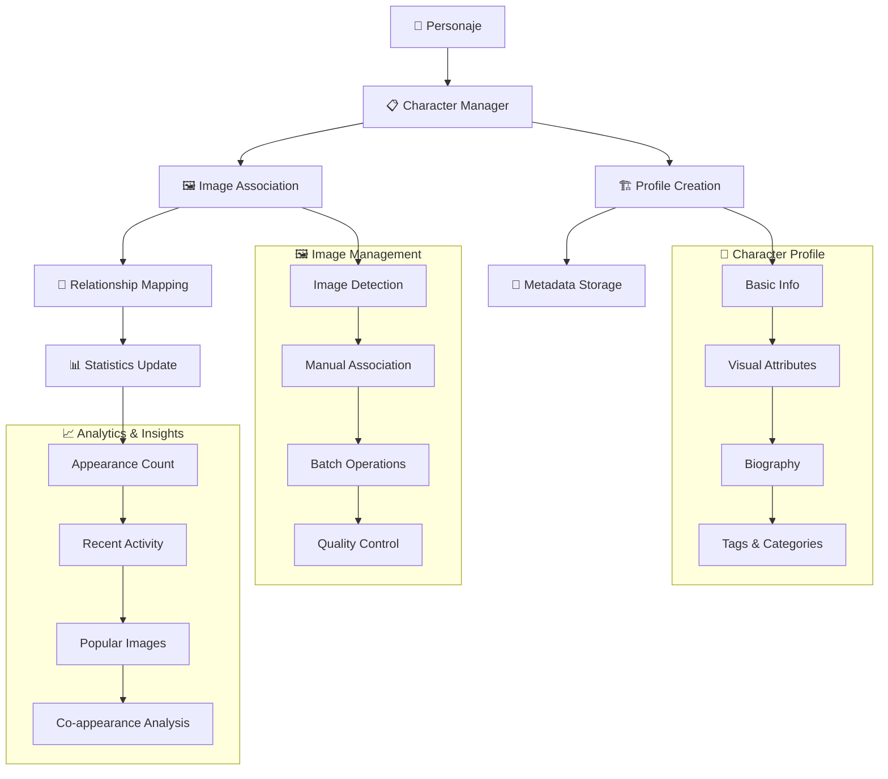

# 👤 Characters Actions

## 📄 Descripción

El módulo **Characters** gestiona personajes y entidades humanas identificables en el sistema de imágenes. Permite crear perfiles de personajes, asociar imágenes donde aparecen, y mantener información detallada sobre cada entidad, facilitando la organización y búsqueda de contenido basado en personas específicas.

### 🎯 Funcionalidades Principales

- **👤 Gestión de Perfiles**: Crear y mantener perfiles detallados de personajes
- **🖼️ Asociación de Imágenes**: Vincular imágenes donde aparece cada personaje
- **📊 Estadísticas**: Métricas de apariciones y actividad
- **🔍 Organización**: Categorización y etiquetado de personajes
- **📝 Metadatos**: Información adicional (biografía, relaciones, etc.)
- **🎨 Visualización**: Configuración visual para cada personaje

## 🌊 Flujo de Operaciones



## 📋 Server Actions Disponibles

### 🏗️ CRUD Básico (character.actions.ts)

#### `createCharacter(data: CreateCharacterData): Promise<CharacterResult>`

- **Descripción**: Crea un nuevo personaje en el sistema
- **Parámetros**: `data` - Información del personaje (name, description, attributes, etc.)
- **Retorna**: Personaje creado con ID generado
- **Características**:
  - Información básica (nombre, descripción, fecha de nacimiento)
  - Atributos físicos (altura, color de ojos, cabello, etc.)
  - Metadatos personalizados
  - Configuración visual inicial
- **Validaciones**: Verifica unicidad del nombre y validez de datos

#### `updateCharacter(id: string, data: UpdateCharacterData): Promise<CharacterResult>`

- **Descripción**: Actualiza información de un personaje existente
- **Parámetros**:
  - `id` - UUID del personaje
  - `data` - Datos a actualizar (parciales)
- **Retorna**: Personaje actualizado con cambios aplicados
- **Flexibilidad**: Permite actualización parcial de cualquier campo
- **Historial**: Mantiene registro de cambios importantes

#### `deleteCharacter(id: string, options?: DeleteCharacterOptions): Promise<void>`

- **Descripción**: Elimina un personaje del sistema
- **Parámetros**:
  - `id` - UUID del personaje
  - `options` - Configuraciones (preserveImages, transferTo, etc.)
- **Comportamiento**:
  - Por defecto mantiene las imágenes asociadas
  - Opción de transferir asociaciones a otro personaje
  - Eliminación suave con posibilidad de recuperación
- **Seguridad**: Confirmación requerida para personajes con muchas imágenes

#### `getCharacterById(id: string, includeStats?: boolean): Promise<CharacterResult>`

- **Descripción**: Obtiene información completa de un personaje
- **Parámetros**:
  - `id` - UUID del personaje
  - `includeStats` - Boolean para incluir estadísticas (opcional)
- **Retorna**: Personaje con toda su información y relaciones
- **Incluye**: Información básica, metadatos, configuración visual
- **Cache**: Utiliza cache para acceso optimizado

#### `getCharacters(options?: GetCharactersOptions): Promise<CharacterResult[]>`

- **Descripción**: Obtiene lista de personajes con filtros opcionales
- **Parámetros**: `options` - Filtros y configuraciones de consulta
- **Opciones de filtrado**:
  - Búsqueda por nombre
  - Filtros por categoría/tags
  - Ordenamiento (alfabético, por actividad, por número de imágenes)
  - Paginación
- **Retorna**: Array de personajes ordenados según criterios

### 🖼️ Gestión de Imágenes (character.actions.ts)

#### `addCharacterImage(characterId: string, imageId: string, metadata?: ImageCharacterMetadata): Promise<void>`

- **Descripción**: Asocia una imagen a un personaje
- **Parámetros**:
  - `characterId` - UUID del personaje
  - `imageId` - UUID de la imagen
  - `metadata` - Metadatos opcionales de la asociación
- **Metadatos de asociación**:
  - Rol en la imagen (principal, secundario, fondo)
  - Emociones expresadas
  - Contexto de la aparición
  - Calidad de la detección
- **Validaciones**: Verifica existencia de personaje e imagen

#### `removeCharacterImage(characterId: string, imageId: string): Promise<void>`

- **Descripción**: Desasocia una imagen de un personaje
- **Parámetros**:
  - `characterId` - UUID del personaje
  - `imageId` - UUID de la imagen
- **Comportamiento**: Solo elimina la asociación, no la imagen
- **Efectos**: Actualiza estadísticas del personaje

#### `getCharacterImages(characterId: string, options?: GetImagesOptions): Promise<CharacterImageResult[]>`

- **Descripción**: Obtiene todas las imágenes asociadas a un personaje
- **Parámetros**:
  - `characterId` - UUID del personaje
  - `options` - Opciones de paginación y ordenamiento
- **Retorna**: Array de imágenes con metadatos de asociación
- **Ordenamiento**: Por fecha, calidad, rol en la imagen
- **Paginación**: Soporte para personajes con muchas imágenes

### 📊 Estadísticas y Analytics (character.actions.ts)

#### `getCharacterStats(characterId: string): Promise<CharacterStats>`

- **Descripción**: Obtiene estadísticas detalladas de un personaje
- **Parámetros**: `characterId` - UUID del personaje
- **Retorna**: Objeto con métricas completas del personaje
- **Incluye**:
  - Total de imágenes asociadas
  - Distribución temporal (apariciones por mes/año)
  - Roles más frecuentes
  - Co-apariciones con otros personajes
  - Actividad reciente
  - Popularidad (vistas, descargas)
- **Cache**: Estadísticas cacheadas para rendimiento

## 🔗 Relaciones y Dependencias

### 📦 Servicios Utilizados

- **prisma**: ORM para persistencia de personajes y asociaciones
- **serverLogger**: Sistema de logging para operaciones
- **image.service**: Integración con sistema de imágenes
- **visual-config.service**: Configuración visual de personajes
- **analytics.service**: Cálculo de estadísticas y métricas
- **search.service**: Búsqueda y filtrado de personajes

### 🏗️ Tipos Principales

- **CharacterResult**: Tipo principal de personaje para respuestas
- **CreateCharacterData, UpdateCharacterData**: DTOs para operaciones CRUD
- **CharacterStats**: Estadísticas completas del personaje
- **CharacterImageResult**: Imagen con metadatos de asociación
- **ImageCharacterMetadata**: Metadatos de la relación imagen-personaje
- **GetCharactersOptions, GetImagesOptions**: Configuraciones de consulta

### 👤 Estructura de Personaje

```typescript
interface CharacterResult {
  id: string;
  name: string;
  description?: string;
  dateOfBirth?: Date;

  // Atributos físicos
  physicalAttributes: {
    height?: number;
    eyeColor?: string;
    hairColor?: string;
    build?: string;
    distinguishingMarks?: string[];
  };

  // Organización
  tags: string[];
  category?: string;

  // Metadatos
  biography?: string;
  occupation?: string;
  relationships?: Record<string, string>;

  // Sistema
  createdAt: Date;
  updatedAt: Date;
  isActive: boolean;

  // Estadísticas (opcional)
  stats?: {
    imageCount: number;
    lastSeen?: Date;
    popularityScore: number;
  };
}
```

## 💡 Ejemplos de Uso

### 🏗️ Crear y gestionar personajes

```typescript
import {
  createCharacter,
  updateCharacter,
  getCharacters
} from '@/app/actions/characters';

// Crear nuevo personaje
const newCharacter = await createCharacter({
  name: 'Ana García',
  description: 'Fotógrafa profesional y modelo',
  dateOfBirth: new Date('1995-03-15'),
  physicalAttributes: {
    height: 165,
    eyeColor: 'Verde',
    hairColor: 'Castaño',
    build: 'Atlética'
  },
  tags: ['modelo', 'fotógrafa', 'profesional'],
  category: 'Colaboradores',
  occupation: 'Fotógrafa'
});

// Actualizar información
const updated = await updateCharacter(newCharacter.id, {
  description: 'Fotógrafa profesional especializada en retratos',
  physicalAttributes: {
    ...newCharacter.physicalAttributes,
    distinguishingMarks: ['Tatuaje en muñeca izquierda']
  }
});

// Obtener personajes activos
const activeCharacters = await getCharacters({
  isActive: true,
  orderBy: 'name',
  includeStats: true
});
```

### 🖼️ Gestión de imágenes asociadas

```typescript
import {
  addCharacterImage,
  getCharacterImages,
  removeCharacterImage
} from '@/app/actions/characters';

// Asociar imagen a personaje con metadatos
await addCharacterImage('character-uuid', 'image-uuid', {
  role: 'principal',
  emotions: ['sonriente', 'confiado'],
  context: 'Sesión de retratos profesional',
  detectionQuality: 0.95
});

// Obtener imágenes del personaje ordenadas por calidad
const characterImages = await getCharacterImages('character-uuid', {
  orderBy: 'detectionQuality',
  order: 'desc',
  limit: 20
});

console.log(`Personaje aparece en ${characterImages.length} imágenes`);

// Remover asociación específica
await removeCharacterImage('character-uuid', 'image-uuid');
```

### 📊 Análisis y estadísticas

```typescript
import { getCharacterStats, getCharacterById } from '@/app/actions/characters';

// Obtener estadísticas completas
const stats = await getCharacterStats('character-uuid');

console.log(`Estadísticas del personaje:
- Total imágenes: ${stats.imageCount}
- Última aparición: ${stats.lastSeen}
- Popularidad: ${stats.popularityScore}
- Rol principal: ${stats.roleDistribution.principal || 0} veces
- Co-apariciones: ${Object.keys(stats.coAppearances).length} personajes
`);

// Obtener personaje con estadísticas incluidas
const characterWithStats = await getCharacterById('character-uuid', true);
if (characterWithStats.stats) {
  console.log(`${characterWithStats.name} aparece en ${characterWithStats.stats.imageCount} imágenes`);
}
```

### 🔍 Búsqueda y filtrado avanzado

```typescript
import { getCharacters } from '@/app/actions/characters';

// Buscar modelos profesionales
const professionalModels = await getCharacters({
  search: 'modelo',
  category: 'Profesionales',
  tags: ['modelo'],
  orderBy: 'imageCount',
  order: 'desc'
});

// Obtener personajes más activos del último mes
const recentlyActive = await getCharacters({
  lastSeenAfter: new Date(Date.now() - 30 * 24 * 60 * 60 * 1000), // 30 días
  orderBy: 'lastSeen',
  order: 'desc',
  limit: 10
});

// Personajes con muchas apariciones
const popularCharacters = await getCharacters({
  minImageCount: 50,
  orderBy: 'popularityScore',
  order: 'desc'
});
```

## 🧪 Testing

Los tests para este módulo cubren:

- ✅ Operaciones CRUD completas de personajes
- ✅ Asociación y desasociación de imágenes
- ✅ Cálculo de estadísticas complejas
- ✅ Búsqueda y filtrado avanzado
- ✅ Validación de datos y metadatos
- ✅ Manejo de relaciones y dependencias
- ✅ Performance con grandes volúmenes de datos
- ✅ Integridad referencial

## ⚠️ Consideraciones Importantes

### 🔒 Privacidad y Ética

- **Consent Management**: Sistema de consentimiento para uso de imágenes
- **Privacy Protection**: Protección de información personal sensible
- **Data Minimization**: Almacenamiento mínimo necesario de datos personales
- **Access Control**: Control de acceso basado en permisos

### 🚀 Rendimiento

- **Image Association**: Operaciones optimizadas para grandes volúmenes
- **Statistics Caching**: Cache inteligente de estadísticas complejas
- **Query Optimization**: Consultas optimizadas con índices apropiados
- **Lazy Loading**: Carga bajo demanda de información detallada

### 📊 Precisión

- **Data Quality**: Validación de calidad en asociaciones
- **Duplicate Detection**: Detección de personajes duplicados
- **Relationship Mapping**: Mapeo preciso de relaciones entre personajes
- **Quality Metrics**: Métricas de calidad de detección y asociación

### 🔄 Escalabilidad

- **Bulk Operations**: Operaciones en lote para eficiencia
- **Archive Management**: Gestión de personajes inactivos o archivados
- **Data Migration**: Herramientas para migración y consolidación
- **Performance Monitoring**: Monitoreo de rendimiento en operaciones

## Funciones disponibles

