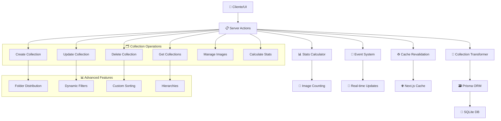

# 🗂️ Collections Actions

## 📄 Descripción

El módulo **Collections** gestiona las colecciones de contenido multimedia avanzadas del sistema. Las colecciones son agrupaciones sofisticadas de imágenes, videos, álbumes y otros elementos que permiten organizar el contenido de forma temática, temporal o basada en criterios específicos del usuario.

A diferencia de los álbumes simples, las colecciones ofrecen **funcionalidades avanzadas**: filtros dinámicos, ordenación personalizada, estadísticas detalladas, jerarquías padre-hijo, compartición con grupos y configuración de visualización flexible. Son ideales para proyectos complejos, portfolios profesionales y organización empresarial.

## 🌊 Flujo de Operaciones



## 📋 Server Actions Disponibles

### 🏗️ CRUD Básico (collection.actions.ts)

#### `getCollections(): Promise<CollectionWithStats[]>`

- **Descripción**: Obtiene todas las colecciones con estadísticas detalladas y distribución por carpetas
- **Retorna**: Array de colecciones con conteos, tamaños y estadísticas
- **Incluye**:
  - Conteo de imágenes, grupos, propiedades y wildcards
  - Tamaño total calculado
  - Distribución por carpetas (top 5)
  - Última actualización
- **Ordenación**: Por cantidad de imágenes (desc) y nombre (asc)
- **Ejemplo**:

```typescript
const collections = await getCollections();
collections.forEach(collection => {
  console.log(`${collection.name}: ${collection._count.images} imágenes`);
  console.log(`Tamaño total: ${collection.totalSize} bytes`);
  console.log(`Carpetas: ${collection.distribution?.map(d => d.name).join(', ')}`);
});
```

#### `getCollection(id: string): Promise<CollectionExtended>`

- **Descripción**: Obtiene una colección específica con propiedades extendidas
- **Parámetros**: `id` - UUID de la colección
- **Retorna**: Colección completa con conteos y propiedades UI
- **Transformaciones**: Aplica deserialización de campos JSON y extensiones
- **Ejemplo**:

```typescript
const collection = await getCollection("collection-123");
// CollectionExtended con _count, propiedades UI, etc.
```

#### `createCollection(data: CreateCollectionData): Promise<CollectionExtended>`

- **Descripción**: Crea una nueva colección con validación completa
- **Parámetros**: `data` - Datos de la colección (name, category, filters, etc.)
- **Retorna**: Colección creada con conteos y transformaciones
- **Efectos secundarios**:
  - Revalida rutas de Next.js cache
  - Emite evento `collections:modified`
  - Actualiza estadísticas del sistema
- **Ejemplo**:

```typescript
const newCollection = await createCollection({
  name: "Fotografía Urbana 2024",
  category: "PHOTOGRAPHY",
  description: "Colección de fotografías urbanas...",
  emoji: "🏙️",
  color: "#3b82f6",
  filters: [
    { field: "tags", operator: "contains", value: "urban" },
    { field: "year", operator: "equals", value: "2024" }
  ]
});
```

#### `updateCollection(id: string, data: UpdateCollectionData): Promise<CollectionExtended>`

- **Descripción**: Actualiza una colección existente
- **Parámetros**:
  - `id` - UUID de la colección
  - `data` - Datos a actualizar (parciales)
- **Retorna**: Colección actualizada con transformaciones
- **Validaciones**: Verifica existencia antes de actualizar
- **Ejemplo**:

```typescript
const updatedCollection = await updateCollection("collection-123", {
  description: "Descripción actualizada...",
  filters: [...newFilters],
  isFavorite: true
});
```

#### `deleteCollection(id: string): Promise<void>`

- **Descripción**: Elimina una colección del sistema
- **Parámetros**: `id` - UUID de la colección a eliminar
- **Validaciones**: Verifica existencia antes de eliminar
- **Efectos**: Revalida cache y notifica cambios
- **Ejemplo**:

```typescript
await deleteCollection("collection-123");
```

### 🖼️ Gestión de Imágenes (collection.actions.ts)

#### `getCollectionImages(id: string): Promise<FileItem[]>`

- **Descripción**: Obtiene todas las imágenes de una colección en formato FileItem
- **Parámetros**: `id` - UUID de la colección
- **Retorna**: Array de imágenes como FileItem con metadatos completos
- **Incluye**: Tags, colecciones relacionadas, información de carpeta
- **Ordenación**: Por favoritos (desc) y fecha de creación (desc)
- **Ejemplo**:

```typescript
const images = await getCollectionImages("collection-123");
images.forEach(image => {
  console.log(`${image.name} - Tags: ${image.tags?.join(', ')}`);
});
```

#### `addImageToCollection(collectionId: string, imageId: string): Promise<void>`

- **Descripción**: Asocia una imagen a una colección específica
- **Parámetros**:
  - `collectionId` - UUID de la colección
  - `imageId` - UUID de la imagen
- **Validaciones**: Verifica existencia de ambas entidades
- **Operación**: Usa Prisma connect para crear la relación
- **Ejemplo**:

```typescript
await addImageToCollection("collection-123", "image-456");
```

#### `removeImageFromCollection(collectionId: string, imageId: string): Promise<void>`

- **Descripción**: Desasocia una imagen de una colección
- **Parámetros**:
  - `collectionId` - UUID de la colección
  - `imageId` - UUID de la imagen
- **Operación**: Usa Prisma disconnect para eliminar la relación
- **Efecto**: La imagen permanece en el sistema, solo se elimina la asociación

#### `addCollectionToImage(collectionId: string, imageId: string): Promise<void>`

- **Descripción**: Asocia una colección a una imagen (operación inversa)
- **Parámetros**:
  - `collectionId` - UUID de la colección
  - `imageId` - UUID de la imagen
- **Uso**: Alternativa para establecer la relación desde la perspectiva de la imagen

#### `removeCollectionFromImage(collectionId: string, imageId: string): Promise<void>`

- **Descripción**: Desasocia una colección de una imagen
- **Operación**: Elimina la relación desde la entidad imagen

## 🔗 Relaciones y Dependencias

### 📦 Servicios Utilizados

- **Collection Transformer**: Transformación y validación de datos
- **Prisma ORM**: Acceso a base de datos con relaciones complejas
- **Image Converter Service**: Conversión de ServerImage a FileItem
- **Event System**: Notificaciones de cambios en tiempo real
- **Stats Service**: Cálculo de estadísticas y distribuciones

### 🔄 Transformers

- **mapCreateCollectionDataToPrisma**: Mapeo de datos de creación
- **mapUpdateCollectionDataToPrisma**: Mapeo de datos de actualización
- **fromPrismaCollection**: Deserialización de Prisma a objeto completo
- **transformCollectionToExtended**: Extensión con propiedades UI

### 🏗️ Tipos Principales

- **CollectionBase**: Estructura base desde Prisma
- **CollectionExtended**: Colección con propiedades UI adicionales
- **CollectionWithStats**: Colección con estadísticas calculadas
- **CreateCollectionData, UpdateCollectionData**: DTOs para operaciones
- **CollectionFilter**: Filtros dinámicos aplicables

### 🗂️ Estructura de Colección

```typescript
interface CollectionWithStats {
  id: string;
  name: string;
  emoji: string;
  color: string;
  description: string | null;
  category: string | null;

  // Filtros y configuración
  filters: CollectionFilter[]; // Deserializados
  sortBy: any; // Criterio de ordenación

  // Estadísticas calculadas
  _count: {
    images: number;
    groups: number;
    properties: number;
    wildcards: number;
  };
  totalSize: number; // Tamaño total en bytes
  lastUpdated: Date;

  // Distribución por carpetas (top 5)
  distribution: Array<{
    name: string;
    count: number;
  }>;

  // Propiedades adicionales
  isFavorite: boolean;
  createdAt: Date;
  updatedAt: Date;
}
```

### 🔍 Tipos de Filtros

```typescript
interface CollectionFilter {
  field: string; // Campo a filtrar
  operator: 'equals' | 'contains' | 'startsWith' | 'gt' | 'lt';
  value: any; // Valor del filtro
  logic?: 'AND' | 'OR'; // Lógica de combinación
}
```

## 💡 Ejemplos de Uso

### Crear Colección Avanzada con Filtros

```typescript
// 1. Crear colección con filtros dinámicos
const photographyCollection = await createCollection({
  name: "Fotografía de Naturaleza",
  category: "PHOTOGRAPHY",
  description: "Colección automática de fotografías de naturaleza",
  emoji: "🌿",
  color: "#059669",
  filters: [
    {
      field: "tags",
      operator: "contains",
      value: "nature",
      logic: "AND"
    },
    {
      field: "metadata.camera.iso",
      operator: "lt",
      value: 800,
      logic: "AND"
    }
  ],
  sortBy: {
    field: "metadata.takenAt",
    direction: "desc"
  }
});

// 2. Obtener estadísticas de la colección
const stats = await getCollections();
const myCollection = stats.find(c => c.id === photographyCollection.id);
console.log(`Distribución: ${myCollection?.distribution?.map(d =>
  `${d.name} (${d.count})`
).join(', ')}`);
```

### Gestión de Imágenes en Colecciones

```typescript
// Obtener imágenes de la colección
const images = await getCollectionImages(collectionId);

// Añadir nuevas imágenes
const newImageIds = ["img-1", "img-2", "img-3"];
for (const imageId of newImageIds) {
  await addImageToCollection(collectionId, imageId);
}

// Verificar el nuevo conteo
const updatedCollection = await getCollection(collectionId);
console.log(`Ahora tiene ${updatedCollection._count.images} imágenes`);
```

### Jerarquías y Organización

```typescript
// Crear colección padre
const parentCollection = await createCollection({
  name: "Proyecto 2024",
  category: "PROJECT",
  description: "Colección principal del proyecto"
});

// Crear colecciones hijas
const childCollection = await createCollection({
  name: "Fase 1",
  parentId: parentCollection.id,
  description: "Primera fase del proyecto"
});

// Actualizar con más metadatos
await updateCollection(parentCollection.id, {
  metadata: {
    projectManager: "Juan Pérez",
    deadline: "2024-12-31",
    budget: 50000
  }
});
```

## 🧪 Testing

Los tests para este módulo cubren:

- ✅ **Operaciones CRUD completas** con validación de transformers
- ✅ **Cálculo de estadísticas** y distribuciones por carpetas
- ✅ **Gestión de relaciones** con imágenes y otras entidades
- ✅ **Filtros dinámicos** y ordenación personalizada
- ✅ **Jerarquías padre-hijo** y herencia de configuración
- ✅ **Validación de datos** y manejo de errores
- ✅ **Revalidación de cache** y eventos del sistema

### Casos de Test Específicos

```typescript
describe('Collections Actions', () => {
  test('should create collection with filters', async () => {
    const collection = await createCollection({
      name: 'Test Collection',
      filters: [{ field: 'tags', operator: 'contains', value: 'test' }]
    });
    expect(collection.filters).toBeInstanceOf(Array);
    expect(collection._count).toBeDefined();
  });

  test('should calculate distribution correctly', async () => {
    const collections = await getCollections();
    const collection = collections[0];
    expect(collection.distribution).toBeInstanceOf(Array);
    expect(collection.totalSize).toBeGreaterThanOrEqual(0);
  });
});
```

## ⚠️ Consideraciones Importantes

### 🚀 Rendimiento

- **Cálculo de estadísticas**: Las estadísticas se calculan en tiempo real, considere cachear para colecciones grandes
- **Distribución por carpetas**: Limitada a top 5 carpetas para evitar sobrecarga
- **Paginación**: Implementar paginación para listas de imágenes grandes
- **Índices de base de datos**: Asegurar índices en campos de filtrado frecuente

### 🔧 Filtros Dinámicos

- **Validación de campos**: Verificar que los campos de filtro existan en el schema
- **Rendimiento de queries**: Filtros complejos pueden impactar el rendimiento
- **Serialización**: Los filtros se serializan como JSON en la base de datos
- **Versionado**: Considerar compatibilidad al cambiar estructura de filtros

### 📊 Estadísticas y Análisis

- **Cálculos costosos**: Tamaño total y distribuciones requieren agregaciones complejas
- **Actualizaciones**: Las estadísticas pueden desactualizarse, implementar revalidación
- **Precisión**: Los conteos pueden ser aproximados en sistemas de alta concurrencia
- **Historial**: Considerar almacenar snapshots históricos de estadísticas

### 🎨 Experiencia de Usuario

- **Carga progresiva**: Mostrar estadísticas básicas primero, cargar detalles después
- **Feedback visual**: Indicar cuando las estadísticas están calculándose
- **Configuración flexible**: Permitir personalizar qué estadísticas mostrar
- **Exportación**: Facilitar exportación de colecciones y sus datos

### 📈 Escalabilidad

- **Colecciones grandes**: Implementar paginación y carga lazy
- **Jerarquías profundas**: Limitar niveles de anidación para evitar problemas
- **Compartición**: Sistema de permisos granular para colecciones compartidas
- **Migración**: Plan para cambios en estructura de metadatos y filtros

---

## 📚 Recursos Adicionales

- **[Transformer Documentation](../../../transformers/collection/README.md)**: Detalles técnicos de transformación
- **[Types Reference](../../../types/entities/collection/)**: Definiciones de tipos completas
- **[Service Layer](../../../services/collection/)**: Lógica de negocio del servicio
- **[Store Implementation](../../../store/entities/collection/)**: Gestión de estado cliente
