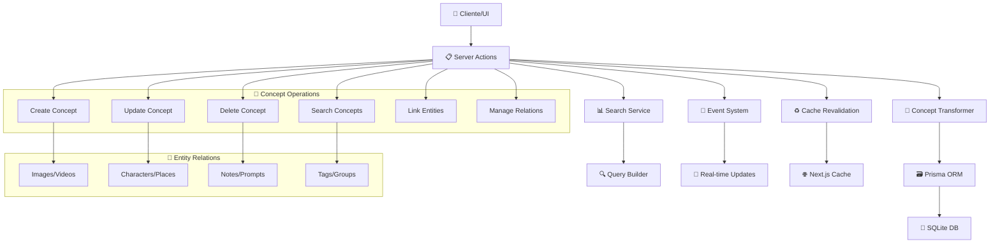

# MIGRACIÓN SERVER ACTIONS → API CALLS

## Estado de migración

- Todas las server actions de conceptos han sido migradas a llamadas API centralizadas en `src/lib/api/services/concepts.ts`.
- Los stores y hooks relevantes ya consumen el servicio API y no dependen de server actions.
- Los archivos de server actions (`concept.actions.ts`, `index.ts`) quedan como stubs temporales y pueden eliminarse tras limpieza de imports legacy.

## Checklist de migración

- [x] Migrar store de conceptos a API calls
- [x] Eliminar imports y dependencias de server actions
- [x] Marcar archivos legacy como obsoletos
- [x] Documentar el proceso

## Notas

- Si encuentras algún import de server actions, debe ser reemplazado por el servicio API correspondiente.
- El patrón a seguir para otras entidades es idéntico: priorizar `src/lib/api/services/*` y limpiar server actions.

---

_Última actualización: 2025-07-03_

# 💭 Concepts Actions

## 📄 Descripción

El módulo **Concepts** gestiona las ideas, conceptos y nociones abstractas del sistema. Los conceptos son entidades que representan conocimiento organizado y permiten establecer conexiones temáticas profundas entre diferentes elementos del sistema. A diferencia de las etiquetas simples, los conceptos contienen contenido detallado, descripciones extensas y pueden relacionarse con cualquier otra entidad del proyecto.

Los conceptos sirven como núcleo del **sistema de relaciones semánticas**, permitiendo crear mapas de conocimiento que conectan imágenes, personajes, lugares, objetos del mundo y otros elementos a través de ideas compartidas.

## 🌊 Flujo de Operaciones



## 📋 Server Actions Disponibles

### 🏗️ CRUD Básico (concept.actions.ts)

#### `createConcept(data: ConceptCreateInput): Promise<ConceptComplete>`

- **Descripción**: Crea un nuevo concepto en el sistema con validación completa
- **Parámetros**: `data` - Datos del concepto (name, content, category, etc.)
- **Retorna**: Concepto creado con metadatos completos
- **Efectos secundarios**:
  - Revalida rutas de Next.js cache
  - Emite evento `concepts:modified`
  - Actualiza estadísticas del sistema
- **Validaciones**: Schema Zod y transformer validation
- **Ejemplo**:

```typescript
const newConcept = await createConcept({
  name: "Realidad Alterada",
  content: "Concepto que describe...",
  category: "Fenómeno",
  tags: ["sci-fi", "metaphysics"],
  emoji: "🌀",
  color: "#6366f1"
});
```

#### `updateConcept(id: string, data: ConceptUpdateInput): Promise<ConceptComplete>`

- **Descripción**: Actualiza un concepto existente
- **Parámetros**:
  - `id` - UUID del concepto
  - `data` - Datos a actualizar (parciales)
- **Retorna**: Concepto actualizado con estadísticas
- **Validaciones**: Verifica existencia antes de actualizar
- **Ejemplo**:

```typescript
const updatedConcept = await updateConcept("concept-123", {
  content: "Contenido actualizado...",
  isFavorite: true
});
```

#### `deleteConcept(id: string): Promise<{ success: boolean }>`

- **Descripción**: Elimina un concepto y sus relaciones
- **Parámetros**: `id` - UUID del concepto a eliminar
- **Retorna**: Confirmación de eliminación
- **Operaciones**: Desconecta todas las relaciones antes de eliminar
- **Ejemplo**:

```typescript
const result = await deleteConcept("concept-123");
// { success: true }
```

#### `getConceptById(id: string): Promise<ConceptComplete | null>`

- **Descripción**: Obtiene un concepto específico con estadísticas
- **Parámetros**: `id` - UUID del concepto
- **Retorna**: Concepto completo o null si no existe
- **Incluye**: Conteos de relaciones y propiedades UI
- **Ejemplo**:

```typescript
const concept = await getConceptById("concept-123");
// ConceptComplete con _count, _ui, etc.
```

### 🔍 Búsqueda y Consultas (concept.actions.ts)

#### `searchConcepts(options?: ConceptSearchOptions): Promise<ConceptSearchResult>`

- **Descripción**: Búsqueda avanzada de conceptos con filtros
- **Parámetros**: `options` - Opciones de búsqueda y filtrado
- **Retorna**: Resultado paginado con total y elementos
- **Filtros**: Por categoría, texto, tags, favoritos
- **Ejemplo**:

```typescript
const results = await searchConcepts({
  filters: {
    category: "Fenómeno",
    search: "realidad",
    onlyFavorites: true
  },
  page: 1,
  pageSize: 20,
  includeStats: true
});
```

#### `getConcepts(options?: ConceptSearchOptions): Promise<ConceptSearchResult>`

- **Descripción**: Alias simplificado para obtener todos los conceptos
- **Parámetros**: `options` - Opciones básicas de búsqueda
- **Retorna**: Lista completa de conceptos (redirige a searchConcepts)
- **Uso**: Para casos simples sin filtros complejos

### 🖼️ Gestión de Imágenes (concept-images.actions.ts)

#### `addConceptImage(conceptId: string, imageId: string): Promise<ConceptComplete>`

- **Descripción**: Asocia una imagen a un concepto específico
- **Parámetros**:
  - `conceptId` - UUID del concepto
  - `imageId` - UUID de la imagen
- **Retorna**: Concepto actualizado con la nueva imagen
- **Validaciones**: Verifica existencia de ambas entidades
- **Ejemplo**:

```typescript
const conceptWithImage = await addConceptImage(
  "concept-123",
  "image-456"
);
```

#### `removeConceptImage(conceptId: string, imageId: string): Promise<ConceptComplete>`

- **Descripción**: Desasocia una imagen de un concepto
- **Parámetros**:
  - `conceptId` - UUID del concepto
  - `imageId` - UUID de la imagen
- **Retorna**: Concepto actualizado sin la imagen
- **Operación**: Desconexión de relación sin eliminar entidades

#### `getConceptImages(conceptId: string): Promise<{ images: any[] }>`

- **Descripción**: Obtiene todas las imágenes asociadas a un concepto
- **Parámetros**: `conceptId` - UUID del concepto
- **Retorna**: Array de imágenes relacionadas
- **Estado**: Función stub, requiere implementación completa

### 🗑️ Eliminación Avanzada (concept-delete.actions.ts)

#### `deleteConcept(id: string): Promise<{ id: string }>`

- **Descripción**: Eliminación segura con desconexión de relaciones
- **Parámetros**: `id` - UUID del concepto a eliminar
- **Retorna**: ID del concepto eliminado
- **Proceso**:
  1. Verifica existencia del concepto
  2. Desconecta de todas las entidades relacionadas
  3. Elimina el concepto en transacción
  4. Notifica cambios y revalida cache
- **Relaciones desconectadas**:
  - Prompts, Notes, Characters, Places
  - WorldItems, Images, Groups, Properties
  - Tags y Wildcards

## 🔗 Relaciones y Dependencias

### 📦 Servicios Utilizados

- **Concept Transformer**: Transformación y validación de datos
- **Prisma ORM**: Acceso a base de datos con relaciones
- **Event System**: Notificaciones de cambios en tiempo real
- **Stats Service**: Actualización de estadísticas del sistema
- **Cache Service**: Revalidación de Next.js cache

### 🔄 Transformers

- **searchConceptsTransformer**: Búsqueda con filtros avanzados
- **createConceptTransformer**: Creación con validación
- **updateConceptTransformer**: Actualización con validación
- **getConceptByIdTransformer**: Recuperación con estadísticas
- **deleteConceptTransformer**: Eliminación segura

### 🏗️ Tipos Principales

- **ConceptBase**: Estructura base del concepto
- **ConceptComplete**: Concepto con relaciones y estadísticas
- **ConceptCreateInput, ConceptUpdateInput**: DTOs para operaciones
- **ConceptSearchOptions, ConceptSearchResult**: Tipos para búsqueda
- **ConceptExtended**: Concepto con propiedades UI adicionales

### 💭 Estructura de Concepto

```typescript
interface ConceptComplete {
  id: string;
  name: string;
  emoji: string;
  color: string;
  description: string | null;
  content: string; // Contenido detallado
  category: string;
  tags: string[]; // Tags deserializados
  featuredImage: string | null;
  isFavorite: boolean;
  createdAt: Date;
  updatedAt: Date;

  // Estadísticas de relaciones
  _count?: {
    images: number;
    videos: number;
    characters: number;
    places: number;
    notes: number;
    prompts: number;
    // ... otros conteos
  };

  // Propiedades UI
  _ui?: {
    previewContent: string;
    lastUpdated: Date;
  };
}
```

## 💡 Ejemplos de Uso

### Crear Sistema de Conocimiento

```typescript
// 1. Crear concepto principal
const mainConcept = await createConcept({
  name: "Viaje Interdimensional",
  content: "Concepto que describe el fenómeno de...",
  category: "Fenómeno",
  tags: ["sci-fi", "metaphysics", "quantum"],
  emoji: "🌌",
  color: "#8b5cf6"
});

// 2. Buscar conceptos relacionados
const relatedConcepts = await searchConcepts({
  filters: {
    category: "Fenómeno",
    tags: ["quantum"]
  },
  includeStats: true
});

// 3. Asociar con imagen
await addConceptImage(mainConcept.id, "dimensional-gate-image-id");
```

### Gestión de Relaciones Semánticas

```typescript
// Buscar conceptos por texto
const searchResults = await searchConcepts({
  filters: {
    search: "tiempo",
    onlyFavorites: false
  },
  page: 1,
  pageSize: 10
});

// Actualizar concepto con nuevas relaciones
const updatedConcept = await updateConcept(conceptId, {
  content: "Contenido expandido con nueva información...",
  tags: ["tiempo", "causalidad", "paradoja"]
});
```

### Análisis de Conceptos

```typescript
// Obtener concepto con estadísticas completas
const conceptWithStats = await getConceptById(conceptId);

// Analizar relaciones
const totalRelations =
  conceptWithStats._count?.images +
  conceptWithStats._count?.characters +
  conceptWithStats._count?.places;

console.log(`Concepto con ${totalRelations} relaciones`);
```

## 🧪 Testing

Los tests para este módulo cubren:

- ✅ **Operaciones CRUD completas** con validación de datos
- ✅ **Búsqueda avanzada** con múltiples filtros
- ✅ **Gestión de relaciones** con otras entidades
- ✅ **Validación de esquemas** Zod y transformers
- ✅ **Manejo de errores** y casos edge
- ✅ **Revalidación de cache** y eventos
- ✅ **Eliminación segura** con desconexión de relaciones

### Casos de Test Específicos

```typescript
describe('Concepts Actions', () => {
  test('should create concept with valid data', async () => {
    const concept = await createConcept(validConceptData);
    expect(concept.id).toBeDefined();
    expect(concept.tags).toBeInstanceOf(Array);
  });

  test('should search concepts with filters', async () => {
    const results = await searchConcepts({
      filters: { category: "Test" }
    });
    expect(results.items).toBeInstanceOf(Array);
  });
});
```

## ⚠️ Consideraciones Importantes

### 🔗 Relaciones Complejas

- **Integridad referencial**: Verificar existencia de entidades antes de crear relaciones
- **Transacciones**: Usar transacciones Prisma para operaciones complejas
- **Desconexión limpia**: Eliminar todas las relaciones antes de eliminar conceptos
- **Consistencia**: Mantener coherencia entre conceptos relacionados

### 🚀 Rendimiento

- **Búsqueda optimizada**: Indices en campos de búsqueda frecuente
- **Paginación**: Implementar paginación para listas grandes
- **Cache estratégico**: Cachear conceptos frecuentemente accedidos
- **Lazy loading**: Cargar relaciones solo cuando sea necesario

### 📊 Contenido Semántico

- **Validación de contenido**: Asegurar calidad del contenido
- **Categorización consistente**: Mantener taxonomía coherente
- **Tags normalizados**: Evitar duplicación de tags similares
- **Versionado**: Considerar historial de cambios para conceptos importantes

### 🎨 Experiencia de Usuario

- **Búsqueda intuitiva**: Implementar autocompletado y sugerencias
- **Visualización de relaciones**: Mostrar conexiones entre conceptos
- **Favoritos útiles**: Sistema de favoritos para acceso rápido
- **Previsualización**: Mostrar contenido truncado en listas

### 📈 Escalabilidad

- **Índices de búsqueda**: Optimizar consultas de texto completo
- **Archivado**: Sistema para conceptos obsoletos
- **Migración de datos**: Plan para cambios de estructura
- **Backup semántico**: Respaldo del grafo de conocimiento

---

## 📚 Recursos Adicionales

- **[Transformer Documentation](../../../transformers/concept/documentation.md)**: Detalles técnicos de transformación
- **[Types Reference](../../../types/entities/concept/)**: Definiciones de tipos completas
- **[Service Layer](../../../services/concept.service.ts)**: Lógica de negocio del servicio
- **[Store Implementation](../../../store/entities/concept/)**: Gestión de estado cliente

## Funciones disponibles
