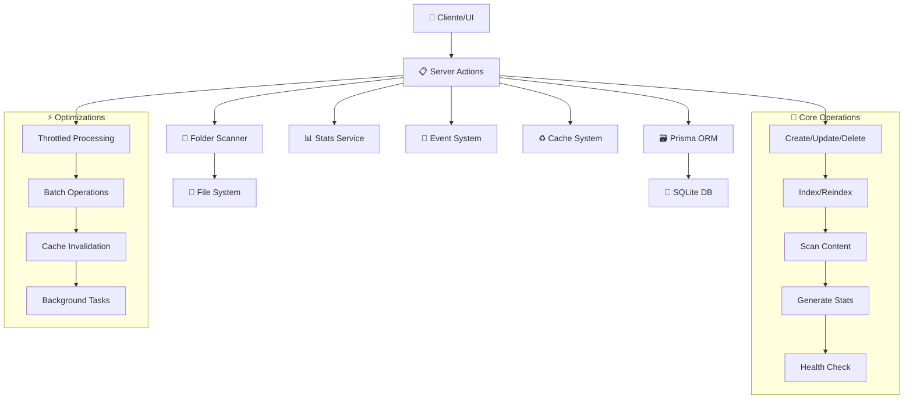
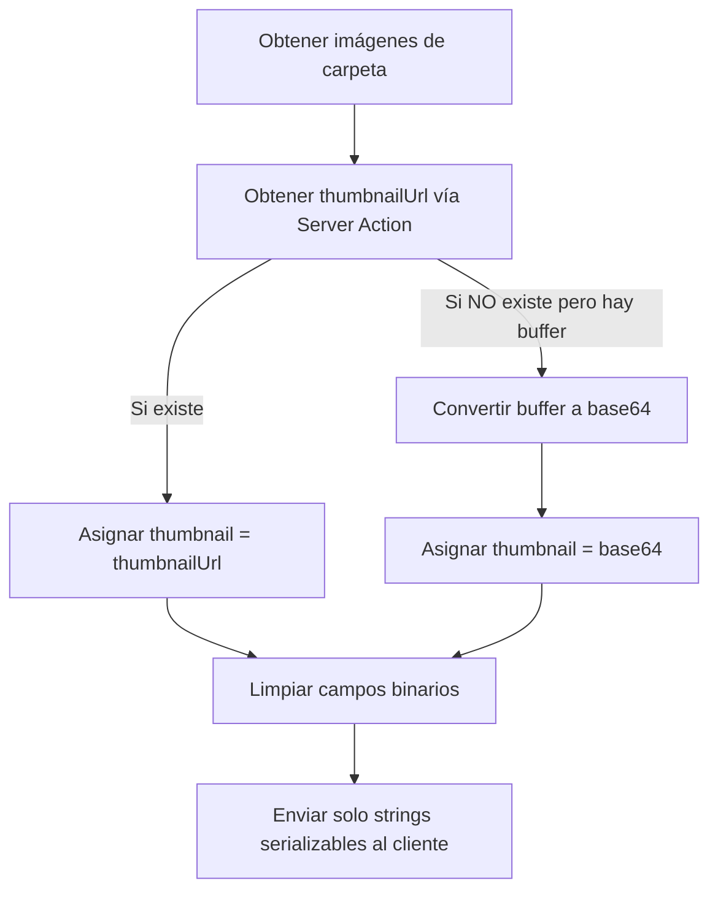

# 📁 Folders Actions

## 📄 Descripción

El módulo **Folders** es el núcleo del sistema Image Manager, responsable de gestionar carpetas del sistema de archivos, indexar contenido multimedia, y mantener sincronizada la base de datos con la estructura de archivos física. Es el punto de entrada principal para la organización y procesamiento de imágenes.

### 🎯 Funcionalidades Principales

- **🗂️ Gestión CRUD**: Crear, leer, actualizar y eliminar carpetas
- **🔍 Indexación**: Escaneo automático y manual de contenido
- **📊 Diagnósticos**: Análisis de salud y consistencia
- **📈 Estadísticas**: Métricas de almacenamiento y contenido
- **🔄 Sincronización**: Mantener BD sincronizada con filesystem
- **⚡ Optimización**: Procesamiento throttled y por lotes

## 🌊 Flujo de Operaciones



## 📋 Server Actions Disponibles

### 🏗️ CRUD Básico (crud.actions.ts)

#### `createFolder(path: string, options?: CreateFolderOptions): Promise<FolderComplete>`

- **Descripción**: Crea una nueva carpeta en la base de datos
- **Parámetros**:
  - `path` - Ruta física de la carpeta en el sistema
  - `options` - Configuraciones adicionales (autoIndex, description, etc.)
- **Retorna**: Carpeta creada con relaciones completas
- **Validaciones**: Verifica existencia física y unicidad
- **Efectos**: Revalida cache y rutas de Next.js

#### `updateFolder(id: string, data: UpdateFolderOptions): Promise<FolderComplete>`

- **Descripción**: Actualiza metadatos de una carpeta existente
- **Parámetros**:
  - `id` - UUID de la carpeta
  - `data` - Datos a actualizar (name, description, autoReindex, etc.)
- **Retorna**: Carpeta actualizada
- **Validaciones**: Verifica existencia antes de actualizar

#### `deleteFolder(id: string): Promise<void>`

- **Descripción**: Elimina una carpeta del sistema
- **Parámetros**: `id` - UUID de la carpeta
- **Comportamiento**: Eliminación en cascada de imágenes y relaciones
- **Seguridad**: Solo elimina registro de BD, no archivos físicos

#### `updateFolderAutoReindex(id: string, autoReindex: boolean): Promise<FolderComplete>`

- **Descripción**: Actualiza la configuración de reindexado automático
- **Parámetros**:
  - `id` - UUID de la carpeta
  - `autoReindex` - Boolean para habilitar/deshabilitar auto-reindex
- **Uso**: Para controlar qué carpetas se procesan automáticamente

### 🔍 Consultas y Búsqueda (get.actions.ts, query.actions.ts)

#### `getFolders(): Promise<FolderExtended[]>`

- **Descripción**: Obtiene todas las carpetas con relaciones básicas
- **Retorna**: Array de carpetas con conteos e información extendida
- **Optimización**: Include selectivo para evitar over-fetching

#### `getFolderById(id: string): Promise<FolderExtended>`

- **Descripción**: Obtiene una carpeta específica por ID
- **Parámetros**: `id` - UUID de la carpeta
- **Retorna**: Carpeta con relaciones completas
- **Cache**: Utiliza sistema de cache para mejor rendimiento

#### `getFoldersWithFilter(filter: FilterOptions): Promise<FolderExtended[]>`

- **Descripción**: Obtiene carpetas aplicando filtros específicos
- **Parámetros**: `filter` - Criterios de filtrado (status, type, etc.)
- **Retorna**: Array filtrado de carpetas
- **Uso**: Para vistas especializadas y búsquedas

#### `searchFolders(query: string): Promise<FolderExtended[]>`

- **Descripción**: Búsqueda textual en carpetas
- **Parámetros**: `query` - Término de búsqueda
- **Retorna**: Carpetas que coinciden con la búsqueda
- **Alcance**: Busca en name, description y path

#### `getFolderTree(): Promise<FolderTreeNode[]>`

- **Descripción**: Obtiene estructura jerárquica de carpetas
- **Retorna**: Árbol de carpetas para navegación
- **Estructura**: Nodos con children y metadata
- **Uso**: Para componentes de navegación tipo tree-view

### ⚡ Procesamiento e Indexación (process.actions.ts)

#### `indexFolder(folderId: string, options?: IndexOptions): Promise<FolderScanResult>`

- **Descripción**: Indexa contenido de una carpeta específica
- **Parámetros**:
  - `folderId` - UUID de la carpeta a indexar
  - `options` - Configuraciones de indexado (force, includeSubdirs, etc.)
- **Retorna**: Resultado del escaneo con estadísticas
- **Proceso**: Escanea archivos, extrae metadatos, actualiza BD

#### `indexFolderThrottled(folderId: string, options?: IndexOptions): Promise<ProcessStatus>`

- **Descripción**: Versión throttled de indexFolder para evitar sobrecarga
- **Parámetros**: Mismos que indexFolder
- **Retorna**: Estado del proceso (queued, processing, completed)
- **Optimización**: Evita procesamiento concurrente excesivo

#### `indexMultipleFolders(folderIds: string[], options?: IndexOptions): Promise<ProcessStatus[]>`

- **Descripción**: Indexa múltiples carpetas en lote
- **Parámetros**:
  - `folderIds` - Array de UUIDs de carpetas
  - `options` - Configuraciones de indexado
- **Retorna**: Array de estados de procesamiento
- **Optimización**: Usa cola PQueue para procesamiento controlado

#### `reindexFolder(folderId: string, options?: ReindexOptions): Promise<FolderScanResult>`

- **Descripción**: Re-indexa una carpeta forzando actualización completa
- **Parámetros**:
  - `folderId` - UUID de la carpeta
  - `options` - Configuraciones de re-indexado
- **Diferencia**: Fuerza re-procesamiento incluso si no hay cambios
- **Uso**: Para reparar inconsistencias o aplicar nuevos algoritmos

#### `reindexAllFoldersInSystem(): Promise<ProcessStatus>`

- **Descripción**: Re-indexa todas las carpetas del sistema
- **Retorna**: Estado global del proceso
- **Uso**: Para mantenimiento del sistema
- **Precaución**: Operación costosa, usar con cuidado

#### `reindexAutoFolders(): Promise<ProcessStatus>`

- **Descripción**: Re-indexa solo carpetas con autoReindex habilitado
- **Retorna**: Estado del proceso
- **Uso**: Para tareas programadas de mantenimiento
- **Eficiencia**: Procesa solo carpetas que requieren actualización

#### `validateFolderPath(path: string): Promise<boolean>`

- **Descripción**: Valida que una ruta de carpeta sea accesible
- **Parámetros**: `path` - Ruta física a validar
- **Retorna**: Boolean indicando si la ruta es válida
- **Validaciones**: Existencia, permisos de lectura, formato

#### `repairFolder(folderId: string): Promise<FolderScanResult>`

- **Descripción**: Repara inconsistencias en una carpeta específica
- **Parámetros**: `folderId` - UUID de la carpeta a reparar
- **Retorna**: Resultado de la reparación
- **Proceso**: Detecta y corrige archivos huérfanos, metadatos faltantes, etc.

### 🩺 Diagnósticos (diagnostics.actions.ts)

#### `analyzeFolderHealth(folderId: string): Promise<HealthReport>`

- **Descripción**: Analiza el estado de salud de una carpeta
- **Parámetros**: `folderId` - UUID de la carpeta a analizar
- **Retorna**: Reporte detallado de problemas encontrados
- **Incluye**: Archivos huérfanos, metadatos faltantes, inconsistencias

#### `checkFolderConsistency(folderId: string): Promise<ConsistencyReport>`

- **Descripción**: Verifica consistencia entre BD y filesystem
- **Parámetros**: `folderId` - UUID de la carpeta
- **Retorna**: Reporte de consistencia con diferencias encontradas
- **Uso**: Para detectar archivos eliminados/movidos externamente

#### `getDuplicateFiles(folderId?: string): Promise<DuplicateFile[]>`

- **Descripción**: Encuentra archivos duplicados en el sistema
- **Parámetros**: `folderId` - Opcional, para limitar búsqueda a una carpeta
- **Retorna**: Array de grupos de archivos duplicados
- **Algoritmo**: Basado en hash MD5 y tamaño de archivo

#### `getOrphanedImages(): Promise<OrphanedImage[]>`

- **Descripción**: Encuentra imágenes en BD sin archivo físico correspondiente
- **Retorna**: Array de imágenes huérfanas
- **Uso**: Para limpieza y mantenimiento de la base de datos

### 🖼️ Gestión de Imágenes (images.actions.ts, get-folder-images.actions.ts)

#### `getFolderImages(folderId: string, options?: ImageQueryOptions): Promise<ServerImage[]>`

- **Descripción**: Obtiene todas las imágenes de una carpeta
- **Parámetros**:
  - `folderId` - UUID de la carpeta
  - `options` - Opciones de paginación y filtrado
- **Retorna**: Array de imágenes con metadatos completos
- **Optimización**: Paginación para carpetas con muchas imágenes

#### `getRecentFolderImages(folderId: string, limit?: number): Promise<ServerImage[]>`

- **Descripción**: Obtiene las imágenes más recientes de una carpeta
- **Parámetros**:
  - `folderId` - UUID de la carpeta
  - `limit` - Número máximo de imágenes (default: 10)
- **Retorna**: Array de imágenes ordenadas por fecha
- **Uso**: Para mostrar actividad reciente en dashboards

### 📊 Estadísticas (stats.actions.ts)

#### `getFolderStats(folderId: string): Promise<FolderStats>`

- **Descripción**: Obtiene estadísticas detalladas de una carpeta
- **Parámetros**: `folderId` - UUID de la carpeta
- **Retorna**: Objeto con conteos, tamaños, tipos de archivo, etc.
- **Incluye**: Total de imágenes, espacio usado, distribución por formato

#### `getFolderStatsById(folderId: string): Promise<FolderStats>`

- **Descripción**: Alias de getFolderStats para compatibilidad
- **Uso**: Misma funcionalidad que getFolderStats

#### `getFolderStorageStats(folderId?: string): Promise<StorageStats>`

- **Descripción**: Obtiene estadísticas de almacenamiento
- **Parámetros**: `folderId` - Opcional, para carpeta específica o global
- **Retorna**: Información de espacio usado/disponible
- **Incluye**: Espacio total, usado, disponible, distribución

#### `getFoldersStats(): Promise<GlobalFolderStats>`

- **Descripción**: Obtiene estadísticas globales de todas las carpetas
- **Retorna**: Resumen estadístico del sistema completo
- **Incluye**: Total de carpetas, imágenes, espacio, etc.

#### `getFolderIndexingStats(): Promise<IndexingStats>`

- **Descripción**: Obtiene estadísticas del proceso de indexación
- **Retorna**: Información sobre estado de indexación del sistema
- **Incluye**: Carpetas pendientes, en proceso, completadas

#### `revalidateFolderStats(): Promise<void>`

- **Descripción**: Invalida cache de estadísticas forzando recálculo
- **Uso**: Después de operaciones que afectan estadísticas
- **Efecto**: Limpia cache y triggea recálculo en próxima consulta

### 🔄 Sistema y Utilidades

#### `revalidateFolderRoutes(): Promise<void>`

- **Descripción**: Revalida todas las rutas relacionadas con carpetas
- **Efecto**: Limpia cache de Next.js para rutas de carpetas
- **Uso**: Después de cambios que afectan navegación

#### `scanFolderAction(path: string): Promise<ScanResult>`

- **Descripción**: Escanea una carpeta física sin indexar en BD
- **Parámetros**: `path` - Ruta física a escanear
- **Retorna**: Información del contenido encontrado
- **Uso**: Para preview antes de agregar carpeta al sistema

# 🏷️ Server Actions: Folders

## Descripción

Acciones del lado del servidor para operaciones sobre carpetas: indexado, reindexado, borrado, validación, emisión de eventos y sincronización de estado.

- **Stack:** Next.js 15, Server Actions, Prisma, eventos custom.
- **Ubicación:** `src/app/actions/folders/`

## Acciones principales

- `indexFolder`
- `reindexFolder`
- `reindexAllFoldersInSystem`
- `validateFolderPath`
- `repairFolder`

## Diagrama de flujo de acción y eventos

```mermaid
graph TD
  U[Usuario inicia acción] --> SA[Server Action ejecuta proceso]
  SA -->|Progreso| E1[emitEvent(PROGRESS)]
  SA -->|Finaliza| E2[emitEvent(COMPLETE)]
  SA -->|Error| E3[emitEvent(ERROR)]
  SA -->|Reindex global| E4[emitEvent(REINDEX_ALL_PROGRESS/COMPLETE)]
  E2 & E4 --> FE[Frontend actualiza UI]
```

## Ejemplo de uso

```ts
await reindexAllFoldersInSystem();
// El frontend recibirá eventos y refrescará la UI automáticamente
```

## Best practices

- Validar siempre con Zod antes de persistir.
- Emitir eventos de finalización y error correctamente.
- Documentar cualquier cambio relevante en este README.

## 🔗 Relaciones y Dependencias

### 📦 Servicios Utilizados

- **prisma**: ORM principal para acceso a base de datos
- **folder-scanner**: Servicio de escaneo de sistema de archivos
- **serverLogger**: Sistema de logging contextual
- **folder-cache**: Sistema de cache especializado para carpetas
- **event-throttler**: Control de throttling para operaciones pesadas
- **PQueue**: Cola de procesamiento para operaciones batch

### 🔄 Transformers

- **transformFolder**: Convierte datos de Prisma a tipos de dominio
- **mapCreateFolderDataToPrisma**: Mapea datos de creación a esquema BD
- **mapUpdateFolderDataToPrisma**: Mapea datos de actualización a esquema BD

### 🏗️ Tipos Principales

- **FolderComplete, FolderExtended**: Tipos base de carpeta
- **CreateFolderOptions, UpdateFolderOptions**: DTOs para operaciones CRUD
- **IndexOptions, ReindexOptions**: Configuraciones de procesamiento
- **FolderScanResult**: Resultado de operaciones de escaneo
- **ProcessStatus**: Estado de operaciones asíncronas

## 💡 Ejemplos de Uso

### 📁 Crear y gestionar carpeta

```typescript
import { createFolder, updateFolder, indexFolder } from '@/app/actions/folders';

// Crear nueva carpeta
const newFolder = await createFolder('/ruta/a/mi/carpeta', {
  name: 'Mi Colección',
  description: 'Fotos de vacaciones 2024',
  autoReindex: true
});

// Actualizar carpeta
const updated = await updateFolder(newFolder.id, {
  description: 'Fotos de vacaciones actualizada'
});

// Indexar contenido
const result = await indexFolder(newFolder.id, {
  force: true,
  includeSubdirs: true
});

console.log(`Indexadas ${result.processedFiles} imágenes`);
```

### 🔍 Búsqueda y consultas

```typescript
import { searchFolders, getFolderTree, getFoldersWithFilter } from '@/app/actions/folders';

// Buscar carpetas
const searchResults = await searchFolders('vacaciones');

// Obtener árbol de navegación
const folderTree = await getFolderTree();

// Filtrar carpetas
const activeFolders = await getFoldersWithFilter({
  status: 'active',
  autoReindex: true
});
```

### 📊 Estadísticas y diagnósticos

```typescript
import {
  getFolderStats,
  analyzeFolderHealth,
  getDuplicateFiles
} from '@/app/actions/folders';

// Obtener estadísticas
const stats = await getFolderStats('folder-uuid');
console.log(`Carpeta tiene ${stats.imageCount} imágenes, ${stats.totalSize} bytes`);

// Analizar salud
const health = await analyzeFolderHealth('folder-uuid');
if (health.issues.length > 0) {
  console.log('⚠️ Problemas encontrados:', health.issues);
}

// Encontrar duplicados
const duplicates = await getDuplicateFiles('folder-uuid');
console.log(`Encontrados ${duplicates.length} grupos de archivos duplicados`);
```

### ⚡ Procesamiento en lote

```typescript
import { indexMultipleFolders, reindexAutoFolders } from '@/app/actions/folders';

// Indexar múltiples carpetas
const folderIds = ['uuid1', 'uuid2', 'uuid3'];
const results = await indexMultipleFolders(folderIds, {
  force: false,
  parallel: 2 // Procesar 2 a la vez
});

// Re-indexar carpetas automáticas (ideal para cron jobs)
const autoReindexResult = await reindexAutoFolders();
console.log('Estado de re-indexación automática:', autoReindexResult.status);
```

## 🧪 Testing

Los tests para este módulo cubren:

- ✅ Operaciones CRUD completas
- ✅ Procesos de indexación y re-indexación
- ✅ Validación de rutas y permisos
- ✅ Diagnósticos y reparación
- ✅ Estadísticas y métricas
- ✅ Manejo de errores y edge cases
- ✅ Optimizaciones de rendimiento

## ⚠️ Consideraciones Importantes

### 🚀 Rendimiento

- **Throttling**: Operaciones pesadas usan throttling para evitar sobrecarga
- **Batch Processing**: Múltiples carpetas se procesan en lotes controlados
- **Cache Strategy**: Sistema de cache multi-nivel para consultas frecuentes
- **Query Optimization**: Includes selectivos y proyecciones para minimizar datos

### 🔒 Seguridad

- **Path Validation**: Validación estricta de rutas para prevenir path traversal
- **Permission Checks**: Verificación de permisos de lectura antes de operaciones
- **Error Handling**: Manejo seguro sin exposición de paths del sistema
- **Transaction Safety**: Operaciones críticas envueltas en transacciones

### 💾 Consistencia

- **Sync Monitoring**: Monitoreo activo de sincronización BD ↔ filesystem
- **Orphan Detection**: Detección y limpieza de registros huérfanos
- **Health Checks**: Verificaciones periódicas de integridad
- **Repair Mechanisms**: Herramientas de reparación automática

### ⚡ Optimización

- **Background Processing**: Operaciones pesadas ejecutadas en background
- **Smart Reindexing**: Re-indexación inteligente basada en cambios detectados
- **Cache Invalidation**: Invalidación selectiva de cache
- **Resource Management**: Control de recursos para evitar exhaustión del sistema

## 🖼️ Convención de serialización de thumbnails (get-folder-images.actions.ts)

- El campo `thumbnail` NUNCA debe ser un objeto binario (Buffer/Uint8Array) al cliente.
- Se prioriza el uso de `thumbnailUrl` (string URL pública o de la API). Si no existe, se genera un string base64 desde el buffer solo como fallback.
- Ambos campos pueden ser `null` si no hay thumbnail.
- Los campos booleanos `isPublic` e `isFavorite` se fuerzan a booleanos explícitos para evitar errores de tipado.
- Se documenta y valida que la respuesta es siempre serializable y segura para Client Components de Next.js/React.

### Ejemplo de objeto serializado

```json
{
  "id": "abc123",
  "name": "foto.jpg",
  "thumbnail": "/api/images/abc123/thumbnail",
  "thumbnailSize": 12345,
  "isPublic": false,
  "isFavorite": true,
  ...
}
```

### Diagrama de flujo (mermaid)



> Última actualización: 2025-06-10
> Responsable: get-folder-images.actions.ts

