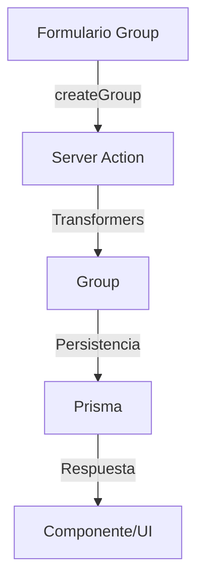

# 👥 Server Actions: Groups

Acciones del servidor para la gestión de grupos (Group) asociados a entidades del sistema.

---

## 🧩 Funciones disponibles

- `createGroup(data: CreateGroupData): Promise<GroupWithStats>`
- `deleteGroup(id: string): Promise<boolean>`
- `getGroups(): Promise<GroupWithStats[]>`
- `getGroup(id: string): Promise<GroupWithStats | null>`
- `toggleGroupFavorite(id: string): Promise<GroupWithStats>`
- `updateGroup(id: string, data: UpdateGroupData): Promise<GroupWithStats>`

---

## 🚀 Ejemplo de uso

```tsx
'use client';
import { createGroup, getGroups } from '@/app/actions/groups/group.actions';

async function handleCreate(data) {
  // data debe cumplir el esquema Zod de grupo
  const group = await createGroup(data);
  // El resultado es el grupo creado (sin wrapper { success, data, error })
  console.log(group);
}

async function fetchGroups() {
  const groups = await getGroups();
  // Devuelve un array de grupos
}
```

---

## 🛡️ Buenas prácticas

- Validar siempre los datos con Zod antes de persistir.
- Usar solo los tipos canónicos de `@/types/entities/group/types.ts`.
- No importar tipos de Prisma en acciones ni transformers.
- El resultado de las acciones es directo, sin wrappers `{ success, data, error }`.
- Revalidar rutas relevantes tras mutaciones si aplica.

---

## 🗺️ Diagrama de flujo



---

## ⚠️ Advertencias

- No exponer datos sensibles ni internos al cliente.
- Validar y sanitizar todos los campos antes de persistir.
- No duplicar lógica de transformación, usar siempre los transformers.

---

## 📚 Referencias

- [Transformers Group](../../transformers/group/documentation.md)
- [Tipos Group](../../types/entities/group/types.ts)

---

> Última revisión: 2025-06-19
> Estado: ✅ Documentación alineada con patrón moderno, ejemplos y advertencias actualizados.
