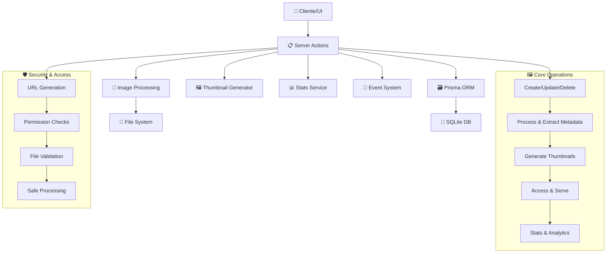

# 🖼️ Images Actions

## 📄 Descripción

El módulo **Images** gestiona todas las operaciones relacionadas con imágenes en el sistema, incluyendo procesamiento, acceso, miniaturización, y estadísticas. Es el componente central para manipulación de contenido multimedia, trabajando estrechamente con el módulo de folders para mantener sincronizada la información de archivos.

### 🎯 Funcionalidades Principales

- **🏗️ Gestión CRUD**: Crear, leer, actualizar y eliminar registros de imágenes
- **🔄 Procesamiento**: Extracción de metadatos, generación de thumbnails
- **🔗 Acceso**: URLs seguras y optimizadas para servir imágenes
- **📊 Estadísticas**: Métricas de uso, formatos y performance
- **🎲 Utilidades**: Imágenes aleatorias, búsquedas específicas
- **👍 Interacciones**: Sistema de favoritos y rating

## 🌊 Flujo de Operaciones



## 📋 Server Actions Disponibles

### 🏗️ CRUD Básico (image-crud.actions.ts)

#### `createImageAction(data: CreateImageData): Promise<ImageResult>`

- **Descripción**: Crea un nuevo registro de imagen en la base de datos
- **Parámetros**: `data` - Datos de la imagen (path, folderId, metadata, etc.)
- **Retorna**: Imagen creada con ID generado y relaciones
- **Proceso**: Valida archivo, extrae metadatos básicos, crea registro
- **Efectos**: Revalida cache de carpeta y actualiza estadísticas

#### `updateImageAction(id: string, data: UpdateImageData): Promise<ImageResult>`

- **Descripción**: Actualiza metadatos de una imagen existente
- **Parámetros**:
  - `id` - UUID de la imagen
  - `data` - Datos a actualizar (name, description, tags, etc.)
- **Retorna**: Imagen actualizada con cambios aplicados
- **Validaciones**: Verifica existencia y permisos antes de actualizar

#### `deleteImageAction(id: string): Promise<void>`

- **Descripción**: Elimina una imagen del sistema
- **Parámetros**: `id` - UUID de la imagen a eliminar
- **Comportamiento**: Eliminación en cascada de relaciones y thumbnails
- **Seguridad**: Solo elimina registro de BD, archivos físicos requieren acción manual

#### `setImageFavoriteAction(id: string, favorite: boolean): Promise<ImageResult>`

- **Descripción**: Marca/desmarca una imagen como favorita
- **Parámetros**:
  - `id` - UUID de la imagen
  - `favorite` - Boolean para establecer estado de favorito
- **Retorna**: Imagen con estado actualizado
- **Uso**: Para sistemas de favoritos y collections especiales

### 🔗 Acceso y URLs (image-access.actions.ts)

#### `getImageUrl(id: string, options?: ImageUrlOptions): Promise<string>`

- **Descripción**: Genera URL segura para acceder a una imagen
- **Parámetros**:
  - `id` - UUID de la imagen
  - `options` - Configuraciones de tamaño, calidad, formato
- **Retorna**: URL firmada para acceso directo
- **Seguridad**: URLs temporales con tokens de acceso
- **Optimización**: Cache inteligente basado en parámetros

#### `getOriginalImage(id: string): Promise<ImageResult>`

- **Descripción**: Obtiene información completa de imagen original
- **Parámetros**: `id` - UUID de la imagen
- **Retorna**: Objeto completo con metadatos, path y relaciones
- **Uso**: Para editores que requieren acceso a archivo original
- **Cache**: Utiliza cache para metadatos frecuentemente accedidos

### 🔄 Procesamiento (image-processing.actions.ts)

#### `processImageAction(id: string, options?: ProcessingOptions): Promise<ProcessingResult>`

- **Descripción**: Procesa una imagen para extraer metadatos completos
- **Parámetros**:
  - `id` - UUID de la imagen
  - `options` - Configuraciones de procesamiento (force, extractAI, etc.)
- **Retorna**: Resultado del procesamiento con metadatos extraídos
- **Proceso**: EXIF, dimensiones, hash, color analysis, AI tags opcionales
- **Optimización**: Procesamiento incremental para evitar re-trabajo

### 🖼️ Thumbnails (image-thumbnails.actions.ts)

#### `getThumbnail(id: string, size?: ThumbnailSize): Promise<string>`

- **Descripción**: Obtiene URL de thumbnail para una imagen
- **Parámetros**:
  - `id` - UUID de la imagen
  - `size` - Tamaño del thumbnail (small, medium, large)
- **Retorna**: URL del thumbnail generado
- **Cache**: Sistema de cache para thumbnails generados
- **Fallback**: Genera thumbnail si no existe

#### `generateThumbnail(id: string, size: ThumbnailSize, force?: boolean): Promise<string>`

- **Descripción**: Genera thumbnail específico para una imagen
- **Parámetros**:
  - `id` - UUID de la imagen
  - `size` - Tamaño específico a generar
  - `force` - Boolean para forzar re-generación
- **Retorna**: URL del thumbnail generado
- **Algoritmo**: Sharp para optimización y calidad
- **Storage**: Almacenamiento optimizado por tamaño

### 📁 Imágenes de Carpeta (folder-images.action.ts)

#### `getLatestFolderImagesAction(folderId: string, limit?: number): Promise<ImageResult[]>`

- **Descripción**: Obtiene las imágenes más recientes de una carpeta específica
- **Parámetros**:
  - `folderId` - UUID de la carpeta
  - `limit` - Número máximo de imágenes (default: 20)
- **Retorna**: Array de imágenes ordenadas por fecha de adición
- **Uso**: Para dashboards y vistas de actividad reciente
- **Optimización**: Query optimizada con índices por fecha

### 🎲 Utilidades (images-random.action.ts)

#### `getRandomImagesForEntityAction(entityType: string, entityId: string, count?: number): Promise<ImageResult[]>`

- **Descripción**: Obtiene imágenes aleatorias asociadas a una entidad específica
- **Parámetros**:
  - `entityType` - Tipo de entidad (album, character, place, etc.)
  - `entityId` - UUID de la entidad
  - `count` - Número de imágenes aleatorias (default: 5)
- **Retorna**: Array de imágenes seleccionadas aleatoriamente
- **Uso**: Para previews, carousels, y muestras representativas
- **Algoritmo**: Distribución uniforme con seed opcional para consistencia

## 🔗 Relaciones y Dependencias

### 📦 Servicios Utilizados

- **prisma**: ORM para acceso a base de datos
- **sharp**: Procesamiento y optimización de imágenes
- **serverLogger**: Sistema de logging contextual
- **image-converter.service**: Conversión entre formatos de imagen
- **stats.service**: Actualización de estadísticas de uso
- **server/events**: Sistema de eventos para notificaciones

### 🔄 Transformers

- **transformImageToResult**: Convierte datos de Prisma a tipos de dominio
- **mapCreateImageDataToPrisma**: Mapea datos de creación a esquema BD
- **mapUpdateImageDataToPrisma**: Mapea datos de actualización a esquema BD
- **convertServerImageToFileItem**: Convierte para uso en UI

### 🏗️ Tipos Principales

- **ImageResult**: Tipo principal de imagen para respuestas
- **CreateImageData, UpdateImageData**: DTOs para operaciones CRUD
- **GetImagesOptions, GetImagesResult**: Configuraciones de consulta
- **ProcessingOptions, ProcessingResult**: Para operaciones de procesamiento
- **ThumbnailSize**: Enumeración de tamaños de thumbnail
- **ImageUrlOptions**: Configuraciones para generación de URLs

## 💡 Ejemplos de Uso

### 🏗️ Crear y procesar imagen

```typescript
import {
  createImageAction,
  processImageAction,
  generateThumbnail
} from '@/app/actions/images';

// Crear nueva imagen
const newImage = await createImageAction({
  path: '/ruta/a/imagen.jpg',
  folderId: 'folder-uuid',
  name: 'Mi Foto',
  description: 'Descripción de la imagen'
});

// Procesar para extraer metadatos completos
const processed = await processImageAction(newImage.id, {
  extractAI: true,
  force: false
});

// Generar thumbnails
const thumbnailUrl = await generateThumbnail(newImage.id, 'medium');
console.log('Thumbnail generado:', thumbnailUrl);
```

### 🔗 Acceso y URLs

```typescript
import { getImageUrl, getOriginalImage } from '@/app/actions/images';

// Obtener URL segura para mostrar imagen
const imageUrl = await getImageUrl('image-uuid', {
  width: 800,
  height: 600,
  quality: 85,
  format: 'webp'
});

// Acceder a imagen original con metadatos completos
const originalImage = await getOriginalImage('image-uuid');
console.log(`Imagen: ${originalImage.name}, Tamaño: ${originalImage.fileSize} bytes`);
```

### 📁 Imágenes de carpeta y aleatorias

```typescript
import {
  getLatestFolderImagesAction,
  getRandomImagesForEntityAction
} from '@/app/actions/images';

// Obtener imágenes recientes de carpeta
const recentImages = await getLatestFolderImagesAction('folder-uuid', 10);
console.log(`${recentImages.length} imágenes recientes encontradas`);

// Obtener imágenes aleatorias de álbum
const randomImages = await getRandomImagesForEntityAction(
  'album',
  'album-uuid',
  3
);
console.log('Imágenes aleatorias para preview:', randomImages);
```

### 👍 Gestión de favoritos

```typescript
import { setImageFavoriteAction } from '@/app/actions/images';

// Marcar como favorita
await setImageFavoriteAction('image-uuid', true);

// Desmarcar favorita
await setImageFavoriteAction('image-uuid', false);
```

## 🧪 Testing

Los tests para este módulo cubren:

- ✅ Operaciones CRUD completas
- ✅ Procesamiento de diferentes formatos de imagen
- ✅ Generación y cache de thumbnails
- ✅ URLs seguras y tokens de acceso
- ✅ Extracción de metadatos EXIF
- ✅ Manejo de errores y archivos corruptos
- ✅ Performance con imágenes grandes
- ✅ Integración con sistema de favoritos

## ⚠️ Consideraciones Importantes

### 🚀 Rendimiento

- **Lazy Loading**: Thumbnails generados bajo demanda
- **Cache Strategy**: Cache multi-nivel para metadatos y thumbnails
- **Processing Queue**: Procesamiento asíncrono para operaciones pesadas
- **Memory Management**: Gestión cuidadosa de memoria para imágenes grandes

### 🔒 Seguridad

- **Path Validation**: Validación estricta de rutas de archivo
- **File Type Validation**: Verificación de tipos MIME y extensiones
- **URL Signing**: URLs firmadas para acceso controlado
- **Input Sanitization**: Sanitización de metadatos de entrada

### 🖼️ Calidad

- **Format Support**: Soporte para JPEG, PNG, WebP, AVIF, TIFF
- **Color Management**: Preservación de perfiles de color
- **Quality Optimization**: Compresión inteligente basada en contenido
- **Progressive Loading**: Soporte para imágenes progresivas

### 💾 Storage

- **Efficient Storage**: Organización optimizada de thumbnails
- **Cleanup Processes**: Limpieza automática de archivos huérfanos
- **Backup Considerations**: Estrategias para respaldo de metadatos
- **Migration Support**: Herramientas para migración de formatos

## Funciones disponibles

