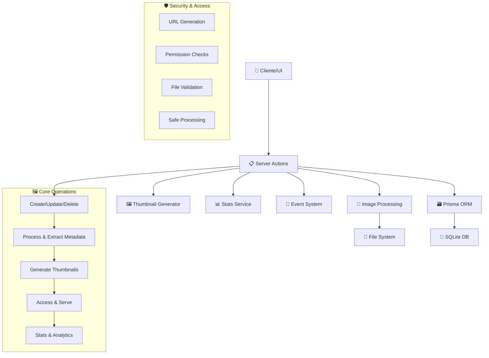

# 🖼️ Images Actions

## 📄 Descripción

El módulo **Images** gestiona todas las operaciones relacionadas con imágenes en el sistema, incluyendo procesamiento, acceso, miniaturización, y estadísticas. Es el componente central para manipulación de contenido multimedia, trabajando estrechamente con el módulo de folders para mantener sincronizada la información de archivos.

### 🎯 Funcionalidades Principales

- **🏗️ Gestión CRUD**: Crear, leer, actualizar y eliminar registros de imágenes
- **🔄 Procesamiento**: Extracción de metadatos, generación de thumbnails
- **🔗 Acceso**: URLs seguras y optimizadas para servir imágenes
- **📊 Estadísticas**: Métricas de uso, formatos y performance
- **🎲 Utilidades**: Imágenes aleatorias, búsquedas específicas
- **👍 Interacciones**: Sistema de favoritos y rating

## 🌊 Flujo de Operaciones



## 🧩 Patrón de Respuesta

> **IMPORTANTE**: Todas las Server Actions devuelven directamente las entidades transformadas sin objetos wrapper.

Todas las Server Actions de este módulo utilizan el patrón estandarizado en junio 2025:

```typescript
// Ejemplo: Obtener una imagen por ID
export async function getImage(id: string): Promise<Image | null> {
  try {
    const image = await prisma.image.findUnique({ where: { id } });
    if (!image) return null;
    return fromPrismaImage(image);
  } catch (error) {
    logger.error('Error fetching image', { id, error });
    throw new Error('Failed to fetch image');
  }
}
```

Las acciones **NO** devuelven objetos con propiedades `success`, `data` o `error`. En su lugar:

- Devuelven directamente el dato solicitado
- Devuelven `null` para elementos no encontrados
- Lanzan excepciones para manejar errores

## 📋 Funciones Disponibles

### crud.actions.ts

Operaciones básicas de crear, leer, actualizar y eliminar imágenes:

```typescript
// Todas estas funciones devuelven directamente las entidades o null

export async function getImage(id: string): Promise<Image | null>;
export async function getImages(params?: GetImagesParams): Promise<Image[]>;
export async function createImage(data: CreateImageInput): Promise<Image>;
export async function updateImage(id: string, data: UpdateImageInput): Promise<Image>;
export async function deleteImage(id: string): Promise<boolean>;
```

### stats.actions.ts

Estadísticas y métricas sobre imágenes:

```typescript
export async function getImageStats(id: string): Promise<ImageStats | null>;
export async function getImagesCountByType(): Promise<{ [type: string]: number }>;
export async function getRecentImageActivity(): Promise<Activity[]>;
```

### thumbnails.actions.ts

Generación y gestión de miniaturas:

```typescript
export async function generateThumbnail(imageId: string): Promise<string>;
export async function getThumbnailUrl(imageId: string): Promise<string | null>;
export async function regenerateAllThumbnails(): Promise<number>;
```

## 🔄 Ejemplo de Consumo

### En un componente de cliente

```typescript
"use client";
import { useState, useEffect } from 'react';
import { getImage, updateImage } from '@/app/actions/images/crud.actions';
import { extendImage } from '@/transformers/image';

export function ImageEditor({ imageId }) {
  const [image, setImage] = useState(null);
  const [error, setError] = useState(null);

  useEffect(() => {
    async function loadImage() {
      try {
        // La acción devuelve directamente la imagen o null
        const imageData = await getImage(imageId);

        if (imageData) {
          // Extendemos la imagen para UI
          const extendedImage = extendImage(imageData);
          setImage(extendedImage);
        } else {
          setError('Imagen no encontrada');
        }
      } catch (error) {
        setError(`Error cargando la imagen: ${error.message}`);
      }
    }

    loadImage();
  }, [imageId]);

  async function handleUpdate(data) {
    try {
      const updatedImage = await updateImage(imageId, data);
      const extendedImage = extendImage(updatedImage);
      setImage(extendedImage);
      // Mostrar mensaje de éxito
    } catch (error) {
      setError(`Error actualizando imagen: ${error.message}`);
    }
  }

  // ... resto del componente
}
```
