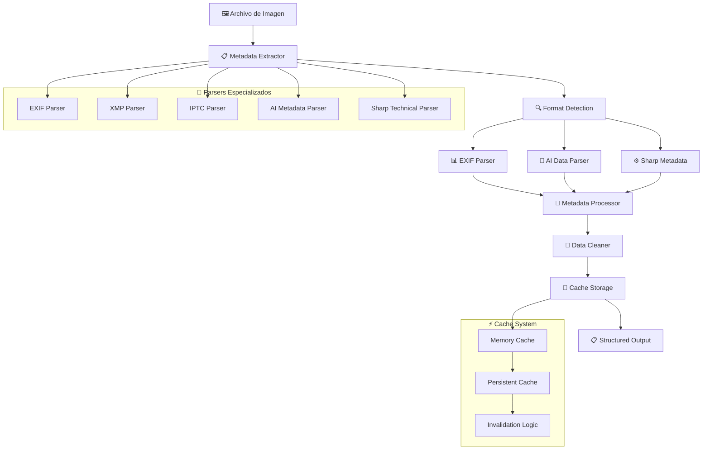

# 📋 Metadata Actions

## 📄 Descripción

El módulo **Metadata** es responsable de extraer, procesar y gestionar metadatos de imágenes y archivos multimedia. Utiliza múltiples parsers especializados para extraer información EXIF, datos de IA, propiedades técnicas y metadatos embebidos, proporcionando una vista completa de las características de cada archivo.

### 🎯 Funcionalidades Principales

- **📊 Extracción EXIF**: Datos de cámara, configuración, GPS y técnicos
- **🤖 Datos de IA**: Información de generación por inteligencia artificial
- **🔍 Análisis Técnico**: Formato, dimensiones, compresión, perfil de color
- **📝 Metadatos Personalizados**: Campos definidos por usuario y aplicaciones
- **⚡ Cache Inteligente**: Sistema de cache para optimizar acceso frecuente
- **🔄 Parsers Modulares**: Extensibilidad para nuevos formatos

## 🌊 Flujo de Operaciones



## 📋 Server Actions Disponibles

### 🔍 Extracción Principal (metadata.actions.ts)

#### `extractMetadata(filePath: string, options?: ExtractOptions): Promise<CompleteMetadata>`

- **Descripción**: Extrae metadatos completos de un archivo de imagen
- **Parámetros**:
  - `filePath` - Ruta absoluta al archivo
  - `options` - Configuraciones de extracción (includeAI, forceFresh, etc.)
- **Retorna**: Objeto con todos los metadatos estructurados
- **Proceso**: Aplica todos los parsers disponibles y consolida resultados
- **Cache**: Utiliza cache inteligente para evitar re-procesamiento

#### `getImageMetadata(imageId: string): Promise<ImageMetadata>`

- **Descripción**: Obtiene metadatos de una imagen por su ID en BD
- **Parámetros**: `imageId` - UUID de la imagen
- **Retorna**: Metadatos estructurados de la imagen
- **Cache**: Acceso optimizado desde cache o BD
- **Uso**: Para mostrar información técnica en UI

#### `getImageMetadataById(id: string): Promise<ImageMetadata>`

- **Descripción**: Alias de getImageMetadata para compatibilidad
- **Parámetros**: `id` - UUID de la imagen
- **Retorna**: Metadatos de la imagen especificada

### 📊 Análisis Técnico (metadata-extractors.actions.ts)

#### `getImageFormat(filePath: string): Promise<ImageFormat>`

- **Descripción**: Detecta y analiza el formato de una imagen
- **Parámetros**: `filePath` - Ruta al archivo de imagen
- **Retorna**: Información detallada del formato
- **Incluye**: MIME type, extensión, compresión, calidad
- **Soporte**: JPEG, PNG, WebP, AVIF, TIFF, HEIC, etc.

#### `isSupportedImageFormat(filePath: string): Promise<boolean>`

- **Descripción**: Verifica si el formato de imagen es soportado
- **Parámetros**: `filePath` - Ruta al archivo
- **Retorna**: Boolean indicando soporte
- **Uso**: Validación antes de procesamiento
- **Formatos**: Lista actualizable de formatos soportados

### 🤖 Datos de IA (metadata-extractors.actions.ts)

#### `getAIGenerationInfo(filePath: string): Promise<AIMetadata>`

- **Descripción**: Extrae información de generación por IA de la imagen
- **Parámetros**: `filePath` - Ruta al archivo
- **Retorna**: Metadatos de IA estructurados
- **Incluye**:
  - Modelo utilizado (Stable Diffusion, DALL-E, Midjourney, etc.)
  - Prompt utilizado
  - Parámetros de generación (steps, cfg_scale, seed, etc.)
  - Software de generación
- **Formatos**: PNG chunks, EXIF comments, XMP data

### 🔄 Parsers Especializados (metadata-parsers.actions.ts)

#### `parseExifData(filePath: string): Promise<ExifData>`

- **Descripción**: Extrae y parsea datos EXIF de la imagen
- **Parámetros**: `filePath` - Ruta al archivo
- **Retorna**: Datos EXIF estructurados
- **Incluye**:
  - Información de cámara (marca, modelo, lente)
  - Configuración de captura (ISO, apertura, velocidad)
  - Datos GPS (coordenadas, altitud)
  - Timestamp de captura
  - Orientación y resolución

#### `parseSharpMetadata(filePath: string): Promise<SharpMetadata>`

- **Descripción**: Utiliza Sharp para extraer metadatos técnicos
- **Parámetros**: `filePath` - Ruta al archivo
- **Retorna**: Metadatos técnicos detallados
- **Incluye**:
  - Dimensiones exactas
  - Profundidad de color
  - Perfil de color (ICC)
  - Tipo de compresión
  - Densidad de píxeles

#### `parseMetadataString(metadataString: string): Promise<ParsedMetadata>`

- **Descripción**: Parsea string de metadatos en formato estructurado
- **Parámetros**: `metadataString` - String con metadatos
- **Retorna**: Metadatos parseados y tipados
- **Formatos**: JSON, XML, key-value pairs
- **Uso**: Para procesar metadatos embebidos en comentarios

### ⚡ Cache y Utilidades (metadata-utils.actions.ts)

#### `clearMetadataCache(imageId?: string): Promise<void>`

- **Descripción**: Limpia cache de metadatos
- **Parámetros**: `imageId` - Opcional, limpia cache específico o todo
- **Uso**: Después de actualizar archivos o detectar inconsistencias
- **Efecto**: Fuerza re-extracción en próximo acceso

#### `withRetry<T>(operation: () => Promise<T>, maxRetries?: number): Promise<T>`

- **Descripción**: Ejecuta operación con sistema de reintentos
- **Parámetros**:
  - `operation` - Función a ejecutar
  - `maxRetries` - Número máximo de reintentos (default: 3)
- **Retorna**: Resultado de la operación exitosa
- **Uso**: Para operaciones que pueden fallar temporalmente
- **Algoritmo**: Backoff exponencial entre reintentos

### 🚨 Manejo de Errores (metadata-errors.actions.ts)

#### `createMetadataError(message: string, context?: ErrorContext): Promise<MetadataError>`

- **Descripción**: Crea error especializado para operaciones de metadatos
- **Parámetros**:
  - `message` - Mensaje descriptivo del error
  - `context` - Contexto adicional (archivo, operación, etc.)
- **Retorna**: Error formateado para el sistema
- **Logging**: Registro automático con contexto completo
- **Categorización**: Clasifica errores por tipo y severidad

## 🔗 Relaciones y Dependencias

### 📦 Servicios Utilizados

- **sharp**: Biblioteca principal para procesamiento de imágenes
- **exifr**: Parser especializado para datos EXIF
- **file-type**: Detección de tipos de archivo
- **serverLogger**: Sistema de logging contextual
- **cache.service**: Sistema de cache para metadatos
- **prisma**: Persistencia de metadatos en BD

### 🏗️ Tipos Principales

- **CompleteMetadata**: Metadatos completos consolidados
- **ImageMetadata**: Metadatos específicos de imagen
- **ExifData**: Datos EXIF estructurados
- **AIMetadata**: Información de generación por IA
- **SharpMetadata**: Metadatos técnicos de Sharp
- **ImageFormat**: Información de formato de archivo
- **ExtractOptions**: Configuraciones de extracción
- **ParsedMetadata**: Metadatos parseados de strings

### 🔄 Parsers Especializados

```typescript
// Estructura de parsers modulares
interface MetadataParser {
  name: string;
  supportedFormats: string[];
  extract: (filePath: string) => Promise<any>;
  priority: number;
}
```

## 💡 Ejemplos de Uso

### 🔍 Extracción completa de metadatos

```typescript
import { extractMetadata, getImageMetadata } from '@/app/actions/metadata';

// Extraer metadatos de archivo nuevo
const fullMetadata = await extractMetadata('/ruta/a/imagen.jpg', {
  includeAI: true,
  includeExif: true,
  forceFresh: false
});

console.log('Metadatos completos:', {
  camera: fullMetadata.exif?.camera,
  dimensions: fullMetadata.technical?.dimensions,
  aiModel: fullMetadata.ai?.model,
  fileSize: fullMetadata.technical?.fileSize
});

// Obtener metadatos de imagen existente
const imageMetadata = await getImageMetadata('image-uuid');
console.log(`Imagen capturada: ${imageMetadata.exif?.dateTime}`);
```

### 📊 Análisis específico por tipo

```typescript
import {
  parseExifData,
  getAIGenerationInfo,
  getImageFormat
} from '@/app/actions/metadata';

// Analizar datos EXIF específicamente
const exifData = await parseExifData('/ruta/a/foto.jpg');
if (exifData.gps) {
  console.log(`Foto tomada en: ${exifData.gps.latitude}, ${exifData.gps.longitude}`);
}

// Detectar información de IA
const aiInfo = await getAIGenerationInfo('/ruta/a/ai-image.png');
if (aiInfo.model) {
  console.log(`Generado con ${aiInfo.model}: "${aiInfo.prompt}"`);
}

// Verificar formato
const format = await getImageFormat('/ruta/a/archivo.unknown');
console.log(`Formato detectado: ${format.mimeType}, ${format.quality}% calidad`);
```

### ⚡ Gestión de cache

```typescript
import { clearMetadataCache, withRetry } from '@/app/actions/metadata';

// Limpiar cache específico
await clearMetadataCache('image-uuid');

// Limpiar todo el cache
await clearMetadataCache();

// Operación con reintentos
const metadata = await withRetry(async () => {
  return extractMetadata('/ruta/problematica/imagen.jpg');
}, 5); // Máximo 5 reintentos
```

### 🔍 Validación y formato

```typescript
import { isSupportedImageFormat } from '@/app/actions/metadata';

// Validar antes de procesar
const isSupported = await isSupportedImageFormat('/ruta/a/archivo.xyz');
if (!isSupported) {
  console.log('❌ Formato no soportado');
  return;
}

// Procesar solo si es soportado
const metadata = await extractMetadata('/ruta/a/archivo.xyz');
```

## 🧪 Testing

Los tests para este módulo cubren:

- ✅ Extracción de metadatos de diferentes formatos
- ✅ Parsing de datos EXIF complejos
- ✅ Detección de información de IA
- ✅ Manejo de archivos corruptos o incompletos
- ✅ Sistema de cache y invalidación
- ✅ Reintentos en operaciones fallidas
- ✅ Performance con archivos grandes
- ✅ Parsers especializados por formato

## ⚠️ Consideraciones Importantes

### 🚀 Rendimiento

- **Cache Strategy**: Cache agresivo para metadatos frecuentemente accedidos
- **Lazy Extraction**: Extracción bajo demanda de metadatos complejos
- **Stream Processing**: Procesamiento por streams para archivos grandes
- **Parser Optimization**: Selección inteligente de parsers por formato

### 🔒 Seguridad

- **File Validation**: Validación estricta de tipos de archivo
- **Path Sanitization**: Sanitización de rutas para evitar path traversal
- **Memory Limits**: Límites de memoria para prevenir ataques DoS
- **Error Handling**: Manejo seguro sin exposición de rutas del sistema

### 📊 Precisión

- **Multiple Parsers**: Uso de múltiples parsers para mejor cobertura
- **Cross-Validation**: Validación cruzada entre diferentes fuentes
- **Format Evolution**: Adaptación a nuevos formatos y versiones
- **Fallback Mechanisms**: Parsers de fallback para casos edge

### 💾 Compatibilidad

- **Format Support**: Soporte extensivo de formatos modernos y legacy
- **Version Handling**: Manejo de diferentes versiones de metadatos
- **Encoding Support**: Soporte para múltiples encodings de texto
- **Platform Independence**: Funcionamiento consistente entre plataformas
