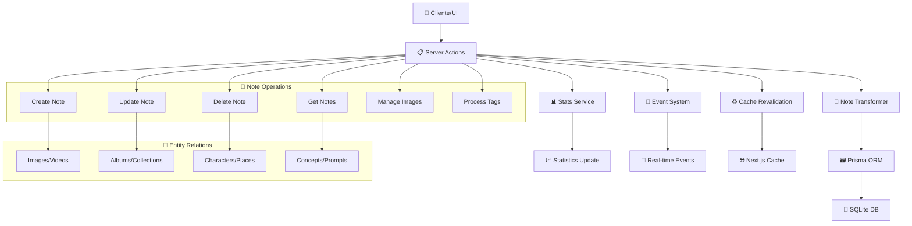

# 📝 Notes Actions

## 📄 Descripción

El módulo **Notes** gestiona el sistema de anotaciones y notas del proyecto. Las notas son entidades versátiles que permiten crear documentación, comentarios, descripciones detalladas y contenido editorial asociado con cualquier elemento del sistema. Cada nota puede contener texto rico, tags categorizados y múltiples relaciones con imágenes, personajes, lugares y otros elementos.

Las notas sirven como **centro de documentación** del proyecto, permitiendo añadir contexto, explicaciones, referencias históricas y cualquier tipo de información textual que enriquezca el contenido multimedia almacenado.

## 🌊 Flujo de Operaciones



## 📋 Server Actions Disponibles

### 🏗️ CRUD Básico (note.actions.ts)

#### `getNotes(): Promise<NoteWithStats[]>`

- **Descripción**: Obtiene todas las notas con estadísticas detalladas de relaciones
- **Retorna**: Array de notas con conteos de entidades relacionadas
- **Incluye**: Conteos de imágenes, álbumes, colecciones, personajes, lugares, etc.
- **Transformaciones**: Aplica fromPrismaNote para deserializar tags y campos JSON
- **Ejemplo**:

```typescript
const notes = await getNotes();
notes.forEach(note => {
  console.log(`${note.title}: ${note._count.images} imágenes relacionadas`);
  console.log(`Tags: ${note.tags.join(', ')}`);
});
```

#### `getNote(id: string): Promise<NoteComplete>`

- **Descripción**: Obtiene una nota específica por ID con transformaciones completas
- **Parámetros**: `id` - UUID de la nota
- **Retorna**: Nota completa con tags deserializados y metadatos
- **Validaciones**: Lanza error si la nota no existe
- **Ejemplo**:

```typescript
const note = await getNote("note-123");
// NoteComplete con tags procesados y campos transformados
```

#### `createNote(data: CreateNoteData): Promise<NoteComplete>`

- **Descripción**: Crea una nueva nota con validación completa usando schemas Zod
- **Parámetros**: `data` - Datos de la nota (title, content, category, tags, etc.)
- **Retorna**: Nota creada con transformaciones aplicadas
- **Validaciones**: Schema createNoteSchema y transformador toCreateNoteData
- **Efectos secundarios**:
  - Revalida rutas de Next.js cache
  - Emite evento `notes:modified`
  - Actualiza estadísticas del sistema
- **Ejemplo**:

```typescript
const newNote = await createNote({
  title: "Análisis de Fotografía Urbana",
  content: "Esta nota documenta las características...",
  category: "ANALYSIS",
  tags: ["photography", "urban", "composition"],
  emoji: "📸",
  color: "#3b82f6"
});
```

#### `updateNote(id: string, data: Partial<CreateNoteData>): Promise<NoteComplete>`

- **Descripción**: Actualiza una nota existente con validación parcial
- **Parámetros**:
  - `id` - UUID de la nota
  - `data` - Datos a actualizar (campos parciales)
- **Validaciones**: Schema updateNoteSchema y transformador toUpdateNoteData
- **Retorna**: Nota actualizada con transformaciones aplicadas
- **Ejemplo**:

```typescript
const updatedNote = await updateNote("note-123", {
  content: "Contenido actualizado con nueva información...",
  tags: ["photography", "urban", "analysis", "updated"],
  isFavorite: true
});
```

#### `deleteNote(id: string): Promise<void>`

- **Descripción**: Elimina una nota y desconecta todas sus relaciones de forma segura
- **Parámetros**: `id` - UUID de la nota a eliminar
- **Validaciones**: Verifica existencia antes de eliminar
- **Operaciones**:
  - Desconecta de todas las entidades relacionadas
  - Elimina la nota en transacción
  - Notifica cambios y revalida cache
- **Relaciones desconectadas**:
  - Images, Albums, Collections
  - Characters, Places, WorldItems
  - Concepts, Prompts, Groups
  - Properties, Wildcards
- **Ejemplo**:

```typescript
await deleteNote("note-123");
// Nota eliminada con todas las relaciones desconectadas
```

### 🖼️ Gestión de Imágenes (note.actions.ts)

#### `getNoteImages(noteId: string): Promise<FileItem[]>`

- **Descripción**: Obtiene todas las imágenes asociadas a una nota específica
- **Parámetros**: `noteId` - UUID de la nota
- **Retorna**: Array de imágenes en formato FileItem con metadatos básicos
- **Validaciones**: Verifica que el ID sea válido y que la nota exista
- **Campos incluidos**: id, name, description, url, thumbnailUrl, timestamps
- **Ejemplo**:

```typescript
const images = await getNoteImages("note-123");
images.forEach(image => {
  console.log(`${image.name} - ${image.description}`);
});
```

#### `addImageToNote(noteId: string, imageId: string): Promise<void>`

- **Descripción**: Asocia una imagen existente a una nota específica
- **Parámetros**:
  - `noteId` - UUID de la nota
  - `imageId` - UUID de la imagen
- **Validaciones**: Verifica existencia de ambas entidades antes de crear relación
- **Operación**: Usa Prisma connect para establecer la relación
- **Efectos**: Emite eventos y revalida cache
- **Ejemplo**:

```typescript
await addImageToNote("note-123", "image-456");
// Imagen asociada a la nota
```

#### `removeImageFromNote(noteId: string, imageId: string): Promise<void>`

- **Descripción**: Desasocia una imagen de una nota sin eliminar ninguna entidad
- **Parámetros**:
  - `noteId` - UUID de la nota
  - `imageId` - UUID de la imagen
- **Operación**: Usa Prisma disconnect para eliminar solo la relación
- **Efectos**: La imagen permanece en el sistema, solo se elimina la asociación

### 📋 Funciones de Compatibilidad (note.actions.ts)

#### `getNoteWithProcessedFields(id: string): Promise<NoteBase & { parsedTags: string[] }>`

- **Estado**: ⚠️ **DEPRECATED** - Usar `getNote` en su lugar
- **Descripción**: Obtiene una nota con tags procesados (para retrocompatibilidad)
- **Retorna**: Nota con campo adicional `parsedTags`

#### `getNotesWithProcessedFields(): Promise<Array<NoteBase & { parsedTags: string[] }>>`

- **Estado**: ⚠️ **DEPRECATED** - Usar `getNotes` en su lugar
- **Descripción**: Obtiene todas las notas con tags procesados (para retrocompatibilidad)

## 🔗 Relaciones y Dependencias

### 📦 Servicios Utilizados

- **Note Transformer**: Transformación y validación de datos (`toCreateNoteData`, `toUpdateNoteData`, `fromPrismaNote`)
- **Prisma ORM**: Acceso a base de datos con transacciones y relaciones complejas
- **Event System**: Notificaciones de cambios en tiempo real (`notes:modified`)
- **Stats Service**: Actualización de estadísticas del sistema (`STATS_EVENTS.NOTE_CHANGE`)
- **Validation Service**: Schemas Zod (`createNoteSchema`, `updateNoteSchema`)

### 🔄 Transformers

- **deserializeTags**: Deserialización de tags desde JSON
- **fromPrismaNote**: Transformación de entidad Prisma a NoteComplete
- **toCreateNoteData**: Mapeo de datos de creación para Prisma
- **toUpdateNoteData**: Mapeo de datos de actualización para Prisma

### 🏗️ Tipos Principales

- **NoteBase**: Estructura base de la nota
- **NoteComplete**: Nota con transformaciones y campos procesados
- **NoteWithStats**: Nota con estadísticas de relaciones (_count)
- **CreateNoteData**: DTO para creación de notas
- **NoteWithImages**: Interfaz de compatibilidad con imágenes

### 📝 Estructura de Nota

```typescript
interface NoteWithStats extends NoteBase {
  id: string;
  title: string;
  content: string;
  category: string | null;
  emoji: string;
  color: string;
  tags: string[]; // Tags deserializados
  isFavorite: boolean;
  createdAt: Date;
  updatedAt: Date;

  // Estadísticas de relaciones
  _count: {
    images: number;
    albums: number;
    collections: number;
    characters: number;
    places: number;
    worldItems: number;
    concepts: number;
    prompts: number;
    groups: number;
    properties: number;
    wildcards: number;
  };
}
```

## 💡 Ejemplos de Uso

### Crear Sistema de Documentación

```typescript
// 1. Crear nota principal de proyecto
const projectNote = await createNote({
  title: "Documentación del Proyecto Fotográfico",
  content: `
    ## Objetivo
    Documentar el progreso del proyecto de fotografía urbana...

    ## Metodología
    - Captura diaria en diferentes zonas
    - Análisis de composición
    - Catalogación por temática
  `,
  category: "PROJECT",
  tags: ["documentation", "photography", "urban", "project"],
  emoji: "📋",
  color: "#059669"
});

// 2. Asociar imágenes relevantes
const imageIds = ["img-1", "img-2", "img-3"];
for (const imageId of imageIds) {
  await addImageToNote(projectNote.id, imageId);
}

// 3. Obtener nota con imágenes
const noteImages = await getNoteImages(projectNote.id);
console.log(`Nota con ${noteImages.length} imágenes asociadas`);
```

### Gestión de Anotaciones por Categoría

```typescript
// Obtener todas las notas con estadísticas
const allNotes = await getNotes();

// Filtrar por categoría y ordenar por relevancia
const analysisNotes = allNotes
  .filter(note => note.category === "ANALYSIS")
  .sort((a, b) => b._count.images - a._count.images);

// Actualizar nota con información adicional
const enrichedNote = await updateNote(analysisNotes[0].id, {
  content: `${analysisNotes[0].content}\n\n## Actualización\nNueva información añadida...`,
  tags: [...analysisNotes[0].tags, "updated", "enhanced"]
});
```

### Análisis de Relaciones y Estadísticas

```typescript
// Obtener nota específica con detalles
const detailedNote = await getNote("note-123");

// Calcular métricas de conectividad
const totalConnections = Object.values(detailedNote._count || {})
  .reduce((sum, count) => sum + count, 0);

console.log(`La nota "${detailedNote.title}" tiene ${totalConnections} conexiones totales`);

// Análisis de categorías más usadas
const categoryStats = allNotes.reduce((stats, note) => {
  const category = note.category || 'Uncategorized';
  stats[category] = (stats[category] || 0) + 1;
  return stats;
}, {} as Record<string, number>);
```

## 🧪 Testing

Los tests para este módulo cubren:

- ✅ **Operaciones CRUD completas** con validación de schemas Zod
- ✅ **Gestión de relaciones** con imágenes y otras entidades
- ✅ **Transformadores** y serialización/deserialización de datos
- ✅ **Validación de datos** y manejo de errores específicos
- ✅ **Eventos del sistema** y revalidación de cache
- ✅ **Transacciones** para eliminación segura
- ✅ **Funciones de compatibilidad** y retrocompatibilidad

### Casos de Test Específicos

```typescript
describe('Notes Actions', () => {
  test('should create note with valid data', async () => {
    const noteData = {
      title: 'Test Note',
      content: 'Test content',
      tags: ['test', 'example']
    };
    const note = await createNote(noteData);
    expect(note.id).toBeDefined();
    expect(note.tags).toEqual(['test', 'example']);
  });

  test('should get notes with statistics', async () => {
    const notes = await getNotes();
    expect(notes).toBeInstanceOf(Array);
    notes.forEach(note => {
      expect(note._count).toBeDefined();
      expect(typeof note._count.images).toBe('number');
    });
  });

  test('should associate and dissociate images', async () => {
    await addImageToNote(noteId, imageId);
    const images = await getNoteImages(noteId);
    expect(images.length).toBeGreaterThan(0);

    await removeImageFromNote(noteId, imageId);
    const updatedImages = await getNoteImages(noteId);
    expect(updatedImages.length).toBe(images.length - 1);
  });
});
```

## ⚠️ Consideraciones Importantes

### 🔗 Gestión de Relaciones

- **Integridad referencial**: Verificar existencia de entidades antes de crear relaciones
- **Transacciones**: Usar transacciones Prisma para operaciones de eliminación complejas
- **Desconexión limpia**: Eliminar todas las relaciones antes de eliminar notas
- **Consistencia**: Mantener coherencia entre notas y entidades relacionadas

### 🚀 Rendimiento

- **Carga de estadísticas**: Los conteos (_count) pueden ser costosos para notas con muchas relaciones
- **Paginación**: Implementar paginación para listas grandes de notas
- **Índices**: Asegurar índices en campos de búsqueda frecuente (title, category, tags)
- **Cache estratégico**: Cachear notas frecuentemente accedidas

### 📝 Contenido y Validación

- **Validación de contenido**: Schemas Zod aseguran integridad de datos
- **Serialización de tags**: Tags se almacenan como JSON y se deserializan automáticamente
- **Límites de tamaño**: Considerar límites para contenido muy extenso
- **Encoding**: Manejar correctamente caracteres especiales y emojis

### 🎨 Experiencia de Usuario

- **Editor de texto rico**: Considerar soporte para Markdown o HTML en el contenido
- **Autocompletado**: Implementar sugerencias para tags y categorías
- **Historial**: Considerar versionado para cambios importantes
- **Búsqueda**: Implementar búsqueda de texto completo en contenido

### 📈 Escalabilidad

- **Archivado**: Sistema para notas obsoletas o poco relevantes
- **Categorización**: Mantener taxonomía consistente de categorías
- **Migración**: Plan para cambios en estructura de datos
- **Backup**: Estrategia de respaldo para contenido crítico

---

## 📚 Recursos Adicionales

- **[Transformer Documentation](../../../transformers/note/README.md)**: Detalles técnicos de transformación
- **[Types Reference](../../../types/entities/note/)**: Definiciones de tipos completas
- **[Validation Schemas](../../../utils/note/validators.ts)**: Schemas Zod para validación
- **[Service Layer](../../../services/note.service.ts)**: Lógica de negocio del servicio

## Funciones disponibles

- `getNotes()` - Obtiene todas las notas con estadísticas.
- `getNote(id)` - Devuelve una nota completa por ID.
- `createNote(data)` - Crea una nueva nota.
- `updateNote(id, data)` - Actualiza una nota existente.
- `deleteNote(id)` - Elimina una nota y sus relaciones.
- `getNoteImages(noteId)` - Obtiene imágenes asociadas a una nota.
- `addImageToNote(noteId, imageId)` - Relaciona una imagen con una nota.
- `removeImageFromNote(noteId, imageId)` - Desasocia una imagen de una nota.
- `getNoteWithProcessedFields(id)` *(deprecated)* - Versión antigua con tags procesados.
- `getNotesWithProcessedFields()` *(deprecated)* - Obtiene todas las notas con tags procesados.

