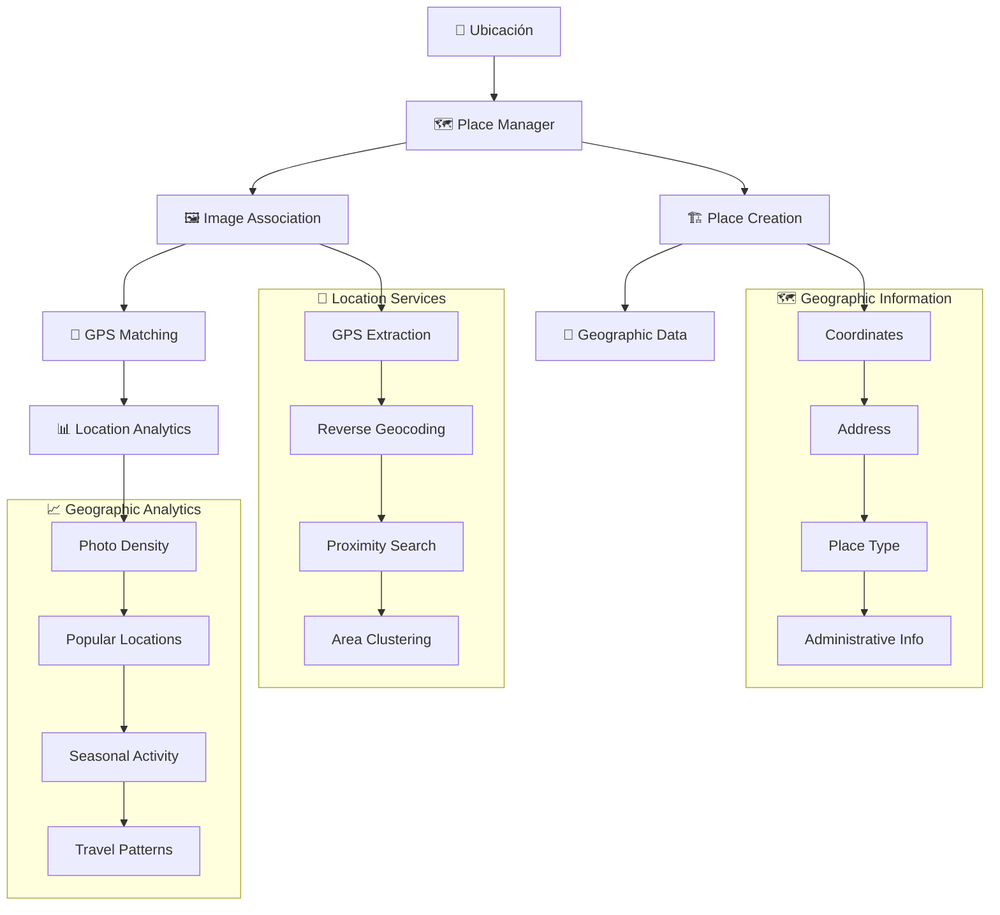

# 🏠 Places Actions

## 📄 Descripción

El módulo **Places** gestiona ubicaciones y lugares geográficos en el sistema de imágenes. Permite crear perfiles de lugares, asociar imágenes capturadas en ubicaciones específicas, y mantener información geográfica detallada, facilitando la organización territorial y búsqueda de contenido basado en ubicación.

### 🎯 Funcionalidades Principales

- **🗺️ Gestión de Ubicaciones**: Crear y mantener perfiles detallados de lugares
- **📍 Geolocalización**: Integración con coordenadas GPS y mapas
- **🖼️ Asociación de Imágenes**: Vincular imágenes por ubicación de captura
- **🏛️ Categorización**: Organización por tipo de lugar (ciudad, parque, edificio, etc.)
- **📊 Estadísticas**: Métricas de actividad fotográfica por ubicación
- **🔍 Búsqueda Geográfica**: Búsqueda por proximidad y área

## 🌊 Flujo de Operaciones



## 📋 Server Actions Disponibles

### 🏗️ CRUD Básico (place.actions.ts)

#### `createPlace(data: CreatePlaceData): Promise<PlaceResult>`

- **Descripción**: Crea un nuevo lugar en el sistema
- **Parámetros**: `data` - Información del lugar (name, coordinates, address, etc.)
- **Retorna**: Lugar creado con ID generado
- **Características**:
  - Información básica (nombre, descripción, tipo)
  - Coordenadas GPS (latitud, longitud, altitud)
  - Dirección postal completa
  - Metadatos geográficos (país, región, ciudad)
  - Categorización por tipo de lugar
- **Servicios**: Integra con servicios de geocodificación para validar datos

#### `updatePlace(id: string, data: UpdatePlaceData): Promise<PlaceResult>`

- **Descripción**: Actualiza información de un lugar existente
- **Parámetros**:
  - `id` - UUID del lugar
  - `data` - Datos a actualizar (parciales)
- **Retorna**: Lugar actualizado con cambios aplicados
- **Validaciones**: Verifica consistencia de datos geográficos
- **Geocoding**: Re-valida coordenadas vs dirección si se modifican

#### `deletePlace(id: string, options?: DeletePlaceOptions): Promise<void>`

- **Descripción**: Elimina un lugar del sistema
- **Parámetros**:
  - `id` - UUID del lugar
  - `options` - Configuraciones (preserveImages, mergeWith, etc.)
- **Comportamiento**:
  - Mantiene imágenes asociadas por defecto
  - Opción de transferir asociaciones a otro lugar
  - Eliminación suave con posibilidad de recuperación
- **Validaciones**: Confirmación para lugares con muchas imágenes

#### `getPlace(id: string, includeStats?: boolean): Promise<PlaceResult>`

- **Descripción**: Obtiene información completa de un lugar
- **Parámetros**:
  - `id` - UUID del lugar
  - `includeStats` - Boolean para incluir estadísticas (opcional)
- **Retorna**: Lugar con toda su información geográfica
- **Incluye**: Coordenadas, dirección, metadatos, configuración visual
- **Servicios**: Puede incluir información de servicios externos (clima, POIs)

#### `getPlaces(options?: GetPlacesOptions): Promise<PlaceResult[]>`

- **Descripción**: Obtiene lista de lugares con filtros opcionales
- **Parámetros**: `options` - Filtros y configuraciones de consulta
- **Opciones de filtrado**:
  - Búsqueda por nombre o dirección
  - Filtros por tipo de lugar o país/región
  - Búsqueda por proximidad (radio desde coordenadas)
  - Ordenamiento (alfabético, por actividad, por distancia)
  - Paginación para grandes datasets
- **Geospatial**: Soporte para consultas geoespaciales avanzadas

### 🖼️ Gestión de Imágenes (place.actions.ts)

#### `addImageToPlace(placeId: string, imageId: string, metadata?: ImagePlaceMetadata): Promise<void>`

- **Descripción**: Asocia una imagen a un lugar específico
- **Parámetros**:
  - `placeId` - UUID del lugar
  - `imageId` - UUID de la imagen
  - `metadata` - Metadatos opcionales de la asociación
- **Metadatos de asociación**:
  - Precisión de la ubicación (GPS accuracy)
  - Método de asociación (automático, manual)
  - Distancia desde punto de referencia
  - Timestamp de la captura
  - Condiciones (clima, iluminación)
- **Validaciones**: Verifica coherencia geográfica si la imagen tiene GPS

#### `removeImageFromPlace(placeId: string, imageId: string): Promise<void>`

- **Descripción**: Desasocia una imagen de un lugar
- **Parámetros**:
  - `placeId` - UUID del lugar
  - `imageId` - UUID de la imagen
- **Comportamiento**: Solo elimina la asociación, mantiene la imagen
- **Efectos**: Actualiza estadísticas del lugar y métricas de actividad

#### `getPlaceImages(placeId: string, options?: GetImagesOptions): Promise<PlaceImageResult[]>`

- **Descripción**: Obtiene todas las imágenes asociadas a un lugar
- **Parámetros**:
  - `placeId` - UUID del lugar
  - `options` - Opciones de paginación y ordenamiento
- **Retorna**: Array de imágenes con metadatos de ubicación
- **Ordenamiento**: Por fecha, precisión GPS, distancia desde centro
- **Filtros**: Por período temporal, tipo de imagen, calidad GPS
- **Clustering**: Agrupa imágenes por proximidad dentro del lugar

## 🔗 Relaciones y Dependencias

### 📦 Servicios Utilizados

- **prisma**: ORM para persistencia de lugares y asociaciones
- **geocoding.service**: Servicios de geocodificación y geocodificación inversa
- **maps.service**: Integración con servicios de mapas (Google Maps, OpenStreetMap)
- **gps.service**: Procesamiento de datos GPS de imágenes
- **analytics.service**: Cálculo de estadísticas geográficas
- **serverLogger**: Sistema de logging para operaciones geográficas

### 🗺️ Servicios Geográficos

- **Reverse Geocoding**: Conversión coordenadas → dirección
- **Forward Geocoding**: Conversión dirección → coordenadas
- **Distance Calculation**: Cálculo de distancias entre puntos
- **Boundary Checking**: Verificación de límites administrativos
- **Elevation Services**: Obtención de datos de altitud

### 🏗️ Tipos Principales

- **PlaceResult**: Tipo principal de lugar para respuestas
- **CreatePlaceData, UpdatePlaceData**: DTOs para operaciones CRUD
- **PlaceImageResult**: Imagen con metadatos de ubicación
- **ImagePlaceMetadata**: Metadatos de la relación imagen-lugar
- **Coordinates**: Estructura de coordenadas GPS
- **Address**: Estructura de dirección postal
- **GetPlacesOptions, GetImagesOptions**: Configuraciones de consulta

### 🗺️ Estructura de Lugar

```typescript
interface PlaceResult {
  id: string;
  name: string;
  description?: string;

  // Coordenadas geográficas
  coordinates: {
    latitude: number;
    longitude: number;
    altitude?: number;
    accuracy?: number;
  };

  // Dirección postal
  address: {
    street?: string;
    city: string;
    state?: string;
    country: string;
    postalCode?: string;
    formattedAddress: string;
  };

  // Clasificación
  type: PlaceType; // 'city', 'park', 'building', 'landmark', etc.
  category?: string;
  tags: string[];

  // Metadatos administrativos
  administrativeInfo: {
    timeZone?: string;
    elevation?: number;
    population?: number;
    area?: number;
  };

  // Sistema
  createdAt: Date;
  updatedAt: Date;
  isActive: boolean;

  // Estadísticas (opcional)
  stats?: {
    imageCount: number;
    lastPhotoDate?: Date;
    photoDensity: number;
    popularityScore: number;
  };
}
```

## 💡 Ejemplos de Uso

### 🏗️ Crear y gestionar lugares

```typescript
import {
  createPlace,
  updatePlace,
  getPlaces
} from '@/app/actions/places';

// Crear nuevo lugar con coordenadas
const newPlace = await createPlace({
  name: 'Parque Central',
  description: 'Principal parque de la ciudad',
  coordinates: {
    latitude: 40.7829,
    longitude: -73.9654,
    accuracy: 10
  },
  address: {
    street: '5th Avenue',
    city: 'New York',
    state: 'NY',
    country: 'USA',
    postalCode: '10022'
  },
  type: 'park',
  category: 'Recreación',
  tags: ['parque', 'naturaleza', 'turismo']
});

// Actualizar información del lugar
const updated = await updatePlace(newPlace.id, {
  description: 'Principal parque de la ciudad con lago artificial',
  administrativeInfo: {
    area: 341, // hectáreas
    timeZone: 'America/New_York'
  }
});

// Obtener lugares cercanos a una coordenada
const nearbyPlaces = await getPlaces({
  nearCoordinates: {
    latitude: 40.7829,
    longitude: -73.9654,
    radius: 5000 // 5km
  },
  orderBy: 'distance',
  limit: 20
});
```

### 🖼️ Gestión de imágenes geolocalizadas

```typescript
import {
  addImageToPlace,
  getPlaceImages,
  removeImageFromPlace
} from '@/app/actions/places';

// Asociar imagen con metadatos de ubicación
await addImageToPlace('place-uuid', 'image-uuid', {
  associationMethod: 'gps_automatic',
  gpsAccuracy: 8.5,
  distanceFromCenter: 150, // metros
  captureConditions: {
    weather: 'sunny',
    lighting: 'golden_hour',
    season: 'spring'
  },
  timestamp: new Date()
});

// Obtener imágenes del lugar ordenadas por fecha
const placeImages = await getPlaceImages('place-uuid', {
  orderBy: 'captureDate',
  order: 'desc',
  limit: 50,
  includeMetadata: true
});

console.log(`${placeImages.length} imágenes capturadas en este lugar`);

// Obtener imágenes con alta precisión GPS
const preciseImages = await getPlaceImages('place-uuid', {
  minGpsAccuracy: 10, // menos de 10 metros de error
  orderBy: 'gpsAccuracy',
  order: 'asc'
});
```

### 🗺️ Búsqueda geográfica avanzada

```typescript
import { getPlaces } from '@/app/actions/places';

// Buscar parques en una región específica
const parksInRegion = await getPlaces({
  type: 'park',
  region: {
    country: 'USA',
    state: 'NY'
  },
  orderBy: 'imageCount',
  order: 'desc'
});

// Buscar lugares populares para fotografía
const popularPhotoSpots = await getPlaces({
  minImageCount: 100,
  orderBy: 'photoDensity',
  order: 'desc',
  includeStats: true
});

// Buscar lugares por área de cobertura
const placesInBounds = await getPlaces({
  boundingBox: {
    northEast: { latitude: 40.8, longitude: -73.9 },
    southWest: { latitude: 40.7, longitude: -74.0 }
  },
  orderBy: 'name'
});
```

### 📊 Análisis geográfico y estadísticas

```typescript
import { getPlace } from '@/app/actions/places';

// Obtener lugar con estadísticas completas
const placeWithStats = await getPlace('place-uuid', true);

if (placeWithStats.stats) {
  console.log(`Estadísticas de ${placeWithStats.name}:
- Total de fotos: ${placeWithStats.stats.imageCount}
- Última foto: ${placeWithStats.stats.lastPhotoDate}
- Densidad fotográfica: ${placeWithStats.stats.photoDensity} fotos/km²
- Puntuación de popularidad: ${placeWithStats.stats.popularityScore}
`);
}

// Análisis de actividad temporal
const timeDistribution = await getPlaceImages('place-uuid', {
  groupBy: 'month',
  orderBy: 'captureDate',
  includeTemporalAnalysis: true
});
```

## 🧪 Testing

Los tests para este módulo cubren:

- ✅ Operaciones CRUD completas de lugares
- ✅ Asociación de imágenes con metadatos geográficos
- ✅ Búsquedas geoespaciales y por proximidad
- ✅ Validación de coordenadas y direcciones
- ✅ Integración con servicios de geocodificación
- ✅ Cálculos de distancia y área
- ✅ Performance con datasets geográficos grandes
- ✅ Manejo de diferentes formatos de coordenadas

## ⚠️ Consideraciones Importantes

### 🗺️ Precisión Geográfica

- **GPS Accuracy**: Validación de precisión de coordenadas GPS
- **Geocoding Quality**: Verificación de calidad en geocodificación
- **Coordinate Systems**: Soporte para diferentes sistemas de coordenadas
- **Boundary Validation**: Validación de límites administrativos

### 🚀 Rendimiento

- **Spatial Indexing**: Índices espaciales para búsquedas geográficas
- **Query Optimization**: Optimización de consultas geoespaciales
- **Cache Strategy**: Cache de datos geográficos frecuentemente accedidos
- **Batch Operations**: Operaciones en lote para asociaciones masivas

### 🔒 Privacidad

- **Location Privacy**: Protección de información de ubicación sensible
- **Data Anonymization**: Anonimización de datos de ubicación personal
- **Access Control**: Control de acceso a información geográfica detallada
- **Consent Management**: Gestión de consentimiento para datos de ubicación

### 🌐 Escalabilidad

- **Geographic Distribution**: Distribución geográfica de datos
- **Regional Optimization**: Optimización por regiones geográficas
- **Multi-timezone Support**: Soporte para múltiples zonas horarias
- **International Standards**: Cumplimiento con estándares internacionales de geodatos

## Funciones disponibles

