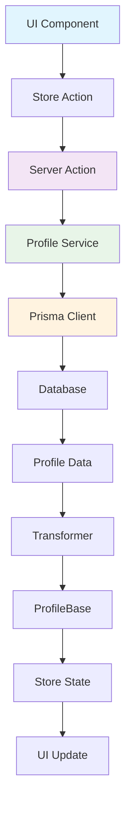

# 👤 Profile Actions

> ✅ **FUNCIONALIDAD ACTIVA** - Módulo completamente funcional

## 📁 Estructura

```
src/app/actions/profiles/
├── profile.actions.ts    # Server Actions principales
├── index.ts             # Exportaciones con tipos
└── README.md           # Esta documentación
```

## 🔧 Funciones Disponibles

### Consultas (GET)

- `getProfiles()` - Obtener todos los perfiles
- `getProfile(id: string)` - Obtener perfil específico por ID
- `getActiveProfile()` - Obtener perfil activo actual

### Mutaciones (CREATE/UPDATE/DELETE)

- `createProfile(data: ProfileCreateInput)` - Crear nuevo perfil
- `updateProfile(id: string, data: ProfileUpdateInput)` - Actualizar perfil existente
- `deleteProfile(id: string)` - Eliminar perfil
- `activateProfile(id: string)` - Activar perfil específico

## 📝 Tipos TypeScript

### ProfileBase

```typescript
interface ProfileBase {
  id: string;
  name: string;
  emoji: string;
  color: string;
  description?: string | null;
  isActive: boolean;
  createdAt: Date;
  updatedAt: Date;
  settingsId?: string | null;
  imageId?: string | null;
}
```

### ProfileCreateInput

```typescript
interface ProfileCreateInput {
  name: string;
  emoji?: string;
  color?: string;
  theme?: ThemeMode;
  language?: Language;
  description?: string;
  isActive?: boolean;
}
```

### ProfileUpdateInput

```typescript
type ProfileUpdateInput = Partial<Omit<ProfileBase, 'id' | 'createdAt' | 'updatedAt'>>;
```

## 🏪 Store de Estado

### Estados Disponibles

- **Perfil Activo**: `activeProfile`, `isLoadingActive`, `activeProfileError`
- **Lista de Perfiles**: `profiles`, `isLoadingProfiles`, `profilesError`, `totalProfiles`
- **Filtros**: `filters`, `pagination`
- **UI**: `viewConfig`, `selectedProfileId`, `hoveredProfileId`, `expandedProfileIds`

### Acciones del Store

```typescript
// Perfil activo
fetchActiveProfile()
setActiveProfile(profile)
setIsLoadingActive(isLoading)

// Lista de perfiles
fetchProfiles()
setProfiles(profiles)
setIsLoadingProfiles(isLoading)

// Configuración de vista
setViewMode(mode)
setShowStats(show)
setGridColumns(columns)

// Estado de UI
setSelectedProfileId(id)
toggleExpandedProfileId(id)
resetUI()
```

## 🔄 Flujo de Datos



## 🛠️ Servicios Relacionados

- **ProfileService**: Lógica de negocio y acceso a datos
- **ProfileTransformers**: Conversión entre tipos Prisma y tipos canónicos
- **ProfileValidators**: Validación con Zod

## 📊 Características

### ✅ Completado

- ✅ Server Actions funcionales
- ✅ Tipos TypeScript completos
- ✅ Store Zustand configurado
- ✅ Validación con Zod
- ✅ Manejo de errores
- ✅ Tests unitarios
- ✅ Transformers implementados
- ✅ Revalidación de caché

### 🎯 Funcionalidades Clave

- **Gestión de perfil activo**: Solo un perfil puede estar activo a la vez
- **CRUD completo**: Crear, leer, actualizar y eliminar perfiles
- **Filtros y búsqueda**: Búsqueda por nombre, tema, idioma
- **Configuración de vista**: Grid, lista, columnas personalizables
- **Estado de UI**: Selección, hover, expansión de tarjetas
- **Persistencia**: Estado del store persistido en localStorage

## 🔗 Relaciones

- **Settings**: Cada perfil puede tener configuraciones asociadas
- **Images**: Cada perfil puede tener una imagen de avatar
- **Users**: Los perfiles pertenecen a usuarios (relación implícita)

## 📈 Métricas de Calidad

- **Cobertura de tipos**: 100% ✅
- **Errores TypeScript**: 0 ✅
- **Tests**: Implementados ✅
- **Documentación**: Completa ✅
