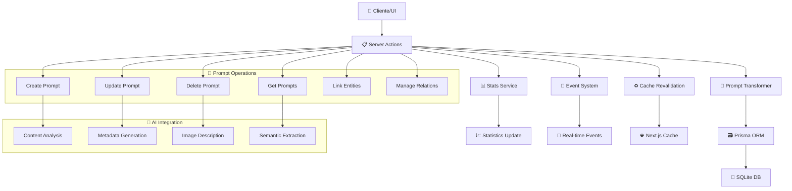

# 🤖 Prompts Actions

## 📄 Descripción

El módulo **Prompts** gestiona el sistema de plantillas y prompts de inteligencia artificial del proyecto. Los prompts son instrucciones estructuradas que definen cómo la IA debe procesar, analizar o generar contenido relacionado con las imágenes, personajes, lugares y otros elementos del sistema.

Los prompts sirven como **interfaz de comunicación con la IA**, permitiendo crear flujos automatizados de análisis de contenido, generación de metadatos, descripción automática de imágenes y extracción de información semántica avanzada.

## 🌊 Flujo de Operaciones



## 📋 Server Actions Disponibles

### 🏗️ CRUD Básico (prompt.actions.ts)

#### `getPrompts(): Promise<PromptWithStats[]>`

- **Descripción**: Obtiene todos los prompts con estadísticas detalladas de relaciones
- **Retorna**: Array de prompts con conteos de entidades relacionadas
- **Incluye**: Conteos de conceptos, notas, personajes, lugares, imágenes, etc.
- **Ordenación**: Por fecha de actualización (desc)
- **Transformaciones**: Aplica toPromptWithStats para deserializar campos
- **Ejemplo**:

```typescript
const prompts = await getPrompts();
prompts.forEach(prompt => {
  console.log(`${prompt.name}: ${prompt._count.images} imágenes relacionadas`);
  console.log(`Tipo: ${prompt.type}, Categoría: ${prompt.category}`);
});
```

#### `getPrompt(id: string): Promise<PromptExtended>`

- **Descripción**: Obtiene un prompt específico por ID con transformaciones extendidas
- **Parámetros**: `id` - UUID del prompt
- **Retorna**: Prompt extendido con conteos y propiedades UI
- **Validaciones**: Lanza error si el prompt no existe
- **Transformaciones**: Aplica toExtendedPrompt para campos procesados
- **Ejemplo**:

```typescript
const prompt = await getPrompt("prompt-123");
// PromptExtended con estadísticas y metadatos UI
```

#### `getPromptWithRelations(id: string): Promise<PromptExtended>`

- **Descripción**: Obtiene un prompt con todas sus relaciones incluidas
- **Parámetros**: `id` - UUID del prompt
- **Retorna**: Prompt con conceptos, notas y otras entidades relacionadas
- **Incluye**: Datos básicos de entidades relacionadas (id, name)
- **Uso**: Para mostrar el contexto completo del prompt
- **Ejemplo**:

```typescript
const fullPrompt = await getPromptWithRelations("prompt-123");
console.log(`Conceptos relacionados: ${fullPrompt.concepts?.map(c => c.name).join(', ')}`);
```

#### `createPrompt(data: PromptCreateInput): Promise<PromptExtended>`

- **Descripción**: Crea un nuevo prompt con validación completa
- **Parámetros**: `data` - Datos del prompt (name, content, type, category, etc.)
- **Retorna**: Prompt creado con transformaciones aplicadas
- **Transformaciones**: Usa mapCreatePromptDataToPrisma para mapeo de datos
- **Efectos secundarios**:
  - Revalida rutas de Next.js cache
  - Emite evento `prompts:modified`
  - Actualiza estadísticas del sistema
- **Ejemplo**:

```typescript
const newPrompt = await createPrompt({
  name: "Análisis de Composición",
  content: `Analiza la composición de esta imagen considerando:
    1. Regla de tercios
    2. Líneas de fuga
    3. Balance visual
    4. Elementos dominantes`,
  type: "ANALYSIS",
  category: "PHOTOGRAPHY",
  parameters: {
    temperature: 0.7,
    max_tokens: 500
  },
  emoji: "📸",
  color: "#3b82f6"
});
```

#### `updatePrompt(id: string, data: PromptUpdateInput): Promise<PromptExtended>`

- **Descripción**: Actualiza un prompt existente con validación
- **Parámetros**:
  - `id` - UUID del prompt
  - `data` - Datos a actualizar (campos parciales)
- **Transformaciones**: Usa mapUpdatePromptDataToPrisma para mapeo
- **Validaciones**: Verifica existencia antes de actualizar
- **Ejemplo**:

```typescript
const updatedPrompt = await updatePrompt("prompt-123", {
  content: "Contenido actualizado del prompt...",
  parameters: { temperature: 0.8 },
  isFavorite: true
});
```

#### `deletePrompt(id: string): Promise<void>`

- **Descripción**: Elimina un prompt y desconecta todas sus relaciones
- **Parámetros**: `id` - UUID del prompt a eliminar
- **Validaciones**: Verifica existencia antes de eliminar
- **Operaciones**:
  - Desconecta de todas las entidades relacionadas
  - Elimina el prompt en transacción
  - Notifica cambios y revalida cache
- **Relaciones desconectadas**:
  - Concepts, Notes, Characters, Places
  - WorldItems, Images, Groups, Properties, Wildcards

### 🖼️ Gestión de Imágenes (prompt.actions.ts)

#### `getPromptImages(promptId: string): Promise<FileItem[]>`

- **Descripción**: Obtiene todas las imágenes asociadas a un prompt específico
- **Parámetros**: `promptId` - UUID del prompt
- **Retorna**: Array de imágenes en formato FileItem
- **Validaciones**: Verifica existencia del prompt
- **Ordenación**: Por favoritos (desc) y fecha de creación (desc)
- **Ejemplo**:

```typescript
const images = await getPromptImages("prompt-123");
images.forEach(image => {
  console.log(`${image.name} - Tags: ${image.tags?.join(', ')}`);
});
```

#### `addImageToPrompt(promptId: string, imageId: string): Promise<void>`

- **Descripción**: Asocia una imagen existente a un prompt específico
- **Parámetros**:
  - `promptId` - UUID del prompt
  - `imageId` - UUID de la imagen
- **Validaciones**: Verifica existencia de ambas entidades
- **Operación**: Usa Prisma connect para establecer la relación
- **Ejemplo**:

```typescript
await addImageToPrompt("prompt-123", "image-456");
// Imagen asociada al prompt para análisis/procesamiento
```

### 🔗 Gestión de Relaciones (prompt.actions.ts)

#### `linkEntityToPrompt(promptId: string, entityType: string, entityId: string): Promise<void>`

- **Descripción**: Asocia cualquier tipo de entidad a un prompt específico
- **Parámetros**:
  - `promptId` - UUID del prompt
  - `entityType` - Tipo de entidad ("concept", "note", "character", etc.)
  - `entityId` - UUID de la entidad
- **Validaciones**: Verifica existencia de ambas entidades y tipo válido
- **Soporte**: Concepts, Notes, Characters, Places, WorldItems, Images, Groups, Properties, Wildcards
- **Ejemplo**:

```typescript
// Asociar concepto al prompt
await linkEntityToPrompt("prompt-123", "concept", "concept-456");

// Asociar personaje al prompt
await linkEntityToPrompt("prompt-123", "character", "character-789");
```

#### `unlinkEntityFromPrompt(promptId: string, entityType: string, entityId: string): Promise<void>`

- **Descripción**: Desasocia una entidad de un prompt sin eliminar ninguna
- **Parámetros**:
  - `promptId` - UUID del prompt
  - `entityType` - Tipo de entidad a desasociar
  - `entityId` - UUID de la entidad
- **Operación**: Usa Prisma disconnect para eliminar solo la relación

## 🔗 Relaciones y Dependencias

### 📦 Servicios Utilizados

- **Prompt Transformer**: Transformación y validación de datos avanzada
- **Prisma ORM**: Acceso a base de datos con relaciones complejas
- **Event System**: Notificaciones de cambios en tiempo real (`prompts:modified`)
- **Stats Service**: Actualización de estadísticas del sistema (`STATS_EVENTS.PROMPT_CHANGE`)
- **Error Handling**: Sistema de errores tipados y serializables

### 🔄 Transformers

- **mapCreatePromptDataToPrisma**: Mapeo de datos de creación para Prisma
- **mapUpdatePromptDataToPrisma**: Mapeo de datos de actualización para Prisma
- **toExtendedPrompt**: Transformación a prompt extendido con propiedades UI
- **toPromptWithStats**: Transformación con estadísticas incluidas

### 🏗️ Tipos Principales

- **PromptBase**: Estructura base del prompt
- **PromptExtended**: Prompt con propiedades UI y transformaciones
- **PromptWithStats**: Prompt con estadísticas de relaciones (_count)
- **PromptCreateInput, PromptUpdateInput**: DTOs para operaciones CRUD
- **PromptWithImages**: Interfaz de compatibilidad con imágenes

### 🤖 Estructura de Prompt

```typescript
interface PromptWithStats extends PromptBase {
  id: string;
  name: string;
  content: string; // Texto del prompt
  type: string; // Tipo de prompt (ANALYSIS, GENERATION, etc.)
  category: string | null;
  emoji: string;
  color: string;

  // Parámetros de IA
  parameters: {
    temperature?: number;
    max_tokens?: number;
    top_p?: number;
    frequency_penalty?: number;
    presence_penalty?: number;
  };

  // Metadatos
  isFavorite: boolean;
  createdAt: Date;
  updatedAt: Date;

  // Estadísticas de relaciones
  _count: {
    concepts: number;
    notes: number;
    characters: number;
    places: number;
    worldItems: number;
    images: number;
    groups: number;
    properties: number;
    wildcards: number;
  };
}
```

## 💡 Ejemplos de Uso

### Crear Sistema de Análisis de IA

```typescript
// 1. Crear prompt de análisis de imagen
const analysisPrompt = await createPrompt({
  name: "Análisis Detallado de Fotografía",
  content: `Analiza esta fotografía en detalle considerando:

## Composición
- Regla de tercios y puntos de interés
- Líneas directrices y patrones
- Balance y simetría

## Técnica
- Exposición y contraste
- Profundidad de campo
- Calidad de la luz

## Contenido
- Sujeto principal y elementos secundarios
- Contexto y ambiente
- Emociones transmitidas

Proporciona un análisis estructurado y constructivo.`,
  type: "ANALYSIS",
  category: "PHOTOGRAPHY",
  parameters: {
    temperature: 0.7,
    max_tokens: 800,
    top_p: 0.9
  },
  emoji: "🎯",
  color: "#059669"
});

// 2. Asociar imágenes para análisis
const imageIds = ["img-1", "img-2", "img-3"];
for (const imageId of imageIds) {
  await addImageToPrompt(analysisPrompt.id, imageId);
}

// 3. Asociar conceptos relacionados
await linkEntityToPrompt(analysisPrompt.id, "concept", "photography-composition-concept-id");
await linkEntityToPrompt(analysisPrompt.id, "concept", "light-analysis-concept-id");
```

### Gestión de Prompts Especializados

```typescript
// Obtener todos los prompts con estadísticas
const allPrompts = await getPrompts();

// Filtrar prompts por tipo y uso
const analysisPrompts = allPrompts.filter(p => p.type === "ANALYSIS");
const generationPrompts = allPrompts.filter(p => p.type === "GENERATION");

// Actualizar prompt con nuevos parámetros
const optimizedPrompt = await updatePrompt(analysisPrompts[0].id, {
  parameters: {
    temperature: 0.5, // Más determinístico
    max_tokens: 1000,  // Respuestas más largas
    top_p: 0.85
  },
  content: `${analysisPrompts[0].content}\n\n## Criterios Adicionales\n- Aspectos culturales\n- Impacto visual`
});
```

### Análisis de Relaciones y Estadísticas

```typescript
// Obtener prompt con todas sus relaciones
const fullPrompt = await getPromptWithRelations("prompt-123");

// Analizar conectividad
const totalEntities = Object.values(fullPrompt._count || {})
  .reduce((sum, count) => sum + count, 0);

console.log(`Prompt "${fullPrompt.name}" conectado a ${totalEntities} entidades`);

// Obtener imágenes asociadas
const promptImages = await getPromptImages(fullPrompt.id);
console.log(`${promptImages.length} imágenes listas para procesamiento`);
```

## 🧪 Testing

Los tests para este módulo cubren:

- ✅ **Operaciones CRUD completas** con transformadores avanzados
- ✅ **Gestión de relaciones** multi-entidad con validación
- ✅ **Parámetros de IA** y configuración de prompts
- ✅ **Manejo de errores** tipados y serializables
- ✅ **Eventos del sistema** y revalidación de cache
- ✅ **Transacciones** para operaciones complejas
- ✅ **Funciones de enlace** dinámico de entidades

### Casos de Test Específicos

```typescript
describe('Prompts Actions', () => {
  test('should create prompt with AI parameters', async () => {
    const promptData = {
      name: 'Test Analysis Prompt',
      content: 'Analyze this content...',
      type: 'ANALYSIS',
      parameters: { temperature: 0.7, max_tokens: 500 }
    };
    const prompt = await createPrompt(promptData);
    expect(prompt.id).toBeDefined();
    expect(prompt.parameters.temperature).toBe(0.7);
  });

  test('should link and unlink entities dynamically', async () => {
    await linkEntityToPrompt(promptId, 'concept', conceptId);
    const prompt = await getPromptWithRelations(promptId);
    expect(prompt.concepts?.length).toBeGreaterThan(0);

    await unlinkEntityFromPrompt(promptId, 'concept', conceptId);
    const updatedPrompt = await getPromptWithRelations(promptId);
    expect(updatedPrompt.concepts?.length).toBe(0);
  });
});
```

## ⚠️ Consideraciones Importantes

### 🤖 Integración con IA

- **Parámetros optimizados**: Ajustar temperature, max_tokens según el tipo de prompt
- **Versionado de prompts**: Mantener versiones de prompts para reproducibilidad
- **Testing de calidad**: Evaluar la calidad de las respuestas generadas
- **Rate limiting**: Considerar límites de uso de APIs de IA

### 🔗 Gestión de Relaciones

- **Validación de tipos**: Verificar que los tipos de entidad sean válidos antes de enlazar
- **Integridad referencial**: Asegurar que las entidades existen antes de crear relaciones
- **Desconexión limpia**: Eliminar todas las relaciones antes de eliminar prompts
- **Consistencia semántica**: Asegurar que las relaciones tienen sentido contextual

### 🚀 Rendimiento

- **Cache de prompts**: Cachear prompts frecuentemente utilizados
- **Optimización de queries**: Cargar solo las relaciones necesarias
- **Paginación**: Implementar paginación para listas grandes de prompts
- **Índices**: Asegurar índices en campos de búsqueda y filtrado

### 📝 Contenido y Estructura

- **Calidad del prompt**: Validar que los prompts produzcan resultados útiles
- **Estructura consistente**: Mantener formato coherente en el contenido
- **Documentación**: Documentar el propósito y uso esperado de cada prompt
- **Categorización**: Mantener taxonomía clara de tipos y categorías

### 📈 Escalabilidad

- **Plantillas de prompts**: Sistema de plantillas para creación rápida
- **Versionado avanzado**: Historial de cambios y rollback
- **Métricas de uso**: Tracking de efectividad y frecuencia de uso
- **Migración**: Plan para evolución de estructura de prompts

---

## 📚 Recursos Adicionales

- **[Transformer Documentation](../../../transformers/prompt/README.md)**: Detalles técnicos de transformación
- **[Types Reference](../../../types/entities/prompt/)**: Definiciones de tipos completas
- **[AI Integration Guide](../../../docs/ai-integration.md)**: Guía de integración con IA
- **[Error Handling](../../../lib/errors/prompt-errors.ts)**: Sistema de errores especializado

## Funciones disponibles

