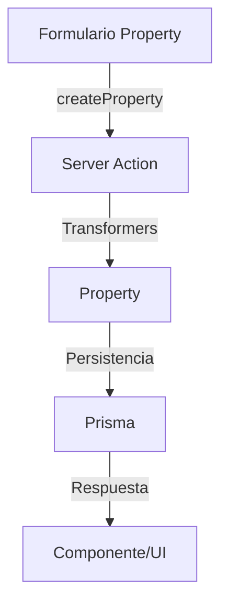

# 🏷️ Server Actions: Properties

Acciones del servidor para la gestión de propiedades (Property) asociadas a entidades del sistema.

---

## 🧩 Funciones disponibles

- `createProperty(data: CreatePropertyData): Promise<Property>`
- `deleteProperty(id: string): Promise<boolean>`
- `getProperties(): Promise<Property[]>`
- `getProperty(id: string): Promise<Property>`
- `togglePropertyFavorite(id: string): Promise<Property>`
- `updateProperty(id: string, data: UpdatePropertyData): Promise<Property>`

---

## 🚀 Ejemplo de uso

```tsx
'use client';
import { createProperty, getProperties } from '@/app/actions/properties/property.actions';

async function handleCreate(data) {
  // data debe cumplir el esquema Zod CreatePropertySchema
  const property = await createProperty(data);
  // El resultado es la propiedad creada (sin wrapper { success, data, error })
  console.log(property);
}

async function fetchProperties() {
  const properties = await getProperties();
  // Devuelve un array de propiedades
}
```

---

## 🛡️ Buenas prácticas

- Validar siempre los datos con Zod (`CreatePropertySchema`, `UpdatePropertySchema`).
- Usar solo los tipos canónicos de `@/types/entities/property/types.ts`.
- No importar tipos de Prisma en acciones ni transformers.
- El resultado de las acciones es directo, sin wrappers `{ success, data, error }`.
- Revalidar rutas relevantes tras mutaciones si aplica.

---

## 🗺️ Diagrama de flujo



---

## ⚠️ Advertencias

- No exponer datos sensibles ni internos al cliente.
- Validar y sanitizar todos los campos antes de persistir.
- No duplicar lógica de transformación, usar siempre los transformers.

---

## 📚 Referencias

- [Transformers Property](../../transformers/property/documentation.md)
- [Tipos Property](../../types/entities/property/types.ts)

---

> Última revisión: 2025-06-19
> Estado: ✅ Documentación alineada con patrón moderno, ejemplos y advertencias actualizados.
