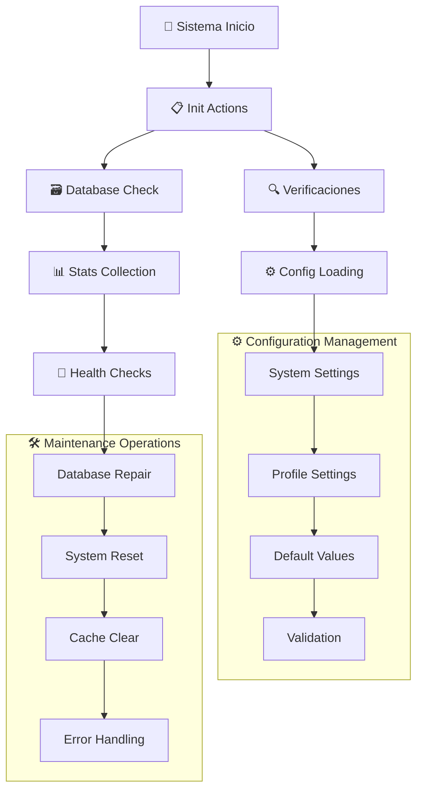

# ⚙️ System Actions

## 📄 Descripción

El módulo **System** gestiona la configuración global del sistema, inicialización de la aplicación, mantenimiento de la base de datos y configuraciones por perfil. Es el componente fundamental que asegura el correcto funcionamiento de toda la aplicación y proporciona herramientas de administración del sistema.

### 🎯 Funcionalidades Principales

- **🚀 Inicialización**: Setup inicial del sistema y verificaciones de integridad
- **⚙️ Configuraciones**: Gestión de settings globales y por perfil
- **📊 Estadísticas**: Métricas del sistema y estado de salud
- **🔧 Mantenimiento**: Reparación, reset y limpieza del sistema
- **📝 Logging**: Registro y manejo de errores del sistema
- **🔄 Versioning**: Control de versiones y actualizaciones

## 🌊 Flujo de Operaciones



## 📋 Server Actions Disponibles

### 🚀 Inicialización (init.actions.ts)

#### `initServer(): Promise<SystemInitResult>`

- **Descripción**: Inicializa el servidor y verifica integridad del sistema
- **Retorna**: Resultado de inicialización con estado del sistema
- **Proceso**:
  - Verifica conexión a base de datos
  - Carga configuraciones por defecto
  - Ejecuta verificaciones de salud
  - Inicializa servicios críticos
- **Uso**: Llamado automáticamente en el startup de la aplicación

### ⚙️ Configuraciones del Sistema (settings.actions.ts)

#### `getSystemSettings(): Promise<SystemSettings>`

- **Descripción**: Obtiene todas las configuraciones globales del sistema
- **Retorna**: Objeto con todas las configuraciones del sistema
- **Cache**: Utiliza cache para acceso rápido a configuraciones
- **Incluye**: Configuraciones de storage, procesamiento, UI, etc.

#### `updateSystemSettings(settings: Partial<SystemSettings>): Promise<SystemSettings>`

- **Descripción**: Actualiza configuraciones globales del sistema
- **Parámetros**: `settings` - Configuraciones parciales a actualizar
- **Retorna**: Configuraciones actualizadas completas
- **Validaciones**: Valida tipos y rangos de valores
- **Efectos**: Revalida cache y notifica componentes afectados

#### `resetSystemSettings(): Promise<SystemSettings>`

- **Descripción**: Restaura configuraciones del sistema a valores por defecto
- **Retorna**: Configuraciones restablecidas
- **Uso**: Para solucionar problemas de configuración
- **Backup**: Crea respaldo antes de reset

#### `createDefaultSettingsData(): Promise<SystemSettings>`

- **Descripción**: Crea datos de configuración por defecto
- **Retorna**: Configuraciones iniciales del sistema
- **Uso**: Primera instalación o reset completo
- **Configuraciones**: Valores optimizados para uso general

### 👤 Configuraciones de Perfil (settings.actions.ts)

#### `getProfileSettings(profileId?: string): Promise<ProfileSettings>`

- **Descripción**: Obtiene configuraciones específicas de un perfil
- **Parámetros**: `profileId` - UUID del perfil (opcional, usa activo si no se especifica)
- **Retorna**: Configuraciones del perfil especificado
- **Incluye**: Preferencias de UI, configuraciones de visualización, etc.

#### `updateProfileSettings(profileId: string, settings: Partial<ProfileSettings>): Promise<ProfileSettings>`

- **Descripción**: Actualiza configuraciones de un perfil específico
- **Parámetros**:
  - `profileId` - UUID del perfil
  - `settings` - Configuraciones parciales a actualizar
- **Retorna**: Configuraciones actualizadas del perfil
- **Validaciones**: Verifica permisos y validez de datos

#### `resetProfileSettings(profileId: string): Promise<ProfileSettings>`

- **Descripción**: Restaura configuraciones de perfil a valores por defecto
- **Parámetros**: `profileId` - UUID del perfil a resetear
- **Retorna**: Configuraciones restablecidas del perfil
- **Backup**: Mantiene historial de configuraciones anteriores

### 📊 Estadísticas y Estado (system.actions.ts)

#### `getSystemStats(): Promise<SystemStats>`

- **Descripción**: Obtiene estadísticas completas del sistema
- **Retorna**: Objeto con métricas del sistema
- **Incluye**:
  - Conteos de entidades (imágenes, carpetas, álbumes, etc.)
  - Métricas de storage y rendimiento
  - Estado de procesos en background
  - Información de versión y uptime
- **Performance**: Cache inteligente para evitar recálculos costosos

#### `getSystemVersion(): Promise<VersionInfo>`

- **Descripción**: Obtiene información de versión del sistema
- **Retorna**: Información detallada de la versión actual
- **Incluye**: Versión, build, fecha de compilación, dependencias críticas
- **Uso**: Para verificaciones de compatibilidad y debugging

### 🛠️ Mantenimiento (system.actions.ts)

#### `repairSystem(): Promise<RepairResult>`

- **Descripción**: Ejecuta reparaciones automáticas del sistema
- **Retorna**: Resultado de las operaciones de reparación
- **Proceso**:
  - Verifica integridad de base de datos
  - Repara índices corruptos
  - Limpia datos huérfanos
  - Regenera estadísticas
- **Uso**: Para resolver problemas de consistencia

#### `resetDatabase(): Promise<ResetResult>`

- **Descripción**: Reinicia la base de datos a estado limpio
- **Retorna**: Resultado de la operación de reset
- **⚠️ PELIGRO**: Elimina todos los datos del sistema
- **Backup**: Crea respaldo completo antes del reset
- **Uso**: Solo para desarrollo o casos extremos

### 🚨 Manejo de Errores (system.errors.ts)

#### `createSystemError(message: string, context?: ErrorContext): Promise<SystemError>`

- **Descripción**: Crea y registra un error del sistema
- **Parámetros**:
  - `message` - Mensaje descriptivo del error
  - `context` - Contexto adicional del error
- **Retorna**: Error formateado para el sistema
- **Logging**: Registra automáticamente en logs del sistema
- **Categorización**: Clasifica errores por tipo y severidad

## 🔗 Relaciones y Dependencias

### 📦 Servicios Utilizados

- **prisma**: ORM para persistencia de configuraciones
- **serverLogger**: Sistema de logging para operaciones del sistema
- **cache.service**: Sistema de cache para configuraciones
- **health.service**: Verificaciones de salud del sistema
- **backup.service**: Creación de respaldos antes de operaciones críticas

### 🏗️ Tipos Principales

- **SystemSettings**: Configuraciones globales del sistema
- **ProfileSettings**: Configuraciones específicas por perfil
- **SystemStats**: Estadísticas y métricas del sistema
- **SystemInitResult**: Resultado de inicialización
- **RepairResult, ResetResult**: Resultados de operaciones de mantenimiento
- **VersionInfo**: Información de versión y build
- **SystemError**: Formato estándar de errores del sistema

## 💡 Ejemplos de Uso

### 🚀 Inicialización del sistema

```typescript
import { initServer, getSystemStats } from '@/app/actions/system';

// Inicializar sistema al startup
const initResult = await initServer();
if (initResult.success) {
  console.log('✅ Sistema inicializado correctamente');

  // Obtener estadísticas iniciales
  const stats = await getSystemStats();
  console.log(`Sistema con ${stats.totalImages} imágenes en ${stats.totalFolders} carpetas`);
} else {
  console.error('❌ Error en inicialización:', initResult.errors);
}
```

### ⚙️ Gestión de configuraciones

```typescript
import {
  getSystemSettings,
  updateSystemSettings,
  getProfileSettings,
  updateProfileSettings
} from '@/app/actions/system';

// Obtener configuraciones del sistema
const systemConfig = await getSystemSettings();
console.log('Configuración actual:', systemConfig);

// Actualizar configuraciones del sistema
const updatedSystem = await updateSystemSettings({
  maxThumbnailSize: 512,
  autoProcessImages: true,
  compressionQuality: 85
});

// Gestionar configuraciones de perfil
const profileConfig = await getProfileSettings('user-profile-uuid');
const updatedProfile = await updateProfileSettings('user-profile-uuid', {
  theme: 'dark',
  imagesPerPage: 50,
  showMetadata: true
});
```

### 🛠️ Operaciones de mantenimiento

```typescript
import { repairSystem, resetDatabase } from '@/app/actions/system';

// Reparar sistema (operación segura)
const repairResult = await repairSystem();
console.log('Reparación completada:', repairResult);

// Reset de base de datos (SOLO para desarrollo)
if (process.env.NODE_ENV === 'development') {
  const resetResult = await resetDatabase();
  console.log('Base de datos reseteada:', resetResult);
}
```

### 📊 Monitoreo y estadísticas

```typescript
import { getSystemStats, getSystemVersion } from '@/app/actions/system';

// Obtener estadísticas para dashboard de administración
const stats = await getSystemStats();
const version = await getSystemVersion();

console.log(`
Sistema Image Manager v${version.version}
- Imágenes: ${stats.totalImages}
- Carpetas: ${stats.totalFolders}
- Espacio usado: ${stats.storageUsed} GB
- Uptime: ${stats.uptime} horas
- CPU: ${stats.cpuUsage}%
- RAM: ${stats.memoryUsage}%
`);
```

## 🧪 Testing

Los tests para este módulo cubren:

- ✅ Inicialización completa del sistema
- ✅ Operaciones CRUD de configuraciones
- ✅ Validación de configuraciones inválidas
- ✅ Operaciones de reparación y mantenimiento
- ✅ Manejo de errores y recovery
- ✅ Performance de cache de configuraciones
- ✅ Integridad después de operaciones de reset

## ⚠️ Consideraciones Importantes

### 🔒 Seguridad

- **Access Control**: Solo administradores pueden modificar configuraciones del sistema
- **Validation**: Validación estricta de todos los valores de configuración
- **Backup**: Respaldos automáticos antes de operaciones destructivas
- **Audit Trail**: Registro de todos los cambios de configuración

### 🚀 Rendimiento

- **Configuration Cache**: Cache agresivo para configuraciones frecuentemente accedidas
- **Lazy Loading**: Carga bajo demanda de configuraciones complejas
- **Change Detection**: Invalidación selectiva de cache
- **Batch Updates**: Agrupación de múltiples cambios de configuración

### 🛡️ Confiabilidad

- **Health Checks**: Verificaciones automáticas de salud del sistema
- **Graceful Degradation**: Funcionamiento con configuraciones por defecto si hay errores
- **Transaction Safety**: Operaciones de configuración envueltas en transacciones
- **Recovery Mechanisms**: Herramientas de recuperación ante fallos

### 📈 Escalabilidad

- **Efficient Queries**: Consultas optimizadas para configuraciones
- **Memory Management**: Gestión cuidadosa de memoria para estadísticas
- **Background Processing**: Operaciones de mantenimiento en background
- **Resource Monitoring**: Monitoreo de recursos del sistema
