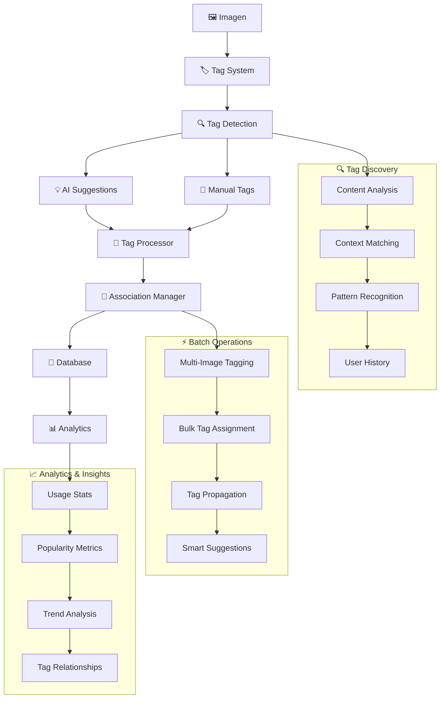

# 🏷️ Tags Actions

## 📄 Descripción

El módulo **Tags** implementa un sistema completo de etiquetado para organizar y categorizar imágenes. Proporciona funcionalidades de creación, gestión y búsqueda de etiquetas, así como la asociación inteligente entre imágenes y tags con capacidades de autocompletado y sugerencias basadas en IA.

### 🎯 Funcionalidades Principales

- **🏗️ Gestión CRUD**: Crear, leer, actualizar y eliminar etiquetas
- **🔗 Asociaciones**: Vincular/desvincular imágenes con etiquetas
- **🔍 Búsqueda Inteligente**: Búsqueda textual y por patrones
- **💡 Sugerencias**: Tags sugeridos basados en contenido y contexto
- **⚡ Operaciones Batch**: Asignación masiva de etiquetas
- **📊 Analytics**: Estadísticas de uso y popularidad de tags

## 🌊 Flujo de Operaciones



## 📋 Server Actions Disponibles

### 🏗️ CRUD Básico (crud.actions.ts)

#### `createTagAction(data: CreateTagData): Promise<TagResult>`

- **Descripción**: Crea una nueva etiqueta en el sistema
- **Parámetros**: `data` - Datos de la etiqueta (name, description, color, etc.)
- **Retorna**: Etiqueta creada con ID generado
- **Validaciones**:
  - Verifica unicidad del nombre
  - Normaliza el formato
  - Asigna color automático si no se especifica
- **Efectos**: Actualiza cache de etiquetas y estadísticas

#### `updateTagAction(id: string, data: UpdateTagData): Promise<TagResult>`

- **Descripción**: Actualiza una etiqueta existente
- **Parámetros**:
  - `id` - UUID de la etiqueta
  - `data` - Datos a actualizar (parciales)
- **Retorna**: Etiqueta actualizada
- **Validaciones**: Verifica que cambios no generen duplicados
- **Propagación**: Actualiza asociaciones existentes si es necesario

#### `deleteTagAction(id: string, options?: DeleteOptions): Promise<void>`

- **Descripción**: Elimina una etiqueta del sistema
- **Parámetros**:
  - `id` - UUID de la etiqueta
  - `options` - Configuraciones (preserveAssociations, replaceWith, etc.)
- **Comportamiento**:
  - Por defecto elimina asociaciones
  - Opción de transferir asociaciones a otra etiqueta
- **Seguridad**: Confirma antes de eliminar etiquetas con muchas asociaciones

#### `getTagByIdAction(id: string): Promise<TagResult>`

- **Descripción**: Obtiene una etiqueta específica por ID
- **Parámetros**: `id` - UUID de la etiqueta
- **Retorna**: Etiqueta con estadísticas de uso
- **Incluye**: Conteo de imágenes asociadas, fecha de último uso

### 🔍 Consultas y Búsqueda (query.actions.ts)

#### `getTagsAction(options?: GetTagsOptions): Promise<TagResult[]>`

- **Descripción**: Obtiene lista de etiquetas con filtros opcionales
- **Parámetros**: `options` - Filtros (search, orderBy, limit, includeStats, etc.)
- **Retorna**: Array de etiquetas ordenadas
- **Ordenamiento**: Por popularidad, alfabético, fecha de creación, uso reciente
- **Paginación**: Soporte para grandes volúmenes de etiquetas

#### `searchTagsAction(query: string, options?: SearchOptions): Promise<TagResult[]>`

- **Descripción**: Búsqueda textual inteligente de etiquetas
- **Parámetros**:
  - `query` - Término de búsqueda
  - `options` - Configuraciones (fuzzy, limit, includeDescriptions, etc.)
- **Algoritmo**:
  - Coincidencia exacta (prioridad alta)
  - Coincidencia parcial
  - Búsqueda difusa (fuzzy matching)
  - Búsqueda en descripciones
- **Ranking**: Basado en relevancia y popularidad

#### `getSuggestedTags(imageId: string, context?: TagContext): Promise<TagSuggestion[]>`

- **Descripción**: Genera sugerencias inteligentes de etiquetas para una imagen
- **Parámetros**:
  - `imageId` - UUID de la imagen
  - `context` - Contexto adicional (folder, user preferences, etc.)
- **Algoritmo**:
  - Análisis de contenido visual (si disponible)
  - Tags de imágenes similares
  - Patrones de etiquetado del usuario
  - Tags de la misma carpeta/álbum
- **Retorna**: Array de sugerencias con scores de confianza

### 🔗 Gestión de Asociaciones (relation.actions.ts)

#### `addImageToTag(tagId: string, imageId: string): Promise<void>`

- **Descripción**: Asocia una imagen específica a una etiqueta
- **Parámetros**:
  - `tagId` - UUID de la etiqueta
  - `imageId` - UUID de la imagen
- **Validaciones**: Verifica existencia de ambos elementos
- **Duplicados**: Previene asociaciones duplicadas
- **Efectos**: Actualiza estadísticas de uso de la etiqueta

#### `assignTagToImages(tagId: string, imageIds: string[]): Promise<AssignmentResult>`

- **Descripción**: Asigna una etiqueta a múltiples imágenes en batch
- **Parámetros**:
  - `tagId` - UUID de la etiqueta
  - `imageIds` - Array de UUIDs de imágenes
- **Retorna**: Resultado con conteos de éxito/error
- **Optimización**: Operación transaccional para mejor rendimiento
- **Manejo de errores**: Continúa con otras imágenes si alguna falla

#### `removeTagFromImages(tagId: string, imageIds: string[]): Promise<RemovalResult>`

- **Descripción**: Remueve una etiqueta de múltiples imágenes
- **Parámetros**:
  - `tagId` - UUID de la etiqueta
  - `imageIds` - Array de UUIDs de imágenes
- **Retorna**: Resultado con conteos de operaciones realizadas
- **Comportamiento**: Solo remueve asociaciones existentes
- **Estadísticas**: Actualiza conteos de uso de etiqueta

#### `updateImageTags(imageId: string, tagOperations: TagOperation[]): Promise<UpdateResult>`

- **Descripción**: Actualiza todas las etiquetas de una imagen en una operación
- **Parámetros**:
  - `imageId` - UUID de la imagen
  - `tagOperations` - Array de operaciones (add, remove, replace)
- **Retorna**: Resultado consolidado de todas las operaciones
- **Tipos de operación**:
  - `add`: Agregar nuevas etiquetas
  - `remove`: Remover etiquetas específicas
  - `replace`: Reemplazar todas las etiquetas
- **Transaccional**: Todas las operaciones en una sola transacción

## 🔗 Relaciones y Dependencias

### 📦 Servicios Utilizados

- **prisma**: ORM para gestión de etiquetas y asociaciones
- **serverLogger**: Sistema de logging para operaciones de tags
- **search.service**: Motor de búsqueda para tags inteligentes
- **ai.service**: Análisis de contenido para sugerencias (opcional)
- **cache.service**: Cache para etiquetas frecuentemente accedidas
- **analytics.service**: Tracking de uso y popularidad

### 🏗️ Tipos Principales

- **TagResult**: Tipo principal de etiqueta para respuestas
- **CreateTagData, UpdateTagData**: DTOs para operaciones CRUD
- **TagSuggestion**: Sugerencia con score de confianza
- **TagOperation**: Operación de actualización (add/remove/replace)
- **GetTagsOptions, SearchOptions**: Configuraciones de consulta
- **AssignmentResult, RemovalResult**: Resultados de operaciones batch
- **TagContext**: Contexto para generación de sugerencias

### 🎨 Características de Etiquetas

```typescript
interface TagResult {
  id: string;
  name: string;
  description?: string;
  color?: string;
  category?: string;
  isSystemTag: boolean;
  createdAt: Date;
  updatedAt: Date;
  stats: {
    imageCount: number;
    lastUsed?: Date;
    popularity: number;
  };
}
```

## 💡 Ejemplos de Uso

### 🏗️ Crear y gestionar etiquetas

```typescript
import {
  createTagAction,
  updateTagAction,
  getTagsAction
} from '@/app/actions/tags';

// Crear nueva etiqueta
const newTag = await createTagAction({
  name: 'Paisajes',
  description: 'Fotografías de paisajes naturales',
  color: '#4CAF50',
  category: 'Fotografía'
});

// Actualizar etiqueta existente
const updatedTag = await updateTagAction(newTag.id, {
  description: 'Paisajes naturales y urbanos'
});

// Obtener todas las etiquetas ordenadas por popularidad
const popularTags = await getTagsAction({
  orderBy: 'popularity',
  limit: 20,
  includeStats: true
});

console.log(`${popularTags.length} etiquetas más populares`);
```

### 🔍 Búsqueda y sugerencias

```typescript
import {
  searchTagsAction,
  getSuggestedTags
} from '@/app/actions/tags';

// Búsqueda textual de etiquetas
const searchResults = await searchTagsAction('natur', {
  fuzzy: true,
  limit: 10,
  includeDescriptions: true
});

// Obtener sugerencias para una imagen
const suggestions = await getSuggestedTags('image-uuid', {
  folderId: 'folder-uuid',
  userId: 'user-uuid',
  maxSuggestions: 5
});

console.log('Sugerencias:', suggestions.map(s =>
  `${s.tag.name} (${Math.round(s.confidence * 100)}%)`
));
```

### 🔗 Gestión de asociaciones

```typescript
import {
  assignTagToImages,
  updateImageTags,
  removeTagFromImages
} from '@/app/actions/tags';

// Asignar etiqueta a múltiples imágenes
const imageIds = ['img1', 'img2', 'img3'];
const result = await assignTagToImages('tag-uuid', imageIds);
console.log(`Asignadas ${result.successful} de ${result.total} imágenes`);

// Actualizar todas las etiquetas de una imagen
await updateImageTags('image-uuid', [
  { operation: 'add', tagIds: ['tag1', 'tag2'] },
  { operation: 'remove', tagIds: ['tag3'] }
]);

// Remover etiqueta de múltiples imágenes
const removal = await removeTagFromImages('tag-uuid', imageIds);
console.log(`Removidas ${removal.successful} asociaciones`);
```

### 🎨 Etiquetas con categorías y colores

```typescript
import { createTagAction, getTagsAction } from '@/app/actions/tags';

// Crear etiquetas categorizadas
const colorTags = await Promise.all([
  createTagAction({ name: 'Azul', color: '#2196F3', category: 'Colores' }),
  createTagAction({ name: 'Verde', color: '#4CAF50', category: 'Colores' }),
  createTagAction({ name: 'Rojo', color: '#F44336', category: 'Colores' })
]);

// Obtener etiquetas por categoría
const colorTagsOnly = await getTagsAction({
  category: 'Colores',
  orderBy: 'name'
});

console.log(`Etiquetas de colores: ${colorTagsOnly.map(t => t.name).join(', ')}`);
```

## 🧪 Testing

Los tests para este módulo cubren:

- ✅ Operaciones CRUD completas de etiquetas
- ✅ Búsqueda textual y fuzzy matching
- ✅ Asociaciones imagen-etiqueta
- ✅ Operaciones batch con múltiples imágenes
- ✅ Generación de sugerencias inteligentes
- ✅ Manejo de duplicados y conflictos
- ✅ Performance con grandes volúmenes de etiquetas
- ✅ Validaciones y manejo de errores

## ⚠️ Consideraciones Importantes

### 🚀 Rendimiento

- **Búsqueda Optimizada**: Índices en campos de búsqueda frecuente
- **Cache Strategy**: Cache de etiquetas populares y recientes
- **Batch Operations**: Operaciones agrupadas para mejor rendimiento
- **Lazy Loading**: Carga bajo demanda de estadísticas complejas

### 🔒 Consistencia

- **Transactional Operations**: Operaciones batch envueltas en transacciones
- **Validation**: Validación estricta de nombres y asociaciones
- **Duplicate Prevention**: Prevención de etiquetas y asociaciones duplicadas
- **Data Integrity**: Verificaciones de integridad referencial

### 🎨 Usabilidad

- **Smart Suggestions**: Sugerencias basadas en contexto y ML
- **Color Management**: Asignación automática de colores distintivos
- **Category Organization**: Organización jerárquica por categorías
- **Search Intelligence**: Búsqueda tolerante a errores tipográficos

### 📊 Analytics

- **Usage Tracking**: Seguimiento detallado de uso de etiquetas
- **Popularity Metrics**: Métricas de popularidad en tiempo real
- **Trend Analysis**: Análisis de tendencias de etiquetado
- **Performance Monitoring**: Monitoreo de performance de operaciones

## Funciones disponibles

