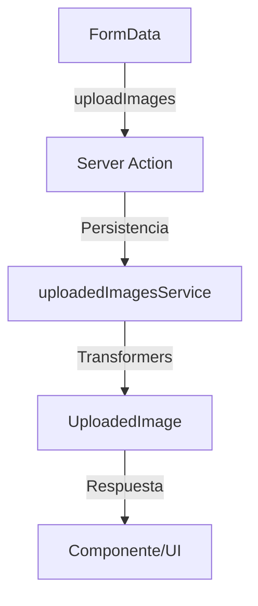

# 📤 Server Actions: Uploaded Images

Acciones del servidor para la gestión de imágenes subidas por el usuario.

---

## 🧩 Funciones disponibles

- `uploadImages(formData: FormData): Promise<UploadedImageResult[]>`
- `getUploadedImages(filters?: UploadedImageFilters): Promise<UploadedImageList>`
- `deleteUploadedImage(id: string): Promise<void>`
- `getUploadedImageStats(): Promise<UploadedImageStats>`

---

## 🚀 Ejemplo de uso

```tsx
'use client';
import { uploadImages, getUploadedImages } from '@/app/actions/uploaded-images/uploaded-images.actions';

async function handleUpload(formData: FormData) {
  const result = await uploadImages(formData);
  // El resultado es un array de imágenes subidas o errores por archivo
  // No se usa wrapper { success, data, error }
  console.log(result);
}

async function fetchImages() {
  const images = await getUploadedImages();
  // Devuelve lista de imágenes y metadatos
}
```

---

## 🛡️ Buenas prácticas

- Validar siempre los datos con Zod antes de persistir.
- Usar solo los tipos canónicos de `@/types/entities/uploaded-image/types.ts`.
- No importar tipos de Prisma en acciones ni transformers.
- El resultado de las acciones es directo, sin wrappers `{ success, data, error }`.
- Revalidar rutas relevantes tras mutaciones (`revalidatePath`).

---

## 🗺️ Diagrama de flujo



---

## ⚠️ Advertencias

- No exponer rutas de archivos internos al cliente.
- Sanitizar y validar los metadatos de las imágenes.
- No almacenar binarios en la base de datos, solo paths y metadatos.

---

## 📚 Referencias

- [Transformers UploadedImage](../../transformers/uploaded-image/documentation.md)
- [Tipos UploadedImage](../../types/entities/uploaded-image/types.ts)
- [Servicio UploadedImages](../../services/uploaded-images/README.md)

---

> Última revisión: 2025-06-19
> Estado: ✅ Documentación alineada con patrón moderno, ejemplos y advertencias actualizados.
