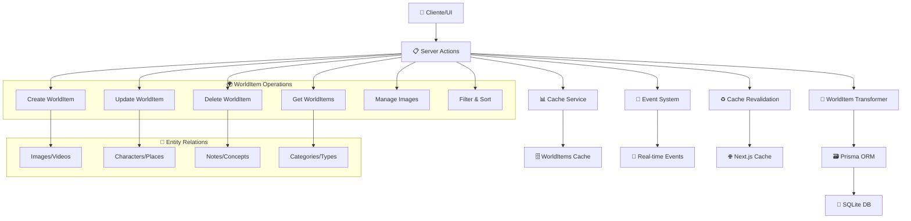

# 🌍 World Items Actions

## 📄 Descripción

El módulo **World Items** gestiona los objetos, elementos y artefactos del mundo virtual del proyecto. Los world items representan entidades físicas o conceptuales que existen en el universo narrativo del proyecto: objetos, artefactos, herramientas, vehículos, estructuras y cualquier elemento tangible que pueda aparecer en las imágenes o formar parte de la narrativa.

Los world items sirven como **inventario del mundo**, permitiendo catalogar, categorizar y relacionar todos los elementos físicos que componen el universo del proyecto, facilitando la coherencia narrativa y la gestión de assets visuales.

## 🌊 Flujo de Operaciones



## 📋 Server Actions Disponibles

### 🏗️ CRUD Básico (world-item.actions.ts)

#### `getWorldItems(filters?: WorldItemFilters, sort?: WorldItemSortCriteria[]): Promise<WorldItemExtended[]>`

- **Descripción**: Obtiene todos los world items con filtros y ordenación opcional
- **Parámetros**:
  - `filters` - Filtros opcionales para búsqueda (nombre, categoría, tipo, etc.)
  - `sort` - Criterios de ordenación personalizados
- **Retorna**: Array de world items extendidos con conteos y transformaciones
- **Cache**: Utiliza worldItemsCache para optimizar rendimiento
- **Transformaciones**: Aplica fromPrismaWorldItem y toExtendedWorldItem
- **Ejemplo**:

```typescript
// Obtener todos los world items
const allItems = await getWorldItems();

// Filtrar por categoría
const weapons = await getWorldItems(
  { category: "WEAPON" },
  [{ field: "name", direction: "asc" }]
);

// Buscar por nombre
const searchResults = await getWorldItems(
  { name: "espada" },
  [{ field: "updatedAt", direction: "desc" }]
);
```

#### `getWorldItemById(id: string): Promise<WorldItemExtended>`

- **Descripción**: Obtiene un world item específico por ID con estadísticas completas
- **Parámetros**: `id` - UUID del world item
- **Retorna**: World item extendido con conteos de relaciones
- **Validaciones**: Lanza error si el world item no existe
- **Incluye**: Conteos de imágenes, personajes, lugares, conceptos, notas, etc.
- **Ejemplo**:

```typescript
const item = await getWorldItemById("worlditem-123");
console.log(`${item.name}: ${item._count.images} imágenes relacionadas`);
```

#### `createWorldItem(data: CreateWorldItemData): Promise<WorldItemExtended>`

- **Descripción**: Crea un nuevo world item con validación completa
- **Parámetros**: `data` - Datos del world item (name, type, category, description, etc.)
- **Retorna**: World item creado con transformaciones aplicadas
- **Transformaciones**: Usa mapCreateWorldItemDataToPrisma para mapeo de datos
- **Efectos secundarios**:
  - Invalida worldItemsCache
  - Revalida rutas de Next.js cache
  - Emite evento `worldItems:modified`
  - Actualiza estadísticas del sistema
- **Ejemplo**:

```typescript
const newItem = await createWorldItem({
  name: "Espada Élfica",
  type: "WEAPON",
  category: "MELEE",
  description: "Espada forjada por los elfos con mithril...",
  properties: {
    damage: 45,
    durability: 95,
    weight: 1.2,
    rarity: "legendary"
  },
  tags: ["élfico", "mithril", "legendario"],
  emoji: "⚔️",
  color: "#c084fc"
});
```

#### `updateWorldItem(id: string, data: UpdateWorldItemData): Promise<WorldItemExtended>`

- **Descripción**: Actualiza un world item existente con validación
- **Parámetros**:
  - `id` - UUID del world item
  - `data` - Datos a actualizar (campos parciales)
- **Transformaciones**: Usa mapUpdateWorldItemDataToPrisma para mapeo
- **Validaciones**: Verifica existencia antes de actualizar
- **Cache**: Invalida cache después de la actualización
- **Ejemplo**:

```typescript
const updatedItem = await updateWorldItem("worlditem-123", {
  description: "Descripción actualizada con nueva información histórica...",
  properties: {
    ...existingProperties,
    condition: "excellent",
    lastMaintenance: new Date()
  },
  isFavorite: true
});
```

#### `deleteWorldItem(id: string): Promise<void>`

- **Descripción**: Elimina un world item y desconecta todas sus relaciones
- **Parámetros**: `id` - UUID del world item a eliminar
- **Validaciones**: Verifica existencia antes de eliminar
- **Operaciones**:
  - Desconecta de todas las entidades relacionadas
  - Elimina el world item en transacción
  - Invalida cache y revalida rutas
  - Notifica cambios via eventos
- **Relaciones desconectadas**:
  - Images, Characters, Places
  - Notes, Concepts, Prompts
  - Groups, Properties, Wildcards

### 🖼️ Gestión de Imágenes (world-item.actions.ts)

#### `getWorldItemImages(worldItemId: string): Promise<FileItem[]>`

- **Descripción**: Obtiene todas las imágenes asociadas a un world item específico
- **Parámetros**: `worldItemId` - UUID del world item
- **Retorna**: Array de imágenes en formato FileItem con metadatos completos
- **Validaciones**: Verifica existencia del world item
- **Incluye**: Tags, colecciones relacionadas, información de carpeta
- **Ordenación**: Por favoritos (desc) y fecha de creación (desc)
- **Transformaciones**: Convierte ServerImage a FileItem
- **Ejemplo**:

```typescript
const itemImages = await getWorldItemImages("worlditem-123");
itemImages.forEach(image => {
  console.log(`${image.name} - Tags: ${image.tags?.join(', ')}`);
  console.log(`Carpeta: ${image.folder?.name}`);
});
```

#### `addImageToWorldItem(worldItemId: string, imageId: string): Promise<void>`

- **Descripción**: Asocia una imagen existente a un world item específico
- **Parámetros**:
  - `worldItemId` - UUID del world item
  - `imageId` - UUID de la imagen
- **Validaciones**: Verifica existencia de ambas entidades
- **Operación**: Usa Prisma connect para establecer la relación
- **Cache**: Invalida cache después de la operación
- **Ejemplo**:

```typescript
await addImageToWorldItem("worlditem-123", "image-456");
// Imagen asociada al world item para referencia visual
```

#### `removeImageFromWorldItem(worldItemId: string, imageId: string): Promise<void>`

- **Descripción**: Desasocia una imagen de un world item sin eliminar ninguna entidad
- **Parámetros**:
  - `worldItemId` - UUID del world item
  - `imageId` - UUID de la imagen
- **Operación**: Usa Prisma disconnect para eliminar solo la relación
- **Cache**: Invalida cache después de la operación

## 🔗 Relaciones y Dependencias

### 📦 Servicios Utilizados

- **WorldItem Transformer**: Transformación y validación de datos complejos
- **Prisma ORM**: Acceso a base de datos con relaciones multi-entidad
- **Cache Service**: Sistema de cache especializado (worldItemsCache)
- **Image Converter**: Conversión de ServerImage a FileItem
- **Event System**: Notificaciones de cambios (`worldItems:modified`)
- **Stats Service**: Actualización de estadísticas (`STATS_EVENTS.WORLD_ITEM_CHANGE`)

### 🔄 Transformers

- **mapCreateWorldItemDataToPrisma**: Mapeo de datos de creación
- **mapUpdateWorldItemDataToPrisma**: Mapeo de datos de actualización
- **fromPrismaWorldItem**: Deserialización de entidad Prisma
- **transformWorldItemToExtended**: Extensión con propiedades UI
- **mapWorldItemFiltersToPrisma**: Construcción de filtros de búsqueda
- **mapWorldItemOrderByToPrisma**: Configuración de ordenación

### 🏗️ Tipos Principales

- **WorldItemBase**: Estructura base del world item
- **WorldItemExtended**: World item con propiedades UI y transformaciones
- **CreateWorldItemData, UpdateWorldItemData**: DTOs para operaciones CRUD
- **WorldItemFilters**: Filtros de búsqueda disponibles
- **WorldItemSortCriteria**: Criterios de ordenación

### 🌍 Estructura de World Item

```typescript
interface WorldItemExtended extends WorldItemBase {
  id: string;
  name: string;
  type: string; // Tipo de objeto (WEAPON, TOOL, ARTIFACT, etc.)
  category: string | null; // Categoría específica
  description: string | null;
  emoji: string;
  color: string;

  // Propiedades específicas del objeto
  properties: {
    [key: string]: any; // Propiedades flexibles según el tipo
    condition?: string;
    rarity?: string;
    weight?: number;
    value?: number;
    // ... propiedades específicas por tipo
  };

  // Metadatos
  tags: string[]; // Tags deserializados
  isFavorite: boolean;
  createdAt: Date;
  updatedAt: Date;

  // Estadísticas de relaciones
  _count: {
    images: number;
    characters: number;
    places: number;
    notes: number;
    concepts: number;
    prompts: number;
    groups: number;
    properties: number;
    wildcards: number;
  };

  // Propiedades UI
  _ui?: {
    previewImage?: string;
    lastUsed?: Date;
  };
}
```

## 💡 Ejemplos de Uso

### Crear Inventario de Objetos

```typescript
// 1. Crear arma legendaria
const legendaryWeapon = await createWorldItem({
  name: "Dracofang",
  type: "WEAPON",
  category: "SWORD",
  description: "Espada forjada con el colmillo de un dragón ancestral...",
  properties: {
    damage: 85,
    criticalChance: 15,
    durability: 98,
    weight: 2.1,
    rarity: "legendary",
    enchantments: ["fire_damage", "dragon_slayer"],
    origin: "Dragon's Lair",
    crafter: "Master Blacksmith Thorin"
  },
  tags: ["legendary", "dragon", "fire", "sword"],
  emoji: "🗡️",
  color: "#dc2626"
});

// 2. Crear herramienta útil
const magicTool = await createWorldItem({
  name: "Cristal de Visión",
  type: "TOOL",
  category: "MAGICAL",
  description: "Cristal que permite ver eventos pasados en un lugar...",
  properties: {
    range: "100 meters",
    duration: "10 minutes",
    cooldown: "24 hours",
    rarity: "rare",
    magicSchool: "divination"
  },
  tags: ["magical", "divination", "crystal", "vision"],
  emoji: "🔮",
  color: "#8b5cf6"
});

// 3. Asociar imágenes de referencia
await addImageToWorldItem(legendaryWeapon.id, "sword-concept-art-image-id");
await addImageToWorldItem(magicTool.id, "crystal-photo-id");
```

### Gestión y Filtrado de Inventario

```typescript
// Obtener todas las armas ordenadas por rareza
const weapons = await getWorldItems(
  { type: "WEAPON" },
  [
    { field: "properties.rarity", direction: "desc" },
    { field: "name", direction: "asc" }
  ]
);

// Buscar objetos mágicos
const magicalItems = await getWorldItems(
  { category: "MAGICAL" },
  [{ field: "updatedAt", direction: "desc" }]
);

// Obtener objetos favoritos
const favoriteItems = await getWorldItems(
  { isFavorite: true },
  [{ field: "name", direction: "asc" }]
);

// Actualizar propiedades de un objeto
const repairedWeapon = await updateWorldItem(legendaryWeapon.id, {
  properties: {
    ...legendaryWeapon.properties,
    condition: "pristine",
    lastMaintenance: new Date(),
    durability: 100
  }
});
```

### Análisis de Inventario y Estadísticas

```typescript
// Obtener objeto con estadísticas completas
const detailedItem = await getWorldItemById("worlditem-123");

// Calcular valor total del inventario
const allItems = await getWorldItems();
const totalValue = allItems.reduce((sum, item) => {
  return sum + (item.properties?.value || 0);
}, 0);

// Análisis por categorías
const categoryStats = allItems.reduce((stats, item) => {
  const category = item.category || 'Uncategorized';
  if (!stats[category]) {
    stats[category] = { count: 0, totalValue: 0 };
  }
  stats[category].count++;
  stats[category].totalValue += item.properties?.value || 0;
  return stats;
}, {} as Record<string, { count: number; totalValue: number }>);

// Obtener imágenes de un objeto
const itemImages = await getWorldItemImages(detailedItem.id);
console.log(`"${detailedItem.name}" tiene ${itemImages.length} imágenes de referencia`);
```

## 🧪 Testing

Los tests para este módulo cubren:

- ✅ **Operaciones CRUD completas** con transformadores complejos
- ✅ **Sistema de filtros** y ordenación personalizada
- ✅ **Gestión de propiedades** flexibles por tipo de objeto
- ✅ **Cache management** y invalidación correcta
- ✅ **Gestión de relaciones** con múltiples entidades
- ✅ **Validación de datos** y manejo de errores
- ✅ **Transformaciones** de imagen y conversiones de tipos

### Casos de Test Específicos

```typescript
describe('WorldItems Actions', () => {
  test('should create world item with complex properties', async () => {
    const itemData = {
      name: 'Test Weapon',
      type: 'WEAPON',
      properties: { damage: 50, rarity: 'common' }
    };
    const item = await createWorldItem(itemData);
    expect(item.id).toBeDefined();
    expect(item.properties.damage).toBe(50);
  });

  test('should filter world items by type and category', async () => {
    const weapons = await getWorldItems(
      { type: 'WEAPON', category: 'SWORD' },
      [{ field: 'name', direction: 'asc' }]
    );
    expect(weapons).toBeInstanceOf(Array);
    weapons.forEach(weapon => {
      expect(weapon.type).toBe('WEAPON');
      expect(weapon.category).toBe('SWORD');
    });
  });

  test('should manage image associations correctly', async () => {
    await addImageToWorldItem(worldItemId, imageId);
    const images = await getWorldItemImages(worldItemId);
    expect(images.length).toBeGreaterThan(0);

    await removeImageFromWorldItem(worldItemId, imageId);
    const updatedImages = await getWorldItemImages(worldItemId);
    expect(updatedImages.length).toBe(images.length - 1);
  });
});
```

## ⚠️ Consideraciones Importantes

### 🗄️ Gestión de Cache

- **Invalidación estratégica**: Cache se invalida solo cuando es necesario
- **Rendimiento**: Cache mejora significativamente las consultas repetidas
- **Consistencia**: Asegurar que el cache refleje el estado actual de la base de datos
- **Memoria**: Monitorear uso de memoria del cache en aplicaciones grandes

### 🏗️ Propiedades Flexibles

- **Esquema dinámico**: Las propiedades varían según el tipo de world item
- **Validación**: Implementar validación específica por tipo cuando sea necesario
- **Serialización**: Las propiedades se almacenan como JSON en la base de datos
- **Evolución**: Plan para añadir nuevos tipos y propiedades sin breaking changes

### 🔍 Filtros y Búsqueda

- **Rendimiento**: Filtros complejos pueden impactar el rendimiento en datasets grandes
- **Índices**: Asegurar índices en campos frecuentemente filtrados
- **Flexibilidad**: Sistema de filtros debe ser extensible para nuevos criterios
- **UX**: Proporcionar filtros intuitivos y autocompletado en la UI

### 🎮 Consistencia del Mundo

- **Taxonomía**: Mantener categorías y tipos consistentes
- **Relaciones lógicas**: Asegurar que las relaciones entre objetos tengan sentido
- **Evolución narrativa**: Permitir que los objetos evolucionen con la historia
- **Referencias cruzadas**: Mantener coherencia entre descripciones y propiedades

### 📈 Escalabilidad

- **Paginación**: Implementar paginación para inventarios grandes
- **Búsqueda de texto**: Considerar indexación de texto completo para descripciones
- **Archivado**: Sistema para objetos obsoletos o fuera de uso
- **Migración**: Plan para cambios en estructura de propiedades

---

## 📚 Recursos Adicionales

- **[Transformer Documentation](../../../transformers/world-item/README.md)**: Detalles técnicos de transformación
- **[Types Reference](../../../types/entities/world-item/)**: Definiciones de tipos completas
- **[Cache Service](../../../lib/cache/world-items-cache.ts)**: Implementación del sistema de cache
- **[Properties Schema](../../../schemas/world-item-properties.ts)**: Esquemas de propiedades por tipo
