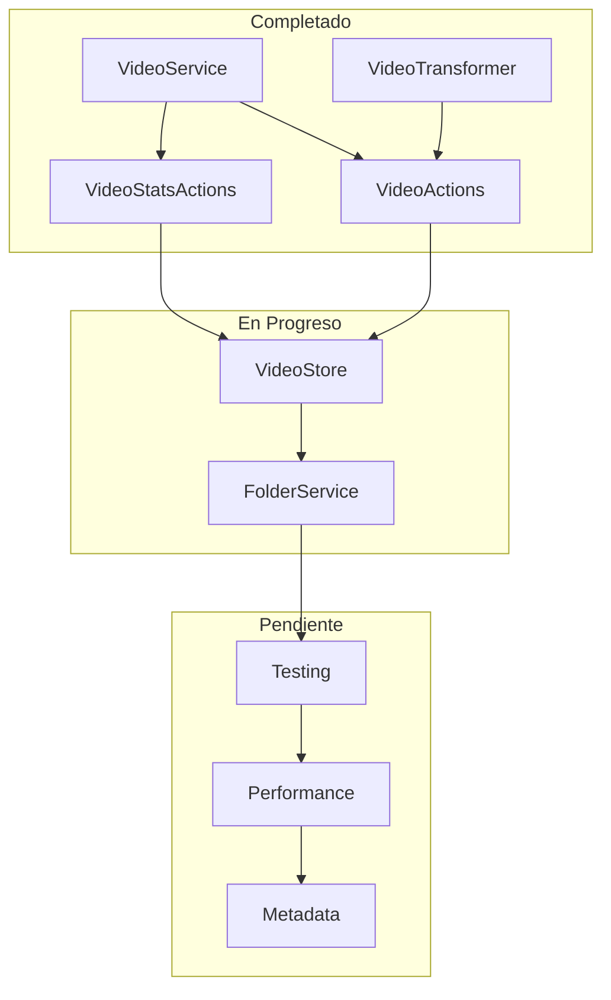

# Progreso de Implementación

## Tareas Completadas

### Servicios

✅ **VideoService**
- Implementado servicio completo para gestión de videos
- Incluye métodos CRUD, búsqueda, estadísticas y operaciones específicas (favoritos, visibilidad, movimiento)
- Manejo de errores consistente y logging

### Transformadores

✅ **VideoTransformer**
- Actualizado `transformers/video/index.ts` para incluir funciones de transformación explícitas
- Agregado `transformVideo` y `transformVideos` como funciones principales de entrada

### Acciones del Servidor

✅ **VideoActions**
- Implementado `app/actions/videos/video.actions.ts` con todas las acciones básicas
- Añadido soporte para revalidación de rutas
- Implementación de logging consistente

✅ **VideoStatsActions**
- Implementado `app/actions/videos/stats.actions.ts` para obtener estadísticas
- Separación de responsabilidades entre acciones CRUD y estadísticas

### Estructura de Exportación

✅ **Índices de Exportación**
- Actualizado `app/actions/videos/index.ts` para exportar todas las acciones

## Tareas Pendientes

### Implementación de Store

⏳ **VideoStore Optimization**
- Revisar y optimizar el store existente
- Asegurar la coherencia con el patrón de slices

### Testing

🔜 **Pruebas unitarias**
- Implementar pruebas para el VideoService
- Implementar pruebas para las acciones del servidor

### Mejoras Futuras

🔜 **Optimización de Rendimiento**
- Mejorar el rendimiento de las consultas de búsqueda con índices
- Implementar caché para consultas frecuentes

🔜 **Gestión de Metadata**
- Mejorar el procesamiento y extracción de metadatos de video
- Soporte para capítulos y marcadores de tiempo

## Próxima Entidad a Implementar

🔜 **Folder**
- Completar la implementación del servicio FolderService
- Optimizar el store de Folder con el patrón de slices

## Diagrama de Avance

