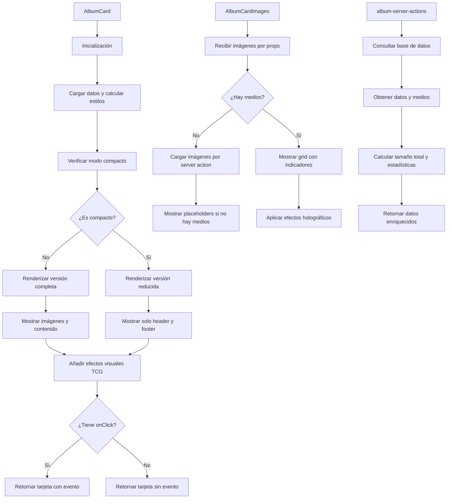

# 📸 AlbumCard

Componente que muestra una tarjeta estilo TCG (Trading Card Game) para representar álbumes de imágenes y videos.

## 📋 Descripción

Este componente forma parte del sistema de tarjetas de entidades, siguiendo el diseño de cartas de juegos como Magic the Gathering, Yu-Gi-Oh y Pokémon. Cada tarjeta incluye:

- Cabecera con nombre de álbum, emoji y categoría
- Sección de ilustración con mosaico de imágenes y videos recientes
- Sección de contenido con descripción y metadatos
- Pie con estadísticas, rareza y tamaño del álbum
- Efectos visuales tipo holográfico y decoraciones de TCG
- Soporte para modo compacto en listados
- Colores personalizados según la configuración del álbum
- Sistema de rareza visual basado en el contenido
- Identificador de carta único estilo TCG

## 🔄 Flujo de funcionamiento



## 🗂️ Estructura de archivos

- **index.ts**: Punto de entrada y exportaciones del componente
- **album-card.tsx**: Componente principal que renderiza la tarjeta con estilo TCG
- **album-card-header.tsx**: Componente para la cabecera con estilo de carta TCG
- **album-card-images.tsx**: Componente para mostrar imágenes y videos con efectos visuales
- **album-card-content.tsx**: Componente para mostrar la descripción y metadatos
- **album-card-footer.tsx**: Componente para mostrar estadísticas, rareza y tamaño
- **album-server-actions.ts**: Acciones del servidor para obtener datos de Prisma
- **README.md**: Documentación del componente

## 🖥️ Ejemplos de uso

### Uso básico

```tsx
import { AlbumCard } from '@/components/cards/album-card';
import { getAlbumCardData } from '@/components/cards/album-card/album-server-actions';

// En un server component
async function AlbumsList() {
  const albums = await getAlbumsForCards({ limit: 10 });

  return (
    <div className="grid grid-cols-1 sm:grid-cols-2 lg:grid-cols-3 gap-4">
      {albums.map(album => (
        <AlbumCard key={album.id} album={album} />
      ))}
    </div>
  );
}
```

### Uso en modo compacto

```tsx
import { AlbumCard } from '@/components/cards/album-card';

function CompactAlbumsList({ albums }) {
  return (
    <div className="grid grid-cols-2 md:grid-cols-3 lg:grid-cols-4 gap-3">
      {albums.map(album => (
        <AlbumCard
          key={album.id}
          album={album}
          compact={true}
        />
      ))}
    </div>
  );
}
```

### Uso con manejador de eventos personalizado

```tsx
import { AlbumCard } from '@/components/cards/album-card';

function AlbumSelector({ albums, onSelect }) {
  return (
    <div className="grid grid-cols-1 sm:grid-cols-2 lg:grid-cols-3 gap-4">
      {albums.map(album => (
        <AlbumCard
          key={album.id}
          album={album}
          onClick={() => onSelect(album)}
        />
      ))}
    </div>
  );
}
```

## 🔌 Integración

Este componente se utiliza principalmente en:

- Vista de álbumes en el dashboard
- Selectores de álbumes en formularios
- Paneles de organización de colecciones
- Diálogos y modales de selección
- Vistas compactas en listados relacionados

## 📊 Datos y requisitos

El componente se alinea completamente con el modelo `Album` de Prisma y soporta:

- **Imágenes y videos**: Muestra ambos tipos de medios con indicadores visuales
- **Relaciones**: Muestra conteos de todas las entidades relacionadas (tags, collections, etc.)
- **Grupos y Propiedades**: Soporte para las nuevas relaciones con modelos `Group` y `Property`
- **Wildcards**: Soporte para las nuevas relaciones con el modelo `Wildcard`
- **Filtros**: Visualización de filtros aplicados al álbum
- **Metadatos**: Muestra tamaño total, estadísticas y rareza en estilo TCG

## 🎨 Personalización visual

El componente ahora presenta un estilo más elaborado inspirado en cartas TCG:

- **Sistema de rareza**: Visualización de rareza basada en la cantidad de contenido (Común, Poco común, Rara, Mítica)
- **ID de carta único**: Número de identificación único estilo TCG con código de serie
- **Indicadores de contenido**: Iconos y contadores para imágenes, videos y entidades relacionadas
- **Tamaño del álbum**: Muestra el tamaño total en formato legible (KB, MB, GB)
- **Efectos holográficos**: Gradientes animados y efectos visuales según rareza
- **Marco decorativo**: Esquinas y bordes decorativos estilo carta coleccionable
- **Viñeta de rareza**: Barra indicadora de nivel de rareza con colores específicos
- **Gradientes personalizados**: Fondos con gradientes y efectos visuales según el color del álbum

## 📝 Cambios recientes

- Actualización del diseño para alinearse mejor con estilo de cartas TCG
- Mejora en la visualización de imágenes y videos con indicadores
- Integración con nuevas entidades (Wildcards, Properties, Groups)
- Visualización de tamaño total del álbum en formato legible
- Sistema mejorado de rareza visual con colores específicos
- Optimización para recibir imágenes directamente por props sin necesidad de server actions adicionales
- Mayor énfasis en estilos visuales TCG con marcos decorativos y efectos
