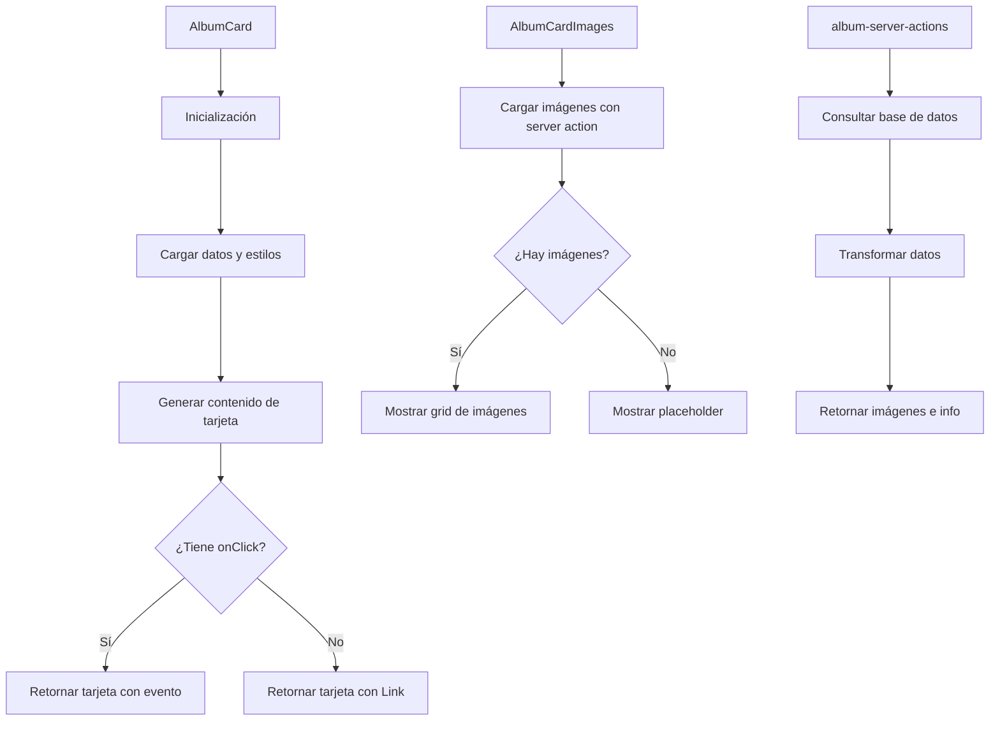

# 📸 AlbumCard

Componente que muestra una tarjeta estilo Magic para representar álbumes de imágenes.

## 📋 Descripción

Este componente forma parte del sistema de tarjetas de entidades, siguiendo el mismo diseño que los otros componentes como `CharacterCard`, `PlaceCard`, etc. Cada tarjeta tiene un diseño inspirado en cartas de Magic con:

- Cabecera con nombre de álbum e icono
- Sección de imágenes en un grid
- Sección de contenido con descripción y metadatos
- Pie con estadísticas e información adicional
- Colores personalizados según la configuración del álbum

## 🔄 Flujo de funcionamiento



## 🗂️ Estructura de archivos

- **index.ts**: Punto de entrada y exportaciones del componente
- **album-card.tsx**: Componente principal que renderiza la tarjeta
- **album-card-header.tsx**: Componente para la cabecera de la tarjeta
- **album-card-images.tsx**: Componente para mostrar las imágenes asociadas
- **album-card-content.tsx**: Componente para mostrar el contenido del álbum
- **album-card-footer.tsx**: Componente para mostrar el pie con estadísticas
- **album-server-actions.ts**: Acciones del servidor para obtener datos
- **README.md**: Documentación del componente

## 🖥️ Ejemplos de uso

### Uso básico con navegación automática

```tsx
import { AlbumCard } from '@/components/cards/album-card';

function AlbumsList({ albums }) {
  return (
    <div className="grid grid-cols-3 gap-4">
      {albums.map(album => (
        <AlbumCard key={album.id} album={album} />
      ))}
    </div>
  );
}
```

### Uso con manejador de eventos personalizado

```tsx
import { AlbumCard } from '@/components/cards/album-card';

function AlbumSelector({ albums, onSelect }) {
  return (
    <div className="grid grid-cols-3 gap-4">
      {albums.map(album => (
        <AlbumCard
          key={album.id}
          album={album}
          onClick={onSelect}
        />
      ))}
    </div>
  );
}
```

## 🔌 Integración

Este componente se utiliza principalmente en:
- Vista de álbumes en el dashboard
- Selectores de álbumes en formularios y al añadir imágenes
- Paneles de organización de colecciones
- Diálogos y modales de selección

## 🎨 Personalización visual

El componente respeta y utiliza los atributos visuales definidos en la entidad Album:
- **color**: Color principal del álbum que se utiliza para los bordes y gradientes
- **emoji**: Emoji asociado que se muestra junto al nombre
- **rarity**: Rareza que afecta al diseño visual (common, uncommon, rare, etc.)
- **texture**: Textura visual (si está definida)