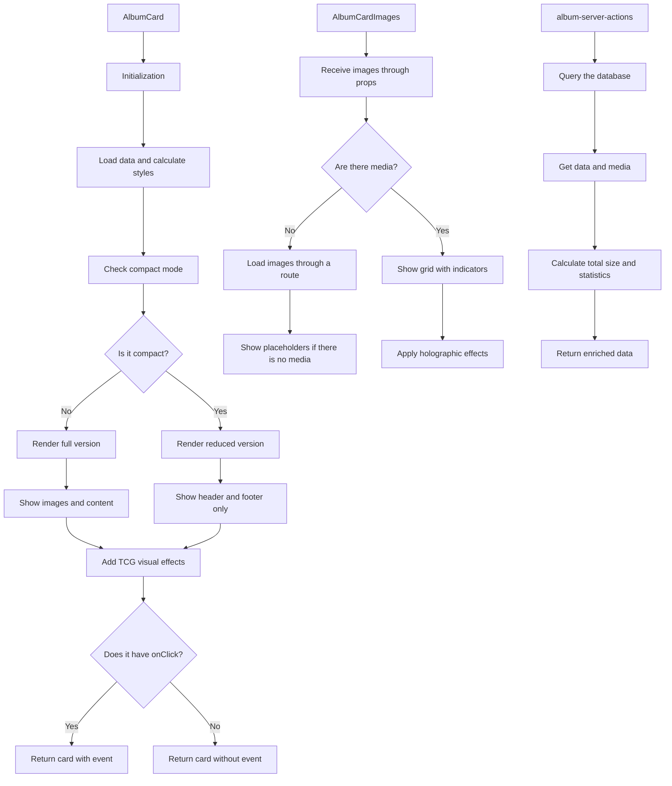

# AlbumCard

This component displays a TCG-style card that represents Albums of images and videos.

## Description

This component is part of the entity card system.

The design follows cards from Magic the Gathering, Yu-Gi-Oh, and Pokemon.

Each card includes the following parts:

- Header with Album name, emoji, and category
- Illustration section with a mosaic of recent images and videos
- Content section with description and metadata
- Footer with statistics, rarity, and Album size
- Holographic visual effects and TCG decorations
- Support for compact mode in listings
- Custom colors from the Album configuration
- Visual rarity system based on content
- Unique TCG-style card identifier

## Operation flow



## File structure

The directory includes the following files:

- **index.ts**: Entry point and component exports
- **album-card.tsx**: Main component that renders the TCG-style card
- **album-card-header.tsx**: Component for the TCG-style header
- **album-card-images.tsx**: Component that shows images and videos with visual effects
- **album-card-content.tsx**: Component that shows the description and metadata
- **album-card-footer.tsx**: Component that shows statistics, rarity, and size
- **album-server-actions.ts**: Routes that fetch Prisma data
- **README.md**: Component documentation

## Usage examples

### Basic use

```tsx
import { AlbumCard } from '@/components/cards/album-card';
import { getAlbumCardData } from '@/components/cards/album-card/album-server-actions';

// In a data-loading component
async function AlbumsList() {
	const albums = await getAlbumsForCards({ limit: 10 });

	return (
		<div className="grid grid-cols-1 sm:grid-cols-2 lg:grid-cols-3 gap-4">
			{albums.map((album) => (
				<AlbumCard key={album.id} album={album} />
			))}
		</div>
	);
}
```

### Use in compact mode

```tsx
import { AlbumCard } from '@/components/cards/album-card';

function CompactAlbumsList({ albums }) {
	return (
		<div className="grid grid-cols-2 md:grid-cols-3 lg:grid-cols-4 gap-3">
			{albums.map((album) => (
				<AlbumCard key={album.id} album={album} compact={true} />
			))}
		</div>
	);
}
```

### Use with a custom event handler

```tsx
import { AlbumCard } from '@/components/cards/album-card';

function AlbumSelector({ albums, onSelect }) {
	return (
		<div className="grid grid-cols-1 sm:grid-cols-2 lg:grid-cols-3 gap-4">
			{albums.map((album) => (
				<AlbumCard key={album.id} album={album} onClick={() => onSelect(album)} />
			))}
		</div>
	);
}
```

## Integration

This component is used mainly in the following places:

- Album view on the dashboard
- Album selectors in forms
- Collection organization panels
- Selection dialogs and modals
- Compact views in related listings

## Data and requirements

The component aligns fully with the Prisma `Album` model.

The component supports the following data:

- **Images and videos**: Shows both media types with visual indicators
- **Relations**: Shows counts of all related entities (Tags, Collections)
- **Groups and Properties**: Support for the new relations with `Group` and `Property` models
- **Wildcards**: Support for the new relations with the `Wildcard` model
- **Filters**: Display of filters applied to the Album
- **Metadata**: Shows total size, statistics, and rarity in TCG style

## Visual customization

The component now presents a more elaborate style inspired by TCG cards.

The style includes the following elements:

- **Rarity system**: Rarity display based on content quantity (Common, Uncommon, Rare, Mythic)
- **Unique card ID**: Unique TCG-style identification number with a series code
- **Content indicators**: Icons and counters for images, videos, and related entities
- **Album size**: Shows the total size in a readable format (KB, MB, GB)
- **Holographic effects**: Animated gradients and visual effects by rarity
- **Decorative frame**: Collectible-card corners and borders
- **Rarity vignette**: Rarity-level indicator bar with specific colors
- **Custom gradients**: Backgrounds with gradients and visual effects from the Album color

## Recent changes

The following changes are recent:

- Design update to align better with TCG card style
- Improved display of images and videos with indicators
- Integration with new entities (Wildcards, Properties, Groups)
- Display of total Album size in a readable format
- Improved visual rarity system with specific colors
- Optimization to receive images directly through props without extra routes
- Greater emphasis on TCG visual styles with decorative frames and effects
