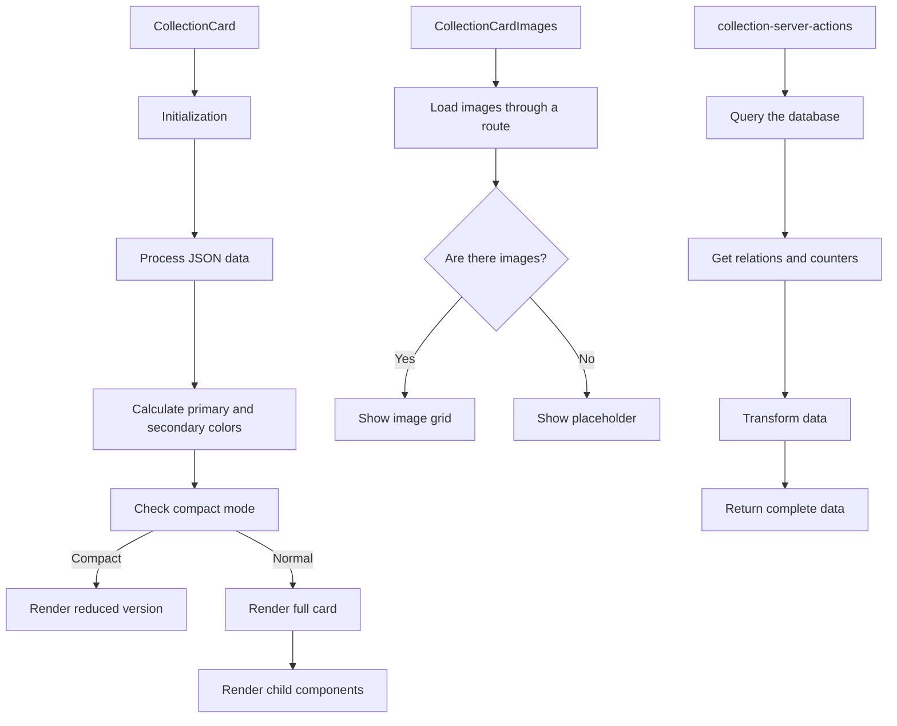

# CollectionCard

This component displays a TCG-style card that represents Collections of images and other items.

## Description

This component is part of the entity card system and follows the same design as the other system components.

Each card uses a design inspired by Magic, Yu-Gi-Oh, and Pokemon with the following parts:

- Header with Collection name, emoji, and category or platform
- Image section in a thumbnail grid
- Content section with description, details, and external metadata
- Footer with statistics and extra information
- Custom colors from the Collection configuration
- TCG-style visual effects (shiny borders, textures, decorative elements)
- Compact mode for dense displays

## Operation flow



## File structure

The directory includes the following files:

- **index.ts**: Entry point and component exports
- **collection-card.tsx**: Main component that renders the card
- **collection-card-header.tsx**: Component for the TCG-style card header
- **collection-card-images.tsx**: Component that shows associated images
- **collection-card-content.tsx**: Component that shows Collection content
- **collection-card-footer.tsx**: Component that shows the footer with statistics
- **collection-server-actions.ts**: Routes that fetch data
- **README.md**: Component documentation

## Usage examples

### Basic use with automatic navigation

```tsx
import { CollectionCard } from '@/components/cards/collection-card';

function CollectionsList({ collections }) {
	return (
		<div className="grid grid-cols-3 gap-4">
			{collections.map((collection) => (
				<CollectionCard key={collection.id} collection={collection} />
			))}
		</div>
	);
}
```

### Use with a custom event handler

```tsx
import { CollectionCard } from '@/components/cards/collection-card';

function CollectionSelector({ collections, onSelect }) {
	return (
		<div className="grid grid-cols-3 gap-4">
			{collections.map((collection) => (
				<CollectionCard key={collection.id} collection={collection} onClick={() => onSelect(collection)} />
			))}
		</div>
	);
}
```

### Use in compact mode

```tsx
import { CollectionCard } from '@/components/cards/collection-card';

function CollectionCompactList({ collections }) {
	return (
		<div className="grid grid-cols-4 gap-3">
			{collections.map((collection) => (
				<CollectionCard key={collection.id} collection={collection} compact={true} />
			))}
		</div>
	);
}
```

## Integration

This component is used mainly in the following places:

- Collection view on the dashboard
- NFT or digital Collection managers
- Navigation between Collections and galleries
- Collection selectors in forms
- Normal and compact list displays

## Visual customization

The component uses the visual attributes defined on the Collection entity.

The attributes include the following:

- **color**: Main Collection color used for borders, gradients, and effects
- **emoji**: Associated emoji shown as an emblem next to the name
- **category**: Category shown as the card type
- **platform**: Associated platform shown as a subtype
- **featuredImage**: Featured image that can display as a background in the content section
- **sourceImage**: Alternative background image if there is no featuredImage
- **isFavorite**: Indicates whether the Collection is marked as a Favorite

## Support for external properties

The card can display external properties that are specific to digital Collections.

The properties include the following:

- **url**: URL associated with the Collection
- **network**: Associated blockchain network
- **tokenId**: Token identifier on the network
- **price**: Price associated with the Collection
- **editions**: List of editions available for the Collection

## Performance

The component uses the following optimization techniques:

- Efficient parsing of JSON data stored in the database
- Component memoization with `React.memo`
- Style calculations with `useMemo` to avoid recalculation
- Efficient handling of visual effects to reduce performance impact
- Compact mode when many Collections must display at once
