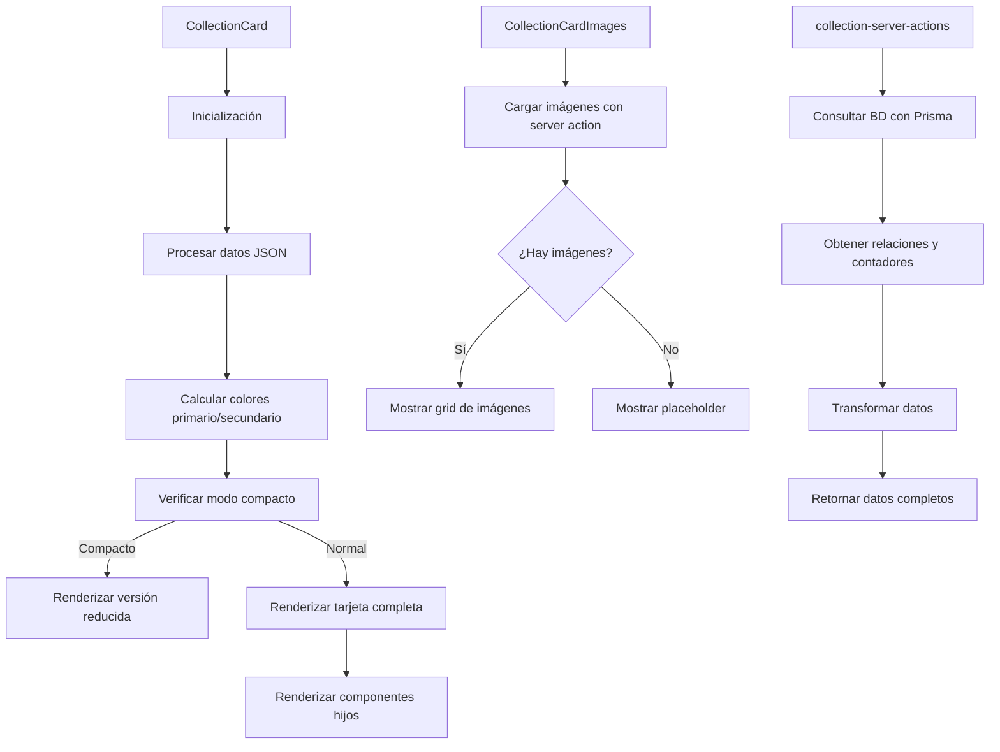

# 🌟 CollectionCard

Componente que muestra una tarjeta estilo TCG (Trading Card Game) para representar colecciones de imágenes y otros elementos.

## 📋 Descripción

Este componente forma parte del sistema de tarjetas de entidades, siguiendo el mismo diseño que los otros componentes del sistema. Cada tarjeta tiene un diseño inspirado en cartas de juegos como Magic/Yu-Gi-Oh/Pokémon con:

- Cabecera con nombre de colección, emoji y categoría/plataforma
- Sección de imágenes en un grid con miniaturas
- Sección de contenido con descripción, detalles y metadatos externos
- Pie con estadísticas e información adicional
- Colores personalizados según la configuración de la colección
- Efectos visuales tipo TCG (bordes brillantes, texturas, elementos decorativos)
- Modo compacto para visualizaciones densas

## 🔄 Flujo de funcionamiento



## 🗂️ Estructura de archivos

- **index.ts**: Punto de entrada y exportaciones del componente
- **collection-card.tsx**: Componente principal que renderiza la tarjeta
- **collection-card-header.tsx**: Componente para la cabecera de la tarjeta con estilo TCG
- **collection-card-images.tsx**: Componente para mostrar las imágenes asociadas
- **collection-card-content.tsx**: Componente para mostrar el contenido de la colección
- **collection-card-footer.tsx**: Componente para mostrar el pie con estadísticas
- **collection-server-actions.ts**: Acciones del servidor para obtener datos
- **README.md**: Documentación del componente

## 🖥️ Ejemplos de uso

### Uso básico con navegación automática

```tsx
import { CollectionCard } from '@/components/cards/collection-card';

function CollectionsList({ collections }) {
  return (
    <div className="grid grid-cols-3 gap-4">
      {collections.map(collection => (
        <CollectionCard key={collection.id} collection={collection} />
      ))}
    </div>
  );
}
```

### Uso con manejador de eventos personalizado

```tsx
import { CollectionCard } from '@/components/cards/collection-card';

function CollectionSelector({ collections, onSelect }) {
  return (
    <div className="grid grid-cols-3 gap-4">
      {collections.map(collection => (
        <CollectionCard
          key={collection.id}
          collection={collection}
          onClick={() => onSelect(collection)}
        />
      ))}
    </div>
  );
}
```

### Uso en modo compacto

```tsx
import { CollectionCard } from '@/components/cards/collection-card';

function CollectionCompactList({ collections }) {
  return (
    <div className="grid grid-cols-4 gap-3">
      {collections.map(collection => (
        <CollectionCard
          key={collection.id}
          collection={collection}
          compact={true}
        />
      ))}
    </div>
  );
}
```

## 🔌 Integración

Este componente se utiliza principalmente en:

- Vista de colecciones en el dashboard
- Gestores de colecciones NFT o digitales
- Navegación entre colecciones y galerías
- Selectores de colecciones en formularios
- Visualizaciones de listado tanto normales como compactas

## 🎨 Personalización visual

El componente respeta y utiliza los atributos visuales definidos en la entidad Collection:

- **color**: Color principal de la colección que se utiliza para los bordes, gradientes y efectos
- **emoji**: Emoji asociado que se muestra como emblema junto al nombre
- **category**: Categoría que se muestra como tipo de carta
- **platform**: Plataforma asociada que se muestra como subtipo
- **featuredImage**: Imagen destacada que se puede mostrar como fondo en la sección de contenido
- **sourceImage**: Imagen alternativa como fondo si no hay featuredImage
- **isFavorite**: Indica si la colección está marcada como favorita

## 🌐 Soporte para propiedades externas

La tarjeta admite la visualización de propiedades externas específicas para colecciones digitales:

- **url**: URL asociada a la colección
- **network**: Red blockchain asociada
- **tokenId**: Identificador del token en la red
- **price**: Precio asociado a la colección
- **editions**: Lista de ediciones disponibles para la colección

## 🚀 Rendimiento

El componente utiliza técnicas de optimización:

- Parseo eficiente de datos JSON almacenados en la base de datos
- Memoización de componentes con `React.memo`
- Cálculos de estilos usando `useMemo` para evitar recálculos
- Manejo eficiente de efectos visuales para minimizar el impacto en rendimiento
- Modo compacto para cuando se necesita mostrar muchas colecciones a la vez
