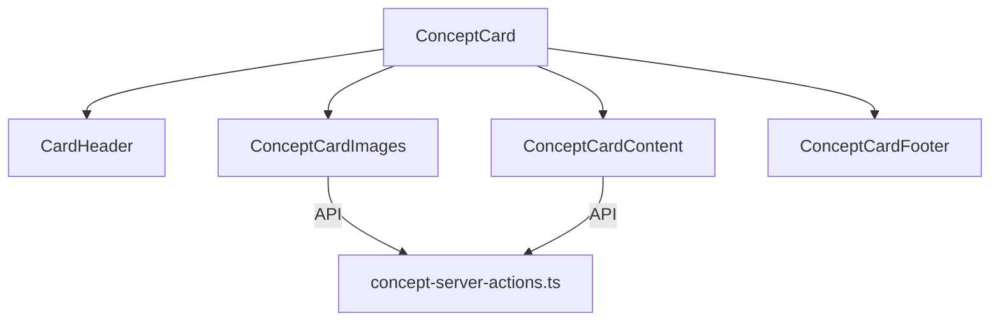

# Componente ConceptCard

El componente `ConceptCard` proporciona una visualización estilizada en formato de carta TCG (Trading Card Game) para los conceptos de la aplicación, alineado con el esquema de base de datos actual.

## Características

- Diseño inspirado en cartas de juegos como Magic the Gathering, Pokémon TCG o Yu-Gi-Oh
- Modo TCG con efectos visuales y estilo mejorado
- Sistema dinámico de rareza basado en el número total de relaciones
- Estadísticas avanzadas con cálculo de atributos (Conocimiento, Influencia, Visibilidad, Conectividad)
- Soporte completo para todas las relaciones del esquema de base de datos actual
- Visualización de imágenes asociadas al concepto
- Indicador de nivel de poder basado en las relaciones y contenido
- Animaciones y efectos visuales al interactuar con la carta
- Completamente responsive y accesible

## Estructura del Componente

El componente está dividido en subcomponentes para facilitar su mantenimiento:

- `ConceptCard`: Componente principal que orquesta todos los demás
- `ConceptCardImages`: Visualización de imágenes asociadas al concepto
- `ConceptCardContent`: Contenido principal, descripción y estadísticas
- `ConceptCardFooter`: Metadatos, fechas y pie de la carta
- `concept-server-actions.ts`: Acciones del servidor para cargar datos



## Propiedades

### ConceptCard

```typescript
interface ConceptCardProps {
  concept: ConceptComplete | (ConceptWithStats & {
    _count?: {
      images: number;
      videos: number;
      albums: number;
      collections: number;
      tags: number;
      characters: number;
      places: number;
      worldItems: number;
      prompts: number;
      notes: number;
      wildcards: number;
      properties: number;
      groups: number;
    };
    imageCount?: number;
    videoCount?: number;
    promptCount?: number;
    noteCount?: number;
    characterCount?: number;
    placeCount?: number;
    worldItemCount?: number;
    propertyCount?: number;
    wildcardCount?: number;
    groupCount?: number;
    albumCount?: number;
    collectionCount?: number;
    tagCount?: number;
    tags?: string[] | string;
  });
  onClick?: () => void;
  className?: string;
  style?: React.CSSProperties;
  tcgMode?: boolean;
}
```

## Alineación con Prisma

El componente está completamente alineado con el modelo `Concept` de Drizzle y todas sus relaciones:

### Multimedia

- Imágenes (`images`)
- Videos (`videos`)

### Organización

- Álbumes (`albums`)
- Colecciones (`collections`)
- Etiquetas (`tags`)

### Entidades de Mundo

- Personajes (`characters`)
- Lugares (`places`)
- Objetos del mundo (`worldItems`)

### Entidades Utilitarias

- Prompts (`prompts`)
- Notas (`notes`)
- Comodines (`wildcards`)
- Propiedades (`properties`)
- Grupos (`groups`)

## Server Actions

El componente utiliza las siguientes acciones del servidor:

- `getRecentConceptImages`: Obtiene las imágenes recientes asociadas al concepto
- `getConceptCounts`: Obtiene los contadores de todas las relaciones
- `getConceptWithRelations`: Obtiene un concepto completo con todas sus relaciones

## Ejemplos de Uso

### Uso Básico

```jsx
import { ConceptCard } from '@/components/cards/concept-card';

// En tu componente
return (
  <ConceptCard
    concept={conceptData}
    onClick={() => router.push(`/concepts/${conceptData.id}`)}
  />
);
```

### Con Modo TCG Desactivado

```jsx
<ConceptCard
  concept={conceptData}
  tcgMode={false}
  className="max-w-xs mx-auto"
/>
```

### En un Grid de Conceptos

```jsx
<div className="grid grid-cols-1 md:grid-cols-2 lg:grid-cols-3 xl:grid-cols-4 gap-6">
  {concepts.map(concept => (
    <ConceptCard
      key={concept.id}
      concept={concept}
      onClick={() => router.push(`/concepts/${concept.id}`)}
    />
  ))}
</div>
```

## Funcionalidades Visuales de TCG

El modo TCG incluye las siguientes características visuales mejoradas:

- Textura de fondo y efectos decorativos (gradientes, brillos, sombras)
- Esquinas decorativas y bordes especiales
- Intensidad de color basada en la cantidad de relaciones
- Barras de estadísticas con atributos tipo TCG (Conocimiento, Influencia, etc.)
- Indicador de rareza basado en el total de relaciones
- Nivel de poder calculado a partir del contenido y relaciones
- ID de colección generado a partir de la fecha de creación
- Contador de relaciones principales y secundarias
- Transformaciones y animaciones al interactuar con la carta
- Sello de copyright y código de edición estilo TCG

## Accesibilidad

El componente cumple con buenas prácticas de accesibilidad:

- Roles ARIA adecuados
- Soporte para navegación con teclado
- Textos alternativos para imágenes
- Contraste adecuado
- Nombres accesibles para los elementos interactivos

## Optimizaciones

- Uso de `useMemo` y `useCallback` para prevenir re-renders innecesarios
- Carga perezosa de imágenes mediante suspense
- Consultas optimizadas a la base de datos
- Deserialización eficiente de campos JSON
- Verificación de tipos para evitar errores con diferentes formatos de datos

## Personalización

El componente permite personalización a través de:

- Props de estilo (`className`, `style`)
- Colores primarios y secundarios derivados del color del concepto
- Intensidad visual basada en la cantidad de relaciones
- Modo TCG activable/desactivable

## Flujo de Datos

1. `ConceptCard` recibe los datos del concepto
2. Calcula las estadísticas y relaciones
3. Pasa los datos a los subcomponentes
4. Los subcomponentes cargan datos adicionales mediante server actions si es necesario
5. Se renderiza la tarjeta con todos los datos y estilos correspondientes
