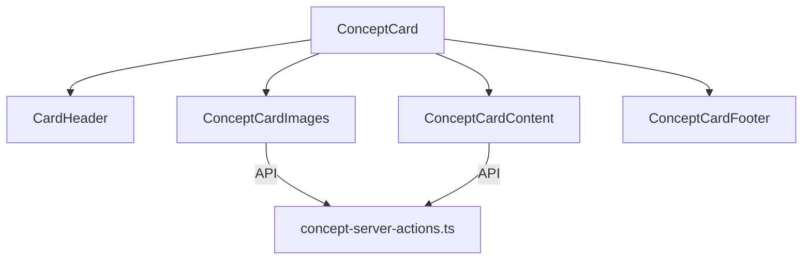

# ConceptCard component

The `ConceptCard` component provides a styled TCG (Trading Card Game) display for Concepts in the application.

The component aligns with the current database schema.

## Features

The card provides the following features:

- Design inspired by Magic the Gathering, Pokemon TCG, or Yu-Gi-Oh
- TCG mode with visual effects and enhanced style
- Dynamic rarity system based on the total number of relations
- Advanced statistics with attribute calculation (Knowledge, Influence, Visibility, Connectivity)
- Full support for all relations of the current database schema
- Display of images associated with the Concept
- Power-level indicator based on relations and content
- Animations and visual effects on interaction with the card
- Fully responsive and accessible

## Component structure

The component is split into subcomponents to ease maintenance.

The subcomponents are the following:

- `ConceptCard`: Main component that orchestrates the others
- `ConceptCardImages`: Display of images associated with the Concept
- `ConceptCardContent`: Main content, description, and statistics
- `ConceptCardFooter`: Metadata, dates, and card footer
- `concept-server-actions.ts`: Routes that load data



## Properties

### ConceptCard

```typescript
interface ConceptCardProps {
	concept:
		| ConceptComplete
		| (ConceptWithStats & {
				_count?: {
					images: number;
					videos: number;
					albums: number;
					collections: number;
					tags: number;
					characters: number;
					places: number;
					worldItems: number;
					prompts: number;
					notes: number;
					wildcards: number;
					properties: number;
					groups: number;
				};
				imageCount?: number;
				videoCount?: number;
				promptCount?: number;
				noteCount?: number;
				characterCount?: number;
				placeCount?: number;
				worldItemCount?: number;
				propertyCount?: number;
				wildcardCount?: number;
				groupCount?: number;
				albumCount?: number;
				collectionCount?: number;
				tagCount?: number;
				tags?: string[] | string;
		  });
	onClick?: () => void;
	className?: string;
	style?: React.CSSProperties;
	tcgMode?: boolean;
}
```

## Alignment with Prisma

The component is fully aligned with the Drizzle `Concept` model and all its relations.

### Multimedia

The multimedia relations are the following:

- Images (`images`)
- Videos (`videos`)

### Organization

The organization relations are the following:

- Albums (`albums`)
- Collections (`collections`)
- Tags (`tags`)

### World entities

The world relations are the following:

- Characters (`characters`)
- Places (`places`)
- World items (`worldItems`)

### Utility entities

The utility relations are the following:

- Prompts (`prompts`)
- Notes (`notes`)
- Wildcards (`wildcards`)
- Properties (`properties`)
- Groups (`groups`)

## Data loading

The component uses the following data-loading functions:

- `getRecentConceptImages`: Gets recent images associated with the Concept
- `getConceptCounts`: Gets the counters of all relations
- `getConceptWithRelations`: Gets a complete Concept with all its relations

Routes call services to load this data.

## Usage examples

### Basic use

```jsx
import { ConceptCard } from '@/components/cards/concept-card';

// In your component
return <ConceptCard concept={conceptData} onClick={() => router.push(`/concepts/${conceptData.id}`)} />;
```

### With TCG mode disabled

```jsx
<ConceptCard concept={conceptData} tcgMode={false} className="max-w-xs mx-auto" />
```

### In a Concept grid

```jsx
<div className="grid grid-cols-1 md:grid-cols-2 lg:grid-cols-3 xl:grid-cols-4 gap-6">
	{concepts.map((concept) => (
		<ConceptCard key={concept.id} concept={concept} onClick={() => router.push(`/concepts/${concept.id}`)} />
	))}
</div>
```

## TCG visual features

TCG mode includes the following enhanced visual features:

- Background texture and decorative effects (gradients, glows, shadows)
- Decorative corners and special borders
- Color intensity based on the number of relations
- Statistic bars with TCG-style attributes (Knowledge, Influence)
- Rarity indicator based on the total of relations
- Power level calculated from content and relations
- Collection ID generated from the creation date
- Counter of primary and secondary relations
- Transforms and animations on interaction with the card
- Copyright stamp and TCG-style edition code

## Accessibility

The component follows accessibility practices.

The practices include the following:

- Appropriate ARIA roles
- Support for keyboard navigation
- Alternative text for images
- Adequate contrast
- Accessible names for interactive elements

## Optimizations

The component uses the following optimizations:

- Use of `useMemo` and `useCallback` to prevent unnecessary re-renders
- Lazy image loading through suspense
- Optimized database queries
- Efficient deserialization of JSON fields
- Type checks to avoid errors with different data formats

## Customization

The component allows customization through the following options:

- Style props (`className`, `style`)
- Primary and secondary colors derived from the Concept color
- Visual intensity based on the number of relations
- TCG mode that can be enabled or disabled

## Data flow

`ConceptCard` receives the Concept data.

The component calculates statistics and relations.

The component passes the data to the subcomponents.

If extra data is needed, the subcomponents load it through routes.

The card then renders with all corresponding data and styles.
