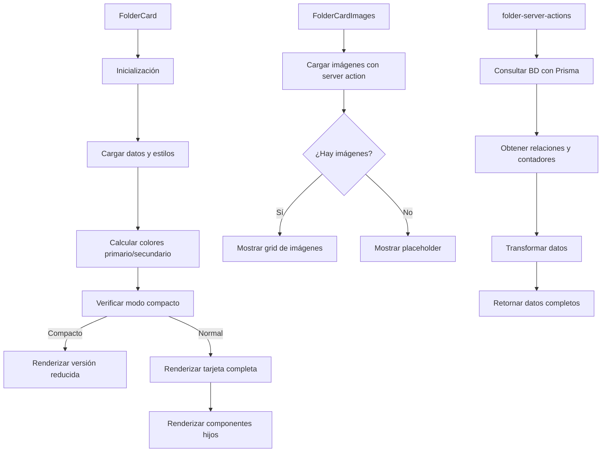

# 📁 FolderCard

Componente que muestra una tarjeta estilo TCG (Trading Card Game) para representar carpetas de imágenes.

## 📋 Descripción

Este componente forma parte del sistema de tarjetas de entidades, siguiendo el mismo diseño que los otros componentes del sistema. Cada tarjeta tiene un diseño inspirado en cartas de juegos como Magic/Yu-Gi-Oh/Pokémon con:

- Cabecera con nombre de carpeta, emoji y tipo de carpeta
- Sección de imágenes en un grid con miniaturas
- Sección de contenido con descripción y metadatos
- Pie con estadísticas e información adicional
- Colores personalizados según la configuración de la carpeta
- Efectos visuales tipo TCG (bordes brillantes, texturas, elementos decorativos)
- Modo compacto para visualizaciones densas

## 🔄 Flujo de funcionamiento



## 🗂️ Estructura de archivos

- **index.ts**: Punto de entrada y exportaciones del componente
- **folder-card.tsx**: Componente principal que renderiza la tarjeta
- **folder-card-header.tsx**: Componente para la cabecera de la tarjeta con estilo TCG
- **folder-card-images.tsx**: Componente para mostrar las imágenes asociadas
- **folder-card-content.tsx**: Componente para mostrar el contenido de la carpeta
- **folder-card-footer.tsx**: Componente para mostrar el pie con estadísticas
- **folder-server-actions.ts**: Acciones del servidor para obtener datos
- **folder-card.test.tsx**: Tests del componente
- **README.md**: Documentación del componente

## 🖥️ Ejemplos de uso

### Uso básico con navegación automática

```tsx
import { FolderCard } from '@/components/cards/folder-card';

function FoldersList({ folders }) {
  return (
    <div className="grid grid-cols-3 gap-4">
      {folders.map(folder => (
        <FolderCard key={folder.id} folder={folder} />
      ))}
    </div>
  );
}
```

### Uso con manejador de eventos personalizado

```tsx
import { FolderCard } from '@/components/cards/folder-card';

function FolderSelector({ folders, onSelect }) {
  return (
    <div className="grid grid-cols-3 gap-4">
      {folders.map(folder => (
        <FolderCard
          key={folder.id}
          folder={folder}
          onClick={() => onSelect(folder)}
        />
      ))}
    </div>
  );
}
```

### Uso en modo compacto

```tsx
import { FolderCard } from '@/components/cards/folder-card';

function FolderCompactList({ folders }) {
  return (
    <div className="grid grid-cols-4 gap-3">
      {folders.map(folder => (
        <FolderCard
          key={folder.id}
          folder={folder}
          compact={true}
        />
      ))}
    </div>
  );
}
```

## 🔌 Integración

Este componente se utiliza principalmente en:

- Vista de carpetas en el dashboard
- Explorador de archivos
- Selectores de carpetas en formularios y al añadir imágenes
- Navegación entre carpetas
- Visualizaciones de listado tanto normales como compactas

## 🎨 Personalización visual

El componente respeta y utiliza los atributos visuales definidos en la entidad Folder:

- **color**: Color principal de la carpeta que se utiliza para los bordes, gradientes y efectos
- **emoji**: Emoji asociado que se muestra como emblema junto al nombre
- **featuredImage**: Imagen destacada que se puede mostrar como fondo en la sección de contenido
- **isFavorite**: Indica si la carpeta está marcada como favorita
<!-- autoReindex eliminado del modelo: la indexación automática ahora se gestiona por lógica de cliente/servicio sin bandera por carpeta -->
- **path**: Ruta que se utiliza para determinar si es una carpeta raíz o subcarpeta

## 🚀 Rendimiento

El componente utiliza técnicas de optimización:

- Memoización de componentes con `React.memo`
- Cálculos de estilos usando `useMemo` para evitar recálculos
- Manejo eficiente de efectos visuales para minimizar el impacto en rendimiento
- Modo compacto para cuando se necesita mostrar muchas carpetas a la vez
