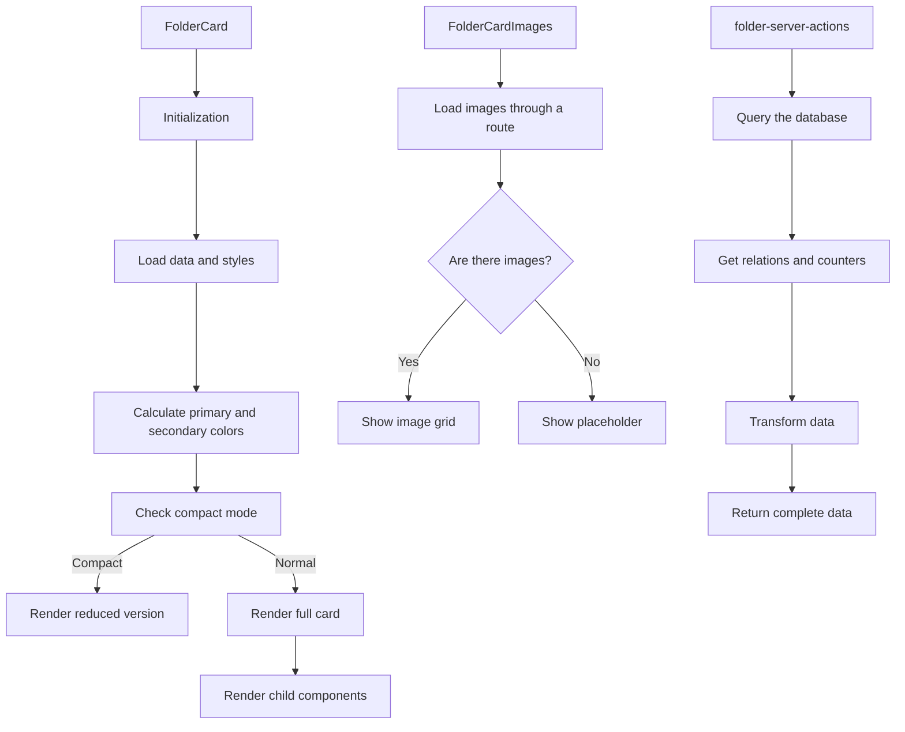

# FolderCard

This component displays a TCG-style card that represents Folders of images.

## Description

This component is part of the entity card system and follows the same design as the other system components.

Each card uses a design inspired by Magic, Yu-Gi-Oh, and Pokemon with the following parts:

- Header with Folder name, emoji, and Folder type
- Image section in a thumbnail grid
- Content section with description and metadata
- Footer with statistics and extra information
- Custom colors from the Folder configuration
- TCG-style visual effects (shiny borders, textures, decorative elements)
- Compact mode for dense displays

## Operation flow



## File structure

The directory includes the following files:

- **index.ts**: Entry point and component exports
- **folder-card.tsx**: Main component that renders the card
- **folder-card-header.tsx**: Component for the TCG-style card header
- **folder-card-images.tsx**: Component that shows associated images
- **folder-card-content.tsx**: Component that shows Folder content
- **folder-card-footer.tsx**: Component that shows the footer with statistics
- **folder-server-actions.ts**: Routes that fetch data
- **folder-card.test.tsx**: Component tests
- **README.md**: Component documentation

## Usage examples

### Basic use with automatic navigation

```tsx
import { FolderCard } from '@/components/cards/folder-card';

function FoldersList({ folders }) {
	return (
		<div className="grid grid-cols-3 gap-4">
			{folders.map((folder) => (
				<FolderCard key={folder.id} folder={folder} />
			))}
		</div>
	);
}
```

### Use with a custom event handler

```tsx
import { FolderCard } from '@/components/cards/folder-card';

function FolderSelector({ folders, onSelect }) {
	return (
		<div className="grid grid-cols-3 gap-4">
			{folders.map((folder) => (
				<FolderCard key={folder.id} folder={folder} onClick={() => onSelect(folder)} />
			))}
		</div>
	);
}
```

### Use in compact mode

```tsx
import { FolderCard } from '@/components/cards/folder-card';

function FolderCompactList({ folders }) {
	return (
		<div className="grid grid-cols-4 gap-3">
			{folders.map((folder) => (
				<FolderCard key={folder.id} folder={folder} compact={true} />
			))}
		</div>
	);
}
```

## Integration

This component is used mainly in the following places:

- Folder view on the dashboard
- File explorer
- Folder selectors in forms and when adding images
- Navigation between Folders
- Normal and compact list displays

## Visual customization

The component uses the visual attributes defined on the Folder entity.

The attributes include the following:

- **color**: Main Folder color used for borders, gradients, and effects
- **emoji**: Associated emoji shown as an emblem next to the name
- **featuredImage**: Featured image that can display as a background in the content section
- **isFavorite**: Indicates whether the Folder is marked as a Favorite

<!-- autoReindex was removed from the model: automatic indexing is now managed by client and service logic without a per-folder flag -->

- **path**: Path used to determine whether the Folder is a root Folder or a subfolder

## Performance

The component uses the following optimization techniques:

- Component memoization with `React.memo`
- Style calculations with `useMemo` to avoid recalculation
- Efficient handling of visual effects to reduce performance impact
- Compact mode when many Folders must display at once
