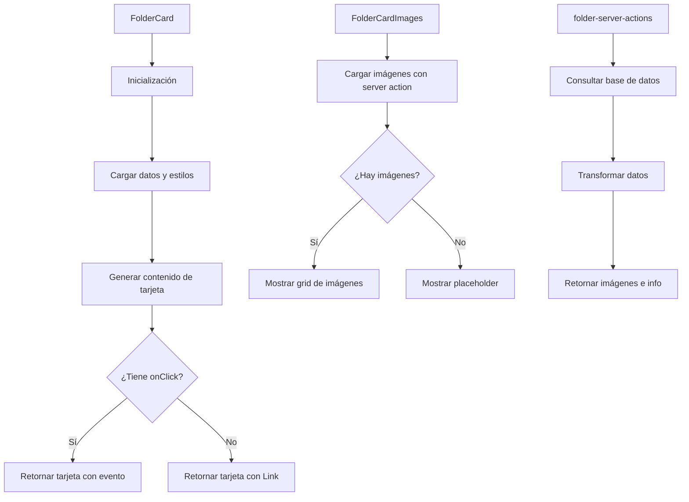

# 📁 FolderCard

Componente que muestra una tarjeta estilo Magic para representar carpetas de imágenes.

## 📋 Descripción

Este componente forma parte del sistema de tarjetas de entidades, siguiendo el mismo diseño que los otros componentes del sistema. Cada tarjeta tiene un diseño inspirado en cartas de Magic con:

- Cabecera con nombre de carpeta e icono
- Sección de imágenes en un grid
- Sección de contenido con descripción y metadatos
- Pie con estadísticas e información adicional
- Colores personalizados según la configuración de la carpeta

## 🔄 Flujo de funcionamiento



## 🗂️ Estructura de archivos

- **index.ts**: Punto de entrada y exportaciones del componente
- **folder-card.tsx**: Componente principal que renderiza la tarjeta
- **folder-card-header.tsx**: Componente para la cabecera de la tarjeta
- **folder-card-images.tsx**: Componente para mostrar las imágenes asociadas
- **folder-card-content.tsx**: Componente para mostrar el contenido de la carpeta
- **folder-card-footer.tsx**: Componente para mostrar el pie con estadísticas
- **folder-server-actions.ts**: Acciones del servidor para obtener datos
- **README.md**: Documentación del componente

## 🖥️ Ejemplos de uso

### Uso básico con navegación automática

```tsx
import { FolderCard } from '@/components/cards/folder-card';

function FoldersList({ folders }) {
  return (
    <div className="grid grid-cols-3 gap-4">
      {folders.map(folder => (
        <FolderCard key={folder.id} folder={folder} />
      ))}
    </div>
  );
}
```

### Uso con manejador de eventos personalizado

```tsx
import { FolderCard } from '@/components/cards/folder-card';

function FolderSelector({ folders, onSelect }) {
  return (
    <div className="grid grid-cols-3 gap-4">
      {folders.map(folder => (
        <FolderCard
          key={folder.id}
          folder={folder}
          onClick={onSelect}
        />
      ))}
    </div>
  );
}
```

## 🔌 Integración

Este componente se utiliza principalmente en:
- Vista de carpetas en el dashboard
- Explorador de archivos
- Selectores de carpetas en formularios y al añadir imágenes
- Navegación entre carpetas

## 🎨 Personalización visual

El componente respeta y utiliza los atributos visuales definidos en la entidad Folder:
- **color**: Color principal de la carpeta que se utiliza para los bordes y gradientes
- **emoji**: Emoji asociado que se muestra junto al nombre
- **isFavorite**: Indica si la carpeta está marcada como favorita
- **autoReindex**: Indica si la carpeta se reindexará automáticamente