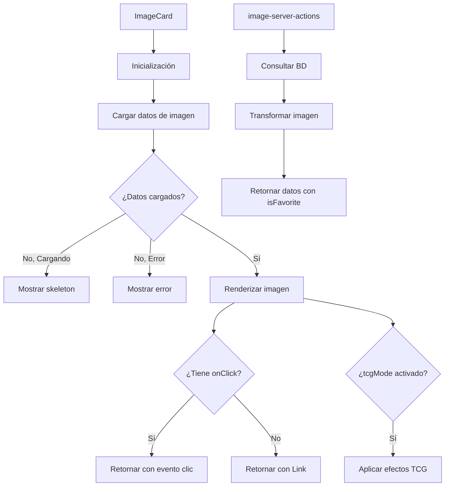
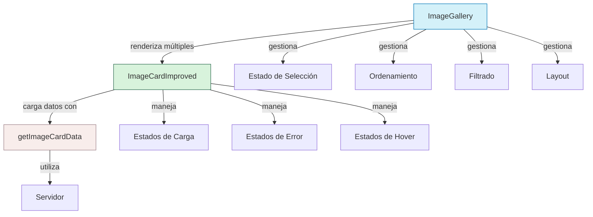

# 🖼️ ImageCard

Componente para mostrar tarjetas de imágenes con metadatos y acciones asociadas.

## 📋 Descripción

Este componente muestra una imagen con sus metadatos principales como dimensiones y etiquetas. Está diseñado para ser usado en galerías, listas y paneles donde se necesite mostrar miniaturas de imágenes con información contextual.

Características:

- Carga y muestra thumbnails de imágenes
- Muestra etiquetas asociadas
- Visualización de dimensiones
- Diferentes variantes de diseño (default, minimal, polaroid)
- Diferentes proporciones de aspecto
- Estados de carga, error y datos vacíos
- Navegación automática o callbacks personalizados
- **Nuevo:** Modo TCG (Trading Card Game) con efectos visuales especiales
- **Nuevo:** Soporte para imágenes favoritas con indicador visual
- **Nuevo:** Efectos decorativos y esquinas estilizadas

## 🔄 Flujo de funcionamiento



## 🗂️ Estructura de archivos

- **index.ts**: Punto de entrada y exportaciones del componente
- **image-card.tsx**: Componente principal que renderiza la tarjeta
- **image-server-actions.ts**: Acciones del servidor para obtener datos de la imagen
- **README.md**: Documentación del componente

## 🖥️ Ejemplos de uso

### Uso básico con navegación automática

```tsx
import { ImageCard } from '@/components/cards/image-card';

function ImageGallery({ imageIds }) {
  return (
    <div className="grid grid-cols-3 gap-4">
      {imageIds.map(id => (
        <ImageCard
          key={id}
          imageId={id}
          aspectRatio="square"
        />
      ))}
    </div>
  );
}
```

### Uso con manejador de eventos personalizado

```tsx
import { ImageCard, type ImageCardData } from '@/components/cards/image-card';

function ImageSelector({ imageIds, onSelect }) {
  const handleImageClick = (imageData: ImageCardData) => {
    onSelect(imageData);
  };

  return (
    <div className="grid grid-cols-4 gap-2">
      {imageIds.map(id => (
        <ImageCard
          key={id}
          imageId={id}
          onClick={handleImageClick}
          variant="minimal"
          showDetails={false}
        />
      ))}
    </div>
  );
}
```

### Variantes de diseño con modo TCG

```tsx
import { ImageCard } from '@/components/cards/image-card';

function ImageVariants() {
  return (
    <div className="flex gap-4">
      <ImageCard imageId="img1" variant="default" aspectRatio="square" />
      <ImageCard imageId="img2" variant="minimal" aspectRatio="video" />
      <ImageCard imageId="img3" variant="polaroid" aspectRatio="4/3" />
      <ImageCard imageId="img4" variant="default" aspectRatio="square" tcgMode />
    </div>
  );
}
```

## 🔌 Integración

Este componente se utiliza principalmente en:

- Galerías de imágenes
- Selectores de imágenes
- Listas de resultados de búsqueda
- Paneles de previsualización
- Vistas tipo colección de cartas coleccionables

## 🎨 Personalización visual

El componente ofrece varias opciones de personalización:

- **aspectRatio**: Define la proporción de la tarjeta ('square', 'video', 'auto' o custom como '4/3')
- **variant**: Estilo visual ('default', 'minimal', 'polaroid')
- **showTags**: Mostrar u ocultar las etiquetas
- **showDetails**: Mostrar u ocultar los detalles de la imagen
- **tcgMode**: Activar el modo Trading Card Game con efectos visuales especiales
- **hoverEffects**: Personaliza los efectos visuales al pasar el cursor (predeterminado: true)

## 🎮 Características del modo TCG

El modo TCG añade elementos visuales inspirados en juegos de cartas coleccionables:

- **Esquinas decorativas**: Elementos visuales en las esquinas de la tarjeta
- **Indicador de favorito**: Muestra un icono especial cuando la imagen está marcada como favorita
- **Efectos de hover**: Efectos visuales al pasar el cursor sobre la tarjeta
- **Textura de fondo**: Fondo con patrón sutil que mejora la apariencia de la tarjeta
- **Bordes estilizados**: Bordes con efectos visuales que destacan la tarjeta

## ♿ Accesibilidad

El componente está diseñado siguiendo buenas prácticas de accesibilidad:

- Utiliza atributos ARIA apropiados
- Soporta navegación por teclado con focus visible
- Proporciona texto alternativo para imágenes
- Alto contraste en textos sobre imágenes

## 🔧 Optimizaciones de rendimiento

Para un mejor rendimiento, el componente:

- Utiliza React.memo para evitar renderizados innecesarios
- Carga thumbnails optimizados en lugar de imágenes completas
- Implementa lazy loading para imágenes
- Utiliza Server Actions para obtener datos eficientemente

# Componentes de Visualización de Imágenes

Este directorio contiene componentes avanzados para mostrar imágenes en la aplicación, con múltiples estilos, variantes y características interactivas.

## Componentes Principales

### 1. ImageCardImproved

Componente para mostrar una imagen individual con sus metadatos. Optimizado para rendimiento y experiencia visual.

#### Características Principales:

- **Múltiples variantes visuales:** default, minimal, polaroid, tcg, gallery
- **Gestión de estados:** carga, error, hover, selección
- **Optimización de imágenes:** integración con next/image para mejor rendimiento
- **Controles de aspecto:** soporta múltiples relaciones de aspecto
- **Animaciones:** efectos de transición con motion/react
- **Modo oscuro integrado:** diseño adaptado para light/dark mode
- **Visualización de metadatos:** muestra información técnica de la imagen
- **Etiquetas y relaciones:** soporte para mostrar tags y entidades relacionadas

#### Props:

```typescript
interface ImageCardProps {
  imageId: string;                // ID de la imagen a mostrar
  onClick?: (imageData) => void;  // Función de clic
  className?: string;             // Clases CSS personalizadas
  showTags?: boolean;             // Mostrar etiquetas
  showDetails?: boolean;          // Mostrar detalles técnicos
  aspectRatio?: string;           // Relación de aspecto
  variant?: string;               // Variante visual
  isSelected?: boolean;           // Estado de selección
  isHoverable?: boolean;          // Efectos de hover
  showRelations?: boolean;        // Mostrar relaciones
  priority?: boolean;             // Prioridad de carga
}
```

### 2. ImageGallery

Componente para mostrar colecciones de imágenes con controles avanzados de visualización, ordenamiento y filtrado.

#### Características Principales:

- **Múltiples layouts:** grid, grid-dense, list
- **Ordenamiento personalizable:** por título, fecha, tamaño, dimensiones
- **Búsqueda y filtrado:** filtro por texto en títulos y etiquetas
- **Selección múltiple:** soporte para seleccionar múltiples imágenes
- **Diseño responsive:** adaptación a diferentes tamaños de pantalla
- **Carga progresiva:** soporte para "cargar más" con scroll infinito
- **Animaciones fluidas:** entre cambios de layout o filtrado
- **Estado vacío personalizable:** mensaje cuando no hay resultados

#### Props:

```typescript
interface ImageGalleryProps {
  images: string[] | ImageCardData[];  // IDs o datos de imágenes
  title?: string;                      // Título de la galería
  className?: string;                  // Clases CSS personalizadas
  emptyMessage?: string;               // Mensaje cuando no hay imágenes
  loading?: boolean;                   // Estado de carga
  selectable?: boolean;                // Permitir selección
  variant?: string;                    // Variante visual de tarjetas
  defaultLayout?: string;              // Layout inicial
  onImageClick?: (image) => void;      // Función de clic en imagen
  onSelectionChange?: (ids) => void;   // Cambio en selección
  aspectRatio?: string;                // Relación de aspecto
  showControls?: boolean;              // Mostrar controles
  showLoadMore?: boolean;              // Mostrar botón "cargar más"
  onLoadMore?: () => Promise<void>;    // Función para cargar más
  hasMoreImages?: boolean;             // ¿Hay más imágenes?
}
```

## Flujo de Datos y Arquitectura



### Flujo de Datos:

1. **ImageGallery** recibe un array de IDs de imagen o datos completos
2. Gestiona estado local: selección, ordenamiento, layout, filtrado
3. Renderiza múltiples instancias de **ImageCardImproved**
4. Cada **ImageCardImproved** carga sus datos si solo recibe ID
5. Se muestran animaciones y transiciones entre cambios
6. Eventos de selección y clic propagan hacia arriba

## Ejemplos de Uso

### Uso básico de ImageCardImproved:

```tsx
<ImageCardImproved
  imageId="img-001"
  variant="default"
  aspectRatio="square"
  onClick={(imageData) => console.log('Imagen clickeada:', imageData)}
/>
```

### Uso avanzado de ImageCardImproved:

```tsx
<ImageCardImproved
  imageId="img-002"
  variant="tcg"
  aspectRatio="3/2"
  isSelected={selectedImages.includes('img-002')}
  showTags={true}
  showDetails={true}
  showRelations={true}
  priority={true}
  className="hover:shadow-xl"
  onClick={handleImageSelect}
/>
```

### Uso básico de ImageGallery:

```tsx
<ImageGallery
  images={['img-001', 'img-002', 'img-003']}
  title="Mis Imágenes"
/>
```

### Uso avanzado de ImageGallery:

```tsx
<ImageGallery
  images={images}
  title="Galería de fotografías"
  selectable={true}
  onSelectionChange={handleSelectionChange}
  variant="polaroid"
  defaultLayout="grid"
  showLoadMore={true}
  onLoadMore={fetchMoreImages}
  hasMoreImages={true}
  aspectRatio="3/2"
/>
```

## Consideraciones de Rendimiento

- Las imágenes se cargan con prioridad para las primeras 8 visibles
- Se implementa carga diferida de imágenes fuera de la vista
- La información de la tarjeta se cachea para evitar cargas repetidas
- Las transiciones visuales utilizan GPU cuando es posible
- El filtrado y ordenamiento se optimiza con useMemo para evitar recálculos

## Personalización

Ambos componentes soportan personalización a través de:

1. **Propiedades de componente**: Controlando qué información se muestra
2. **Clases CSS**: Mediante className para estilizar contenedores externos
3. **Variantes visuales**: Preconfiguradas para diferentes estilos
4. **Integración con tema**: Soporte completo para tema claro/oscuro

## Dependencias

- `motion/react`: Para animaciones y transiciones
- `next/image`: Para optimización de carga de imágenes
- `shadcn/ui`: Componentes base (Button, Badge, etc.)
- `tailwindcss`: Sistema de estilos
- `clsx` / `tailwind-merge`: Utilidades para clases condicionales
