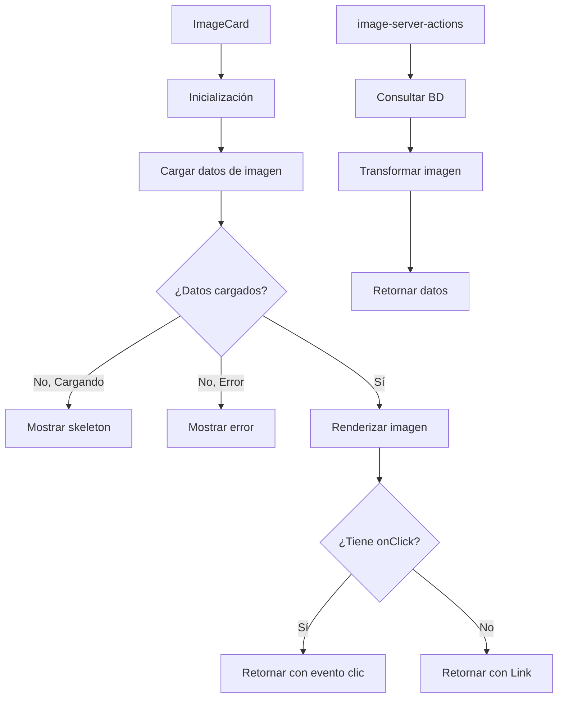

# 🖼️ ImageCard

Componente para mostrar tarjetas de imágenes con metadatos y acciones asociadas.

## 📋 Descripción

Este componente muestra una imagen con sus metadatos principales como dimensiones y etiquetas. Está diseñado para ser usado en galerías, listas y paneles donde se necesite mostrar miniaturas de imágenes con información contextual.

Características:
- Carga y muestra thumbnails de imágenes
- Muestra etiquetas asociadas
- Visualización de dimensiones
- Diferentes variantes de diseño (default, minimal, polaroid)
- Diferentes proporciones de aspecto
- Estados de carga, error y datos vacíos
- Navegación automática o callbacks personalizados

## 🔄 Flujo de funcionamiento



## 🗂️ Estructura de archivos

- **index.ts**: Punto de entrada y exportaciones del componente
- **image-card.tsx**: Componente principal que renderiza la tarjeta
- **image-server-actions.ts**: Acciones del servidor para obtener datos de la imagen
- **README.md**: Documentación del componente

## 🖥️ Ejemplos de uso

### Uso básico con navegación automática

```tsx
import { ImageCard } from '@/components/cards/image-card';

function ImageGallery({ imageIds }) {
  return (
    <div className="grid grid-cols-3 gap-4">
      {imageIds.map(id => (
        <ImageCard
          key={id}
          imageId={id}
          aspectRatio="square"
        />
      ))}
    </div>
  );
}
```

### Uso con manejador de eventos personalizado

```tsx
import { ImageCard, type ImageCardData } from '@/components/cards/image-card';

function ImageSelector({ imageIds, onSelect }) {
  const handleImageClick = (imageData: ImageCardData) => {
    onSelect(imageData);
  };

  return (
    <div className="grid grid-cols-4 gap-2">
      {imageIds.map(id => (
        <ImageCard
          key={id}
          imageId={id}
          onClick={handleImageClick}
          variant="minimal"
          showDetails={false}
        />
      ))}
    </div>
  );
}
```

### Variantes de diseño

```tsx
import { ImageCard } from '@/components/cards/image-card';

function ImageVariants() {
  return (
    <div className="flex gap-4">
      <ImageCard imageId="img1" variant="default" aspectRatio="square" />
      <ImageCard imageId="img2" variant="minimal" aspectRatio="video" />
      <ImageCard imageId="img3" variant="polaroid" aspectRatio="4/3" />
    </div>
  );
}
```

## 🔌 Integración

Este componente se utiliza principalmente en:
- Galerías de imágenes
- Selectores de imágenes
- Listas de resultados de búsqueda
- Paneles de previsualización

## 🎨 Personalización visual

El componente ofrece varias opciones de personalización:
- **aspectRatio**: Define la proporción de la tarjeta ('square', 'video', 'auto' o custom como '4/3')
- **variant**: Estilo visual ('default', 'minimal', 'polaroid')
- **showTags**: Mostrar u ocultar las etiquetas
- **showDetails**: Mostrar u ocultar los detalles de la imagen