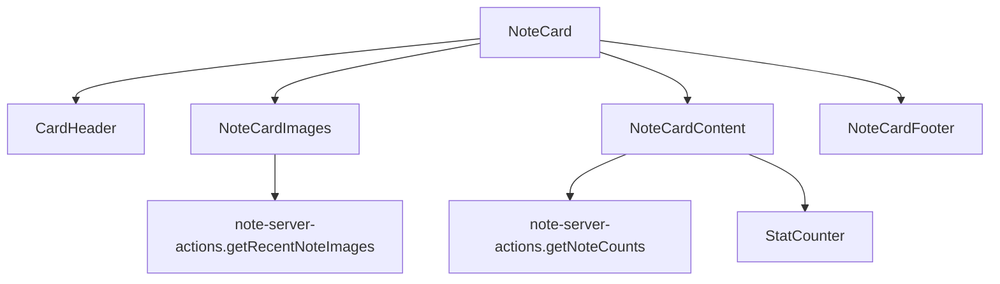

# NoteCard

## Description

This card component displays Notes with a Magic-style card design.

The card shows relevant Note information, including title, content, category, priority, related images, and states.

## Structure

```
/note-card
  ├── index.ts                  # Component exports
  ├── note-card.tsx             # Main component
  ├── note-card-content.tsx     # Central card content
  ├── note-card-footer.tsx      # Card footer with metadata
  ├── note-card-header.tsx      # Header (uses the shared CardHeader)
  ├── note-card-images.tsx      # Image section
  ├── note-server-actions.ts    # Related routes
  └── README.md                 # This documentation
```

## Design

The component follows a Magic card design with the following sections:

1. **Header:** Note title and category
2. **Images:** Thumbnails of the last 6 images of the Note
3. **Content:** Content excerpt, Tags, and statistics
4. **Footer:** Metadata such as status, priority, date, and counters

## Use

```tsx
import { NoteCard } from '@/components/cards/note-card';

// Inside a component
<NoteCard note={note} onClick={() => handleNoteClick(note)} />;
```

## Props

### NoteCardProps

| Property  | Type                     | Description                            |
| --------- | ------------------------ | -------------------------------------- |
| note      | Note                     | Object with the Note data to display   |
| onClick   | () => void (optional)    | Function that handles clicks on the card |
| className | string (optional)        | Extra CSS classes                      |
| style     | CSSProperties (optional) | Extra inline styles                    |

## Features

The card provides the following features:

- **Dynamic colors:** Uses the color defined on the Note for theming
- **Thumbnails:** Shows the last 6 associated images
- **Statistics:** Counters of related items
- **Tags:** Shows the Tags associated with the Note
- **Performance:** Memoized version for lists with many items
- **Accessibility:** Support for keyboard navigation

## Dependencies

The card depends on the following libraries:

- Lucide React for icons
- date-fns for date formatting
- motion/react for animations
- CardHeader from the shared component system

## Flow diagram



## Examples

### Basic view

```tsx
<NoteCard note={note} />
```

### With event handling

```tsx
<NoteCard note={note} onClick={() => navigate(`/notes/${note.id}`)} className="transition-all hover:scale-105" />
```
