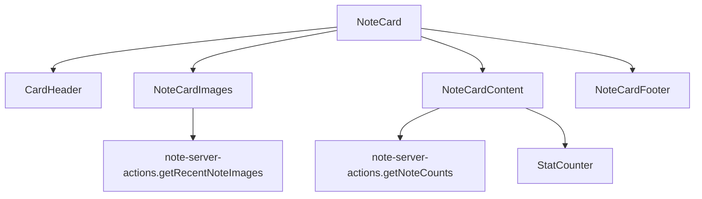

# NoteCard

## Descripción

Componente de tarjeta para la visualización de notas, inspirado en el diseño de cartas Magic. Muestra información relevante de una nota, incluyendo título, contenido, categoría, prioridad, imágenes relacionadas y estados.

## Estructura

```
/note-card
  ├── index.ts                  # Exportaciones del componente
  ├── note-card.tsx             # Componente principal
  ├── note-card-content.tsx     # Contenido central de la tarjeta
  ├── note-card-footer.tsx      # Pie de la tarjeta con metadatos
  ├── note-card-header.tsx      # Cabecera (usa el CardHeader común)
  ├── note-card-images.tsx      # Sección de imágenes
  ├── note-server-actions.ts    # Acciones del servidor relacionadas
  └── README.md                 # Esta documentación
```

## Diseño

El componente sigue el diseño de una carta Magic con:

1. **Cabecera:** Título de la nota y categoría
2. **Imágenes:** Miniatura de las últimas 6 imágenes de la nota
3. **Contenido:** Extracto del contenido, etiquetas y estadísticas
4. **Pie:** Metadatos como estado, prioridad, fecha y contadores

## Uso

```tsx
import { NoteCard } from '@/components/cards/note-card';

// Dentro de un componente
<NoteCard note={note} onClick={() => handleNoteClick(note)} />;
```

## Props

### NoteCardProps

| Propiedad | Tipo                     | Descripción                              |
| --------- | ------------------------ | ---------------------------------------- |
| note      | Note                     | Objeto con datos de la nota a mostrar    |
| onClick   | () => void (opcional)    | Función para manejar clics en la tarjeta |
| className | string (opcional)        | Clases CSS adicionales                   |
| style     | CSSProperties (opcional) | Estilos inline adicionales               |

## Features

- 🎨 **Colores dinámicos:** Usa el color definido en la nota para tematizar
- 🖼️ **Miniaturas:** Muestra las últimas 6 imágenes asociadas
- 📊 **Estadísticas:** Contadores de elementos relacionados
- 🏷️ **Etiquetas:** Muestra las etiquetas asociadas a la nota
- ⚡ **Rendimiento:** Versión memorizada para listas con muchos elementos
- ♿ **Accesibilidad:** Soporte para navegación por teclado

## Dependencias

- Lucide React para iconos
- date-fns para formateo de fechas
- motion/react para animaciones
- CardHeader del sistema de componentes común

## Diagrama de flujo



## Ejemplos

### Vista básica

```tsx
<NoteCard note={note} />
```

### Con manejo de eventos

```tsx
<NoteCard note={note} onClick={() => navigate(`/notes/${note.id}`)} className="transition-all hover:scale-105" />
```
