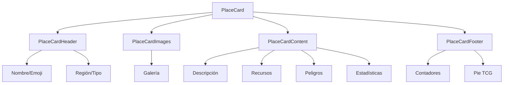

# 🏙️ PlaceCard

Componente de tarjeta para visualizar lugares con estilo de Trading Card Game (TCG).

## Estructura



## Propiedades

El componente `PlaceCard` acepta las siguientes propiedades:

| Propiedad | Tipo | Descripción |
|-----------|------|-------------|
| place | `PlaceCardData` | Datos del lugar a mostrar |
| compact | `boolean` | Modo compacto con menos información |
| tcgMode | `boolean` | Activa efectos visuales de carta tipo TCG |
| disabled | `boolean` | Deshabilita interacciones con la tarjeta |
| className | `string` | Clases CSS adicionales |
| onClick | `() => void` | Función para manejar clic en la tarjeta |
| isSelected | `boolean` | Indica si la tarjeta está seleccionada |

## Ejemplo de uso

```tsx
import { PlaceCard } from '@/components/cards/place-card';
import { getPlaceCardData } from '@/components/cards/place-card/place-server-actions';

// En un Server Component
const PlaceCardExample = async () => {
  const placeData = await getPlaceCardData('place-id-here');

  return (
    <PlaceCard
      place={placeData}
      tcgMode={true}
      onClick={() => console.log('Tarjeta clickeada')}
    />
  );
}
```

## Server Actions

El componente utiliza Server Actions para cargar datos:

- `getPlaceCardData(placeId)`: Obtiene datos del lugar incluyendo imágenes y métricas
- `getRecentPlaceImages(placeId, limit)`: Obtiene imágenes recientes de un lugar

## Campos TCG

La tarjeta muestra los siguientes elementos inspirados en juegos de cartas:

- **Power**: Nivel de poder del lugar (1-10)
- **Rareza**: Nivel de rareza calculado según características
- **Recursos**: Elementos valiosos disponibles en el lugar
- **Peligros**: Amenazas y riesgos del lugar
- **Salud**: Resistencia del lugar
- **Valor**: Importancia estratégica

## Diseño Responsivo

- Desktop: 320px de ancho
- Mobile: 300px de ancho
- Altura adaptativa según modo compacto

## Accesibilidad

- Soporta navegación por teclado
- Incluye roles ARIA apropiados
- Textos alternativos para imágenes
