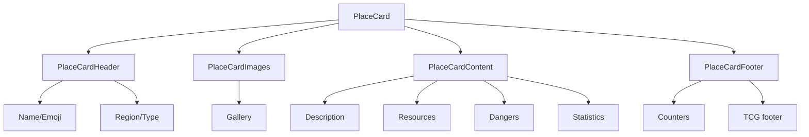

# PlaceCard

This card component displays Places with a Trading Card Game (TCG) style.

## Structure



## Properties

The `PlaceCard` component accepts the following properties:

| Property   | Type            | Description                              |
| ---------- | --------------- | ---------------------------------------- |
| place      | `PlaceCardData` | Place data to display                    |
| compact    | `boolean`       | Compact mode with less information       |
| tcgMode    | `boolean`       | Enables TCG-style visual effects         |
| disabled   | `boolean`       | Disables interactions with the card      |
| className  | `string`        | Extra CSS classes                        |
| onClick    | `() => void`    | Function that handles a click on the card |
| isSelected | `boolean`       | Indicates whether the card is selected   |

## Usage example

```tsx
import { PlaceCard } from '@/components/cards/place-card';
import { getPlaceCardData } from '@/components/cards/place-card/place-server-actions';

// In a data-loading component
const PlaceCardExample = async () => {
	const placeData = await getPlaceCardData('place-id-here');

	return <PlaceCard place={placeData} tcgMode={true} onClick={() => console.log('Tarjeta clickeada')} />;
};
```

## Data loading

The component uses routes that call services to load data.

The following functions load Place data:

- `getPlaceCardData(placeId)`: Gets Place data, including images and metrics
- `getRecentPlaceImages(placeId, limit)`: Gets recent images of a Place

## TCG fields

The card shows the following elements inspired by card games:

- **Power**: Power level of the Place (1-10)
- **Rarity**: Rarity level calculated from characteristics
- **Resources**: Valuable elements available at the Place
- **Dangers**: Threats and risks of the Place
- **Health**: Resistance of the Place
- **Value**: Strategic importance

## Responsive design

The card uses the following widths:

- Desktop: 320px wide
- Mobile: 300px wide
- Adaptive height in compact mode

## Accessibility

The card supports the following accessibility features:

- Keyboard navigation
- Appropriate ARIA roles
- Alternative text for images
