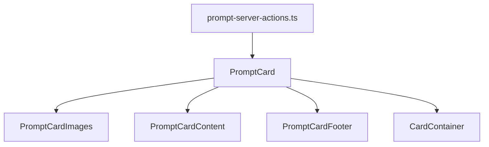

# PromptCard

Componente para mostrar un prompt con diseño inspirado en cartas de TCG (Trading Card Game) como Magic the Gathering, Yu-Gi-Oh o Pokémon.

## Características

- Diseño tipo carta TCG con efectos visuales
- Soporte para parámetros y propósito
- Visualización de relaciones con otras entidades
- Contador de etiquetas y elementos relacionados
- Modo compacto para listas densas
- Efectos holográficos y visuales al estilo TCG

## Estructura del Componente

```
PromptCard/
├── prompt-card.tsx (Componente principal)
├── prompt-card-content.tsx (Contenido central)
├── prompt-card-footer.tsx (Pie con estadísticas)
├── prompt-card-images.tsx (Galería de imágenes)
├── prompt-card-grid.tsx (Grid de tarjetas)
├── prompt-server-actions.ts (Acciones del servidor)
└── index.ts (Exportaciones)
```

## Flujo de Datos



## Modelo de Datos

El componente PromptCard consume el siguiente modelo de datos:

```typescript
interface PromptCardData {
  id: string;
  name: string;
  emoji?: string | null;
  color?: string | null;
  description?: string | null;
  purpose?: string | null;
  content?: string | null;
  category?: string | null;
  parsedParameters?: Record<string, any>;
  parsedTags?: string[];
  parameters?: string | null;
  isFavorite?: boolean;
  model?: string | null;
  featuredImage?: string | null;
  createdAt: Date;
  updatedAt: Date;
  recentImages?: { id: string; thumbnailUrl: string }[];
  _count?: {
    images?: number;
    videos?: number;
    albums?: number;
    collections?: number;
    tags?: number;
    concepts?: number;
    notes?: number;
    characters?: number;
    places?: number;
    worldItems?: number;
    properties?: number;
    wildcards?: number;
    groups?: number;
  };
}
```

## Ejemplos de Uso

### Uso Básico

```tsx
import { PromptCard } from '@/components/cards/prompt-card';
import { getPromptById } from '@/components/cards/prompt-card/prompt-server-actions';

// En un componente o página
const prompt = await getPromptById('prompt-id');

return (
  <div>
    <h2>Ejemplo de Prompt</h2>
    {prompt && <PromptCard prompt={prompt} />}
  </div>
);
```

### Modo Compacto

```tsx
<PromptCard prompt={prompt} compact={true} />
```

### Con Manejador de Clic

```tsx
<PromptCard
  prompt={prompt}
  onClick={() => handleSelectPrompt(prompt.id)}
  isSelected={selectedPromptId === prompt.id}
/>
```

### Sin Efectos TCG

```tsx
<PromptCard prompt={prompt} tcgMode={false} />
```

## Propiedades

| Propiedad   | Tipo                 | Descripción                                  |
|-------------|----------------------|----------------------------------------------|
| prompt      | PromptCardData       | Datos del prompt a mostrar                   |
| tcgMode     | boolean              | Habilita efectos visuales de carta TCG       |
| compact     | boolean              | Mostrar en modo compacto (menos información) |
| disabled    | boolean              | Deshabilitar interacciones                   |
| onClick     | () => void           | Función al hacer clic                        |
| isSelected  | boolean              | Indica si la tarjeta está seleccionada       |
| className   | string               | Clases CSS adicionales                       |
| style       | React.CSSProperties  | Estilos CSS adicionales                      |
