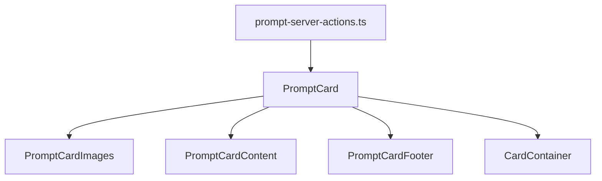

# PromptCard

This component displays a Prompt with a TCG (Trading Card Game) design inspired by Magic the Gathering, Yu-Gi-Oh, or Pokemon.

## Features

The card provides the following features:

- TCG-style card design with visual effects
- Support for parameters and purpose
- Display of relations with other entities
- Counter of Tags and related items
- Compact mode for dense lists
- Holographic and TCG-style visual effects

## Component structure

```
PromptCard/
├── prompt-card.tsx (Main component)
├── prompt-card-content.tsx (Central content)
├── prompt-card-footer.tsx (Footer with statistics)
├── prompt-card-images.tsx (Image gallery)
├── prompt-card-grid.tsx (Card grid)
├── prompt-server-actions.ts (Routes)
└── index.ts (Exports)
```

## Data flow



## Data model

The PromptCard component consumes the following data model:

```typescript
interface PromptCardData {
	id: string;
	name: string;
	emoji?: string | null;
	color?: string | null;
	description?: string | null;
	purpose?: string | null;
	content?: string | null;
	category?: string | null;
	parsedParameters?: Record<string, any>;
	parsedTags?: string[];
	parameters?: string | null;
	isFavorite?: boolean;
	model?: string | null;
	featuredImage?: string | null;
	createdAt: Date;
	updatedAt: Date;
	recentImages?: { id: string; thumbnailUrl: string }[];
	_count?: {
		images?: number;
		videos?: number;
		albums?: number;
		collections?: number;
		tags?: number;
		concepts?: number;
		notes?: number;
		characters?: number;
		places?: number;
		worldItems?: number;
		properties?: number;
		wildcards?: number;
		groups?: number;
	};
}
```

## Usage examples

### Basic use

```tsx
import { PromptCard } from '@/components/cards/prompt-card';
import { getPromptById } from '@/components/cards/prompt-card/prompt-server-actions';

// In a component or page
const prompt = await getPromptById('prompt-id');

return (
	<div>
		<h2>Prompt example</h2>
		{prompt && <PromptCard prompt={prompt} />}
	</div>
);
```

### Compact mode

```tsx
<PromptCard prompt={prompt} compact={true} />
```

### With a click handler

```tsx
<PromptCard prompt={prompt} onClick={() => handleSelectPrompt(prompt.id)} isSelected={selectedPromptId === prompt.id} />
```

### Without TCG effects

```tsx
<PromptCard prompt={prompt} tcgMode={false} />
```

## Properties

| Property   | Type                | Description                                  |
| ---------- | ------------------- | -------------------------------------------- |
| prompt     | PromptCardData      | Prompt data to display                       |
| tcgMode    | boolean             | Enables TCG card visual effects              |
| compact    | boolean             | Show in compact mode (less information)      |
| disabled   | boolean             | Disable interactions                         |
| onClick    | () => void          | Function that runs on click                  |
| isSelected | boolean             | Indicates whether the card is selected       |
| className  | string              | Extra CSS classes                            |
| style      | React.CSSProperties | Extra CSS styles                             |
