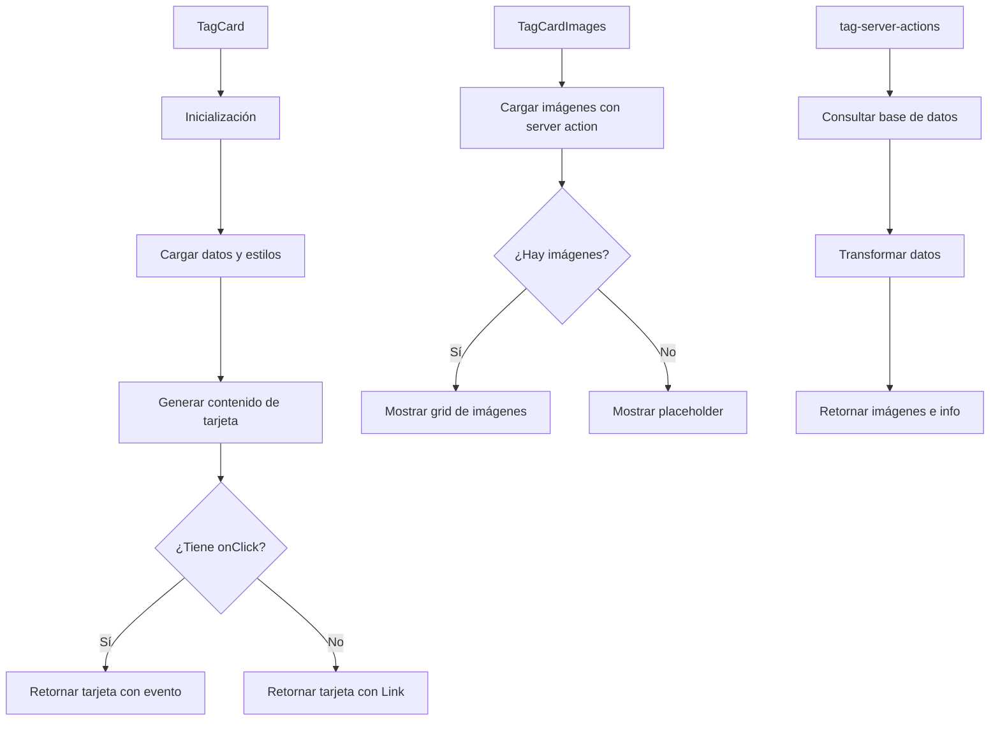

# 🏷️ TagCard

Componente que muestra una tarjeta estilo Magic para representar etiquetas (tags).

## 📋 Descripción

Este componente forma parte del sistema de tarjetas de entidades, siguiendo el mismo diseño que `CharacterCard`, `PlaceCard` y `WorldItemCard`. Cada tarjeta tiene un diseño inspirado en cartas de Magic con:

- Cabecera con nombre de etiqueta e icono
- Sección de imágenes asociadas
- Sección de contenido con descripción y metadatos
- Pie con estadísticas e información adicional
- Colores personalizados según la configuración de la etiqueta

## 🔄 Flujo de funcionamiento



## 🗂️ Estructura de archivos

- **index.ts**: Punto de entrada y exportaciones del componente
- **tag-card.tsx**: Componente principal que renderiza la tarjeta
- **tag-card-header.tsx**: Componente para la cabecera de la tarjeta
- **tag-card-images.tsx**: Componente para mostrar las imágenes asociadas
- **tag-card-content.tsx**: Componente para mostrar el contenido de la etiqueta
- **tag-card-footer.tsx**: Componente para mostrar el pie con estadísticas
- **tag-server-actions.ts**: Acciones del servidor para obtener datos
- **README.md**: Documentación del componente

## 🖥️ Ejemplos de uso

### Uso básico con navegación automática

```tsx
import { TagCard } from '@/components/cards/tag-card';

function TagsList({ tags }) {
  return (
    <div className="grid grid-cols-3 gap-4">
      {tags.map(tag => (
        <TagCard key={tag.id} tag={tag} />
      ))}
    </div>
  );
}
```

### Uso con manejador de eventos personalizado

```tsx
import { TagCard } from '@/components/cards/tag-card';

function TagSelector({ tags, onSelect }) {
  return (
    <div className="grid grid-cols-3 gap-4">
      {tags.map(tag => (
        <TagCard
          key={tag.id}
          tag={tag}
          onClick={onSelect}
        />
      ))}
    </div>
  );
}
```

## 🔌 Integración

Este componente se utiliza principalmente en:

- Vista de etiquetas en el dashboard
- Selectores de etiquetas en formularios
- Paneles de filtrado y organización
- Diálogos y modales de selección

## 🎨 Personalización visual

El componente respeta y utiliza los atributos visuales definidos en la entidad Tag:

- **color**: Color principal de la etiqueta que se utiliza para los bordes y gradientes
- **emoji**: Emoji asociado que se muestra junto al nombre
- **texture**: Textura visual (si está definida)
- **rarity**: Rareza que afecta al diseño visual (common, uncommon, rare, etc.)

## 🎨 Diseño TCG

El componente presenta información de una etiqueta en formato de carta TCG (Trading Card Game), con efectos visuales y diseño estructurado que muestra metadatos, imágenes relacionadas y estadísticas.

## 🎨 Características

- **Diseño TCG**: Efectos visuales que simulan cartas de juegos como Magic, Yu-Gi-Oh o Pokémon
- **Visualización de rareza**: Muestra visualmente la rareza de la etiqueta basada en la cantidad de relaciones
- **Imágenes asociadas**: Muestra miniaturas de las imágenes vinculadas a la etiqueta
- **Estadísticas detalladas**: Contadores de relaciones con otras entidades del sistema
- **Animaciones**: Efectos de hover y selección para mejorar la experiencia de usuario
- **Personalizable**: Admite múltiples opciones de personalización (TCG, compacto, interactivo)
- **Accesible**: Soporte completo para navegación con teclado

## 🎨 Uso

```tsx
import { TagCard } from '@/components/cards/tag-card';

// Dentro de tu componente
<TagCard
  tag={tagWithRelations}
  onClick={() => handleTagClick(tag.id)}
  tcgMode={true}
  compact={false}
/>
```

## 🎨 Props

| Prop | Tipo | Descripción |
|------|------|-------------|
| `tag` | `TagWithRelations` | Objeto de etiqueta con relaciones y contadores |
| `onClick` | `() => void` | Función a ejecutar al hacer clic en la tarjeta |
| `className` | `string` | Clases CSS adicionales |
| `style` | `React.CSSProperties` | Estilos inline adicionales |
| `tcgMode` | `boolean` | Activar/desactivar diseño TCG (por defecto: `true`) |
| `isSelected` | `boolean` | Indica si la tarjeta está seleccionada |
| `compact` | `boolean` | Versión más compacta de la tarjeta |
| `disabled` | `boolean` | Deshabilita la interacción |
| `interactive` | `boolean` | Habilita/deshabilita efectos interactivos (por defecto: `true`) |

## 🎨 Tipo de Datos

El componente espera un objeto `TagWithRelations` que incluye:

```typescript
interface TagWithRelations {
  id: string;
  name: string;
  emoji: string;
  color: string;
  description: string | null;
  shortcut: string | null;
  category: string;
  viewMode: string;
  featuredImage: string | object | null;
  isFavorite: boolean;
  createdAt: Date;
  updatedAt: Date;
  _count?: {
    images: number;
    videos: number;
    albums: number;
    collections: number;
    characters: number;
    places: number;
    worldItems: number;
    concepts: number;
    prompts: number;
    notes: number;
    wildcards: number;
    properties: number;
    groups: number;
  }
}
```

## 🎨 Alineación con el esquema Prisma

Esta implementación se alinea con el modelo Tag en el esquema Prisma, incluyendo:

- Propiedades básicas (id, name, emoji, color)
- Atributos descriptivos (description, category)
- Configuración visual (featuredImage, isFavorite)
- Relaciones con otras entidades (albums, collections, characters, etc.)
- Conteos de relaciones (_count)

## 🎨 Componentes auxiliares

El componente TagCard utiliza varios componentes auxiliares:

- `TagCardHeader`: Muestra el título, emoji y categoría
- `TagCardImages`: Muestra miniaturas de imágenes relacionadas
- `TagCardContent`: Muestra descripción y estadísticas
- `TagCardFooter`: Muestra metadatos y contadores

## 🎨 Estilo TCG

La visualización en modo TCG incluye efectos como:

1. Gradientes y bordes estilizados
2. Indicadores visuales de rareza
3. Efectos de brillo basados en la rareza
4. Animaciones al pasar el cursor
5. Diseño estructurado similar a cartas de juegos de colección
