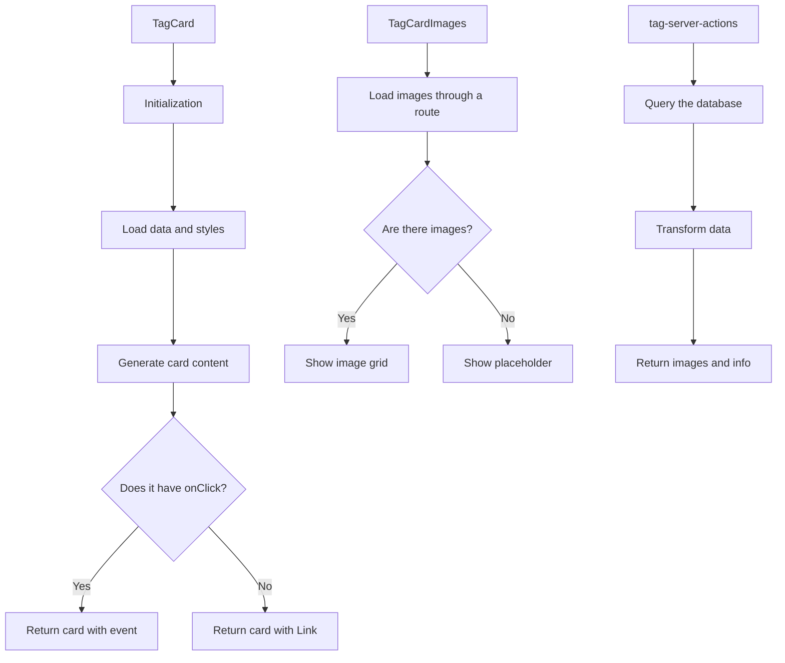

# TagCard

This component displays a Magic-style card that represents Tags.

## Description

This component is part of the entity card system.

The design matches `CharacterCard`, `PlaceCard`, and `WorldItemCard`.

Each card uses a Magic-inspired design with the following parts:

- Header with Tag name and icon
- Associated image section
- Content section with description and metadata
- Footer with statistics and extra information
- Custom colors from the Tag configuration

## Operation flow



## File structure

The directory includes the following files:

- **index.ts**: Entry point and component exports
- **tag-card.tsx**: Main component that renders the card
- **tag-card-header.tsx**: Component for the card header
- **tag-card-images.tsx**: Component that shows associated images
- **tag-card-content.tsx**: Component that shows Tag content
- **tag-card-footer.tsx**: Component that shows the footer with statistics
- **tag-server-actions.ts**: Routes that fetch data
- **README.md**: Component documentation

## Usage examples

### Basic use with automatic navigation

```tsx
import { TagCard } from '@/components/cards/tag-card';

function TagsList({ tags }) {
	return (
		<div className="grid grid-cols-3 gap-4">
			{tags.map((tag) => (
				<TagCard key={tag.id} tag={tag} />
			))}
		</div>
	);
}
```

### Use with a custom event handler

```tsx
import { TagCard } from '@/components/cards/tag-card';

function TagSelector({ tags, onSelect }) {
	return (
		<div className="grid grid-cols-3 gap-4">
			{tags.map((tag) => (
				<TagCard key={tag.id} tag={tag} onClick={onSelect} />
			))}
		</div>
	);
}
```

## Integration

This component is used mainly in the following places:

- Tag view on the dashboard
- Tag selectors in forms
- Filter and organization panels
- Selection dialogs and modals

## Visual customization

The component uses the visual attributes defined on the Tag entity.

The attributes include the following:

- **color**: Main Tag color used for borders and gradients
- **emoji**: Associated emoji shown next to the name
- **texture**: Visual texture (if it is defined)
- **rarity**: Rarity that affects the visual design (common, uncommon, rare)

## TCG design

The component presents Tag information in TCG (Trading Card Game) format.

The structured design shows metadata, related images, and statistics.

## Features

The card provides the following features:

- **TCG design**: Visual effects that simulate cards from Magic, Yu-Gi-Oh, or Pokemon
- **Rarity display**: Visual rarity of the Tag based on the number of relations
- **Associated images**: Thumbnails of images linked to the Tag
- **Detailed statistics**: Relation counters with other system entities
- **Animations**: Hover and selection effects that improve the user experience
- **Customizable**: Multiple customization options (TCG, compact, interactive)
- **Accessible**: Full support for keyboard navigation

## Use

```tsx
import { TagCard } from '@/components/cards/tag-card';

// Inside your component
<TagCard tag={tagWithRelations} onClick={() => handleTagClick(tag.id)} tcgMode={true} compact={false} />;
```

## Props

| Prop          | Type                  | Description                                                     |
| ------------- | --------------------- | --------------------------------------------------------------- |
| `tag`         | `TagWithRelations`    | Tag object with relations and counters                          |
| `onClick`     | `() => void`          | Function that runs on a click on the card                       |
| `className`   | `string`              | Extra CSS classes                                               |
| `style`       | `React.CSSProperties` | Extra inline styles                                             |
| `tcgMode`     | `boolean`             | Enable or disable TCG design (default: `true`)                  |
| `isSelected`  | `boolean`             | Indicates whether the card is selected                          |
| `compact`     | `boolean`             | More compact version of the card                                |
| `disabled`    | `boolean`             | Disables interaction                                            |
| `interactive` | `boolean`             | Enables or disables interactive effects (default: `true`)       |

## Data type

The component expects a `TagWithRelations` object that includes the following fields:

```typescript
interface TagWithRelations {
	id: string;
	name: string;
	emoji: string;
	color: string;
	description: string | null;
	shortcut: string | null;
	category: string;
	viewMode: string;
	featuredImage: string | object | null;
	isFavorite: boolean;
	createdAt: Date;
	updatedAt: Date;
	_count?: {
		images: number;
		videos: number;
		albums: number;
		collections: number;
		characters: number;
		places: number;
		worldItems: number;
		concepts: number;
		prompts: number;
		notes: number;
		wildcards: number;
		properties: number;
		groups: number;
	};
}
```

## Alignment with the Prisma schema

This implementation aligns with the Tag model in the Prisma schema.

The alignment includes the following parts:

- Basic properties (id, name, emoji, color)
- Descriptive attributes (description, category)
- Visual configuration (featuredImage, isFavorite)
- Relations with other entities (albums, collections, characters)
- Relation counts (_count)

## Auxiliary components

The TagCard component uses several auxiliary components.

The auxiliary components are the following:

- `TagCardHeader`: Shows the title, emoji, and category
- `TagCardImages`: Shows thumbnails of related images
- `TagCardContent`: Shows description and statistics
- `TagCardFooter`: Shows metadata and counters

## TCG style

TCG mode display includes the following effects:

1. Styled gradients and borders
2. Visual rarity indicators
3. Glow effects based on rarity
4. Animations on hover
5. Structured design similar to collectible game cards
